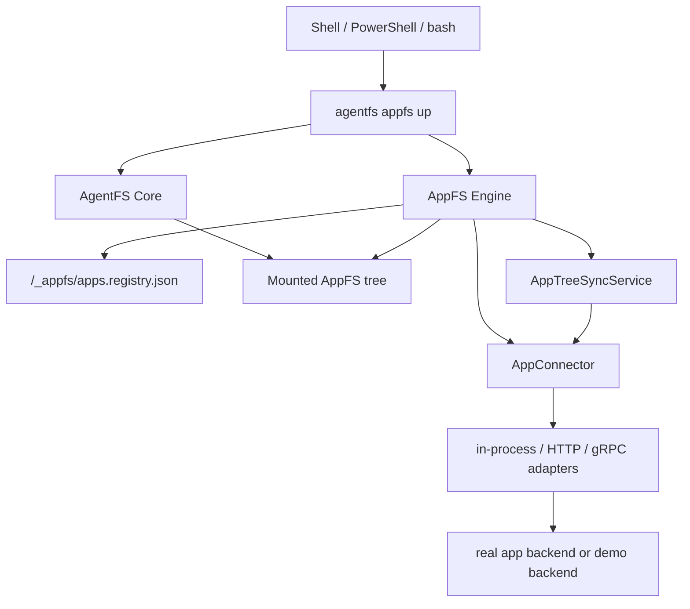

# AppFS

Filesystem-native app protocol for shell-first AI agents.

[中文 README](README.zh-CN.md)

AppFS turns different apps into one filesystem contract so agents can use the same primitives everywhere:

- `cat` to read resources
- `>> *.act` to trigger actions with JSONL
- `tail -f` to watch async event streams

This repository contains the AppFS protocol docs, runtime, reference fixtures, bridge adapters, and conformance tests, all built on top of AgentFS core storage and mount backends.

## Overview

AppFS is designed for practical LLM + shell workflows:

- one interaction model across many apps instead of one schema per app
- path-native operations with low token overhead
- stream-first async flows with replay support
- managed runtime lifecycle with dynamic app registration
- connector adapters for in-process, HTTP, and gRPC integrations

The recommended runtime entrypoint is:

```bash
agentfs appfs up <id-or-path> <mountpoint>
```

Managed runtime state lives in:

```text
/_appfs/apps.registry.json
```

Low-level debug commands still exist:

- `agentfs mount ... --managed-appfs`
- `agentfs serve appfs --managed`

## Quick Start

The normal AppFS flow is:

1. start a bridge or in-process connector
2. initialize an empty AgentFS database
3. start AppFS with `agentfs appfs up`
4. register an app through `/_appfs/register_app.act`
5. read files, switch scope, and trigger actions through the mounted tree

Prerequisites:

- Rust toolchain with `cargo`
- Python + `uv` for the reference HTTP bridge
- port `127.0.0.1:8080` available
- Windows: WinFsp installed
- Linux: FUSE available
- macOS: NFS mount support available

### Windows

Start the reference HTTP bridge:

```powershell
cd C:\Users\esp3j\rep\agentfs\examples\appfs\http-bridge\python
uv run python bridge_server.py
```

Initialize an empty database:

```powershell
cd C:\Users\esp3j\rep\agentfs\cli
cargo run -- init managed-http --force
```

Start AppFS:

```powershell
cd C:\Users\esp3j\rep\agentfs\cli
cargo run -- appfs up .agentfs\managed-http.db C:\mnt\appfs-managed-http --backend winfsp
```

Register an app:

```powershell
Add-Content C:\mnt\appfs-managed-http\_appfs\register_app.act '{"app_id":"aiim","transport":{"kind":"http","endpoint":"http://127.0.0.1:8080","http_timeout_ms":5000,"grpc_timeout_ms":5000,"bridge_max_retries":2,"bridge_initial_backoff_ms":100,"bridge_max_backoff_ms":1000,"bridge_circuit_breaker_failures":5,"bridge_circuit_breaker_cooldown_ms":3000},"client_token":"reg-http-001"}'
```

Read a snapshot and trigger an action:

```powershell
Get-Content C:\mnt\appfs-managed-http\aiim\chats\chat-001\messages.res.jsonl | Select-Object -First 5
Add-Content C:\mnt\appfs-managed-http\aiim\contacts\zhangsan\send_message.act '{"version":2,"client_token":"msg-001","payload":{"text":"hello"}}'
```

### Linux

Start the reference HTTP bridge:

```bash
cd /path/to/agentfs/examples/appfs/bridges/http-python
uv run python bridge_server.py
```

Initialize an empty database:

```bash
cd /path/to/agentfs/cli
cargo run -- init managed-http --force
```

Start AppFS:

```bash
cd /path/to/agentfs/cli
mkdir -p /tmp/appfs-managed-http
cargo run -- appfs up .agentfs/managed-http.db /tmp/appfs-managed-http --backend fuse
```

Register an app:

```bash
echo '{"app_id":"aiim","transport":{"kind":"http","endpoint":"http://127.0.0.1:8080","http_timeout_ms":5000,"grpc_timeout_ms":5000,"bridge_max_retries":2,"bridge_initial_backoff_ms":100,"bridge_max_backoff_ms":1000,"bridge_circuit_breaker_failures":5,"bridge_circuit_breaker_cooldown_ms":3000},"client_token":"reg-http-001"}' >> /tmp/appfs-managed-http/_appfs/register_app.act
```

Read a snapshot and trigger an action:

```bash
head -n 5 /tmp/appfs-managed-http/aiim/chats/chat-001/messages.res.jsonl
echo '{"version":2,"client_token":"msg-001","payload":{"text":"hello"}}' >> /tmp/appfs-managed-http/aiim/contacts/zhangsan/send_message.act
```

### macOS

macOS uses the AgentFS NFS backend instead of FUSE. The AppFS managed flow is the same, but Linux is still the primary required CI platform.

Initialize an empty database:

```bash
cd /path/to/agentfs/cli
cargo run -- init managed-http --force
```

Start AppFS:

```bash
cd /path/to/agentfs/cli
mkdir -p /tmp/appfs-managed-http
cargo run -- appfs up .agentfs/managed-http.db /tmp/appfs-managed-http --backend nfs
```

Then use the same `/_appfs/register_app.act`, per-app `.act`, and ordinary file reads shown above.

## Build From Source

### CLI and Rust SDK

```bash
cd cli
cargo build
cargo build --release
cargo test --package agentfs
```

```bash
cd sdk/rust
cargo test
```

### TypeScript SDK

```bash
cd sdk/typescript
npm install
npm run build
npm test
```

### Python SDK

```bash
cd sdk/python
uv sync
uv run pytest
uv run ruff check .
uv run ruff format .
```

## Documentation

Key entry points:

- [Documentation Index](docs/README.md)
- [Current AppFS milestone (v4)](docs/v4/README.md)
- [Connectorization milestone (v3)](docs/v3/README.md)
- [Backend-native milestone (v2)](docs/v2/README.md)
- [cli/TEST-WINDOWS.md](cli/TEST-WINDOWS.md)
- [Runtime closure design plan](docs/plans/2026-03-26-appfs-runtime-closure-design.md)

## Architecture

AppFS is organized into three layers:

- AgentFS Core: SQLite filesystem, generic overlay behavior, and platform mount backends
- AppFS Engine: registry, structure sync, runtime lifecycle, snapshot read-through, and connector adapters
- AppFS UX: `agentfs appfs up` plus the mounted control plane under `/_appfs/*`



Notes:

- `AppConnector` is the canonical runtime-facing connector surface
- `_meta/manifest.res.json` is a derived view, not the runtime source of truth
- snapshot cold misses auto-expand on ordinary file reads through the mount path
- `agentfs init --base` remains an AgentFS feature, but it is not part of the recommended AppFS path

## Repository Layout

- `cli/`: CLI, runtime, and mount integration
- `sdk/rust/`: Rust SDK and filesystem implementations
- `sdk/typescript/`: TypeScript SDK
- `sdk/python/`: Python SDK
- `sandbox/`: Linux-only syscall interception sandbox
- `examples/appfs/`: fixtures and bridge reference implementations
- `docs/`: ADRs, plans, contracts, and release notes

## Testing

Core validation paths:

- Rust CLI tests: `cargo test --manifest-path cli/Cargo.toml --package agentfs`
- Rust SDK tests: `cargo test --manifest-path sdk/rust/Cargo.toml`
- Linux contract suite: `cli/tests/test-appfs-connector-contract.sh`
- Windows managed lifecycle regression: `cli/test-windows-appfs-managed.ps1`

Linux remains the primary required CI platform. Windows has dedicated manual regression coverage for the managed AppFS flow.

## Status

Current repository status:

- `v0.3` connectorization is merged and remains the release baseline
- `v0.4` structure sync, unified connector, managed lifecycle, and `appfs up` are implemented in-tree
- multi-app managed runtime is available
- real app pilot work is the next validation milestone before a stable release claim

## License

MIT
