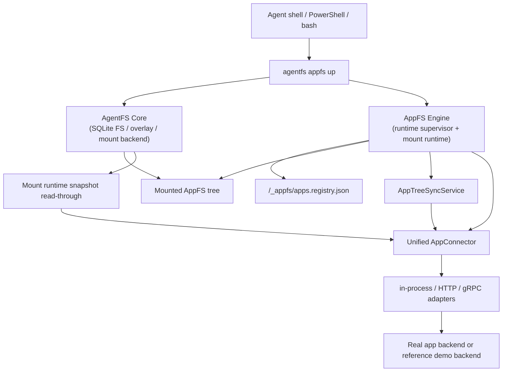

# AppFS

Filesystem-native app protocol for shell-first AI agents.

[中文 README](README.zh-CN.md)

AppFS makes different apps look and feel like one filesystem contract, so an agent can use the same primitives across tools:

1. `cat` for reading resources.
2. `>> *.act` (append JSONL) for triggering actions.
3. `tail -f` on stream files for async results.

This repository currently hosts the AppFS spec, adapter contracts, reference fixtures, conformance tests, and runtime implementation on top of AgentFS.

## Why AppFS

The design target is practical LLM + bash operation:

1. One interaction model across many apps instead of one MCP schema per app.
2. Low token overhead with path-native operations.
3. Stream-first async model with replay support.
4. Runtime-generated request IDs, so clients do not need UUID management.
5. Cross-language adapter compatibility through a frozen contract surface.

## Core Interaction Model

```bash
# 1) subscribe app event stream first
tail -f /app/aiim/_stream/events.evt.jsonl

# 2) trigger an action by append ActionLineV2 JSONL
echo '{"version":2,"client_token":"msg-001","payload":{"text":"hello"}}' >> /app/aiim/contacts/zhangsan/send_message.act

# 3) read resources directly
cat /app/aiim/contacts/zhangsan/profile.res.json

# 4) snapshot resources are full files (.res.jsonl), live resources keep paging
cat /app/aiim/chats/chat-001/messages.res.jsonl | rg "hello"
cat /app/aiim/feed/recommendations.res.json
echo '{"version":2,"client_token":"page-001","payload":{"handle_id":"<from-page>"}}' >> /app/aiim/_paging/fetch_next.act
```

## Available Actions (AIIM Fixture)

Source of truth: `examples/appfs/aiim/_meta/manifest.res.json`.

1. `contacts/{contact_id}/send_message.act`
   - `kind`: `action`
   - `execution_mode`: `inline`
   - `input_mode`: `json`
2. `files/{file_id}/download.act`
   - `kind`: `action`
   - `execution_mode`: `streaming`
   - `input_mode`: `json`
3. `/_paging/fetch_next.act`
   - `kind`: `action`
   - `execution_mode`: `inline`
   - `input_mode`: `json`
4. `/_paging/close.act`
   - `kind`: `action`
   - `execution_mode`: `inline`
   - `input_mode`: `json`
5. `/_snapshot/refresh.act`
   - `kind`: `action`
   - `execution_mode`: `inline`
   - `input_mode`: `json`

## Runtime Modes

AppFS now has one primary runtime model:

1. `agentfs appfs up <id-or-path> <mountpoint>` is the recommended startup path.
2. `/_appfs/apps.registry.json` is the shared runtime source of truth for app routing, transport config, session IDs, and active scope.
3. app registration, removal, and discovery happen through the root control plane:
   - `/_appfs/register_app.act`
   - `/_appfs/unregister_app.act`
   - `/_appfs/list_apps.act`
4. ordinary reads still go through the mount path, so snapshot cold misses auto-expand on file access.
5. action, event, structure sync, and lifecycle flow through the AppFS runtime supervisor.

Low-level debug surfaces still exist:

1. `agentfs mount ... --managed-appfs`
2. `agentfs serve appfs --managed`
3. explicit single-app bootstrap flags for protocol/debug work

`agentfs init --base` remains an AgentFS overlay feature, but it is no longer part of the recommended AppFS flow.

## Runtime Quick Start

### Managed-first HTTP bridge flow

This is the primary AppFS flow now:

1. start a bridge or in-process connector implementation;
2. `agentfs init` an empty database;
3. `agentfs appfs up` to start mount + runtime together;
4. register apps through `/_appfs/register_app.act`;
5. read files, switch scope, and unregister apps through the mounted control plane.

Prerequisites:

1. Rust toolchain with `cargo`
2. Python + `uv` for the reference HTTP bridge
3. `127.0.0.1:8080` available
4. Windows: WinFsp installed
5. Linux: FUSE available and writable mountpoint prepared

### Windows (PowerShell)

1. Start the HTTP bridge.

```powershell
cd C:\Users\esp3j\rep\agentfs\examples\appfs\http-bridge\python
uv run python bridge_server.py
```

2. Initialize an empty AgentFS database.

```powershell
cd C:\Users\esp3j\rep\agentfs\cli
cargo run -- init managed-http --force
```

3. Start AppFS in managed mode.

```powershell
cd C:\Users\esp3j\rep\agentfs\cli
cargo run -- appfs up .agentfs\managed-http.db C:\mnt\appfs-managed-http --backend winfsp
```

4. Watch the root lifecycle stream and register an app.

```powershell
Get-Content C:\mnt\appfs-managed-http\_appfs\_stream\events.evt.jsonl -Wait
Add-Content C:\mnt\appfs-managed-http\_appfs\register_app.act '{"app_id":"aiim","transport":{"kind":"http","endpoint":"http://127.0.0.1:8080","http_timeout_ms":5000,"grpc_timeout_ms":5000,"bridge_max_retries":2,"bridge_initial_backoff_ms":100,"bridge_max_backoff_ms":1000,"bridge_circuit_breaker_failures":5,"bridge_circuit_breaker_cooldown_ms":3000},"client_token":"reg-http-001"}'
```

5. Work with the registered app.

```powershell
# per-app events
Get-Content C:\mnt\appfs-managed-http\aiim\_stream\events.evt.jsonl -Wait

# trigger an action
Add-Content C:\mnt\appfs-managed-http\aiim\contacts\zhangsan\send_message.act '{"version":2,"client_token":"msg-001","payload":{"text":"hello"}}'

# switch scope and read snapshot through ordinary file read
Add-Content C:\mnt\appfs-managed-http\aiim\_app\enter_scope.act '{"target_scope":"chat-long","client_token":"scope-http-001"}'
Get-Content C:\mnt\appfs-managed-http\aiim\chats\chat-long\messages.res.jsonl | Select-Object -First 5

# unregister when done
Add-Content C:\mnt\appfs-managed-http\_appfs\unregister_app.act '{"app_id":"aiim","client_token":"unreg-http-001"}'
```

### Linux (bash)

1. Start the HTTP bridge.

```bash
cd /path/to/agentfs/examples/appfs/http-bridge/python
uv run python bridge_server.py
```

2. Initialize an empty AgentFS database.

```bash
cd /path/to/agentfs/cli
cargo run -- init managed-http --force
```

3. Start AppFS in managed mode.

```bash
cd /path/to/agentfs/cli
mkdir -p /tmp/appfs-managed-http
cargo run -- appfs up .agentfs/managed-http.db /tmp/appfs-managed-http --backend fuse
```

4. Watch the root lifecycle stream and register an app.

```bash
tail -f /tmp/appfs-managed-http/_appfs/_stream/events.evt.jsonl
echo '{"app_id":"aiim","transport":{"kind":"http","endpoint":"http://127.0.0.1:8080","http_timeout_ms":5000,"grpc_timeout_ms":5000,"bridge_max_retries":2,"bridge_initial_backoff_ms":100,"bridge_max_backoff_ms":1000,"bridge_circuit_breaker_failures":5,"bridge_circuit_breaker_cooldown_ms":3000},"client_token":"reg-http-001"}' >> /tmp/appfs-managed-http/_appfs/register_app.act
```

5. Work with the registered app.

```bash
# per-app events
tail -f /tmp/appfs-managed-http/aiim/_stream/events.evt.jsonl

# trigger an action
echo '{"version":2,"client_token":"msg-001","payload":{"text":"hello"}}' >> /tmp/appfs-managed-http/aiim/contacts/zhangsan/send_message.act

# switch scope and read snapshot through ordinary file read
echo '{"target_scope":"chat-long","client_token":"scope-http-001"}' >> /tmp/appfs-managed-http/aiim/_app/enter_scope.act
head -n 5 /tmp/appfs-managed-http/aiim/chats/chat-long/messages.res.jsonl

# unregister when done
echo '{"app_id":"aiim","client_token":"unreg-http-001"}' >> /tmp/appfs-managed-http/_appfs/unregister_app.act
```

Notes:

1. `.act` sinks are append-only JSONL. Submit one JSON object per line with `>>` or `Add-Content`.
2. snapshot `*.res.jsonl` files are ordinary readable files; cold misses auto-expand on first read.
3. `/_app/enter_scope.act` and `/_app/refresh_structure.act` are per-app control actions.
4. `/_snapshot/refresh.act` still exists for explicit prefetch or forced rematerialization, but it is not part of the normal happy path.
5. `unregister_app.act` removes runtime ownership and registry membership, but intentionally keeps the app tree on disk for inspection.
6. `agentfs mount ... --managed-appfs` and `agentfs serve appfs --managed` remain available for low-level debugging.

## Architecture

### Layered Runtime Topology



### Responsibilities

1. AgentFS Core owns SQLite storage, generic overlay behavior, and platform mount backends.
2. AppFS Engine owns registry sync, action/event/control processing, structure sync, snapshot read-through, and runtime lifecycle.
3. `/_appfs/apps.registry.json` is the managed runtime source of truth.
4. `_meta/manifest.res.json` is a derived AppFS view generated from connector-owned structure, not the runtime's primary source of truth.
5. The canonical runtime-facing connector surface is `AppConnector`. Existing `AppConnectorV2` / `AppConnectorV3` remain transport compatibility layers behind the adapters.
6. `agentfs mount` and `agentfs serve appfs` still exist, but they are now debug surfaces rather than the primary product entrypoint.

## Release Tracks

### v0.3 Released Baseline

`v0.3` remains the released connectorization baseline in this repository.

Done and shipped in `v0.3`:

1. runtime default path routes through `AppConnectorV2` (in-process / HTTP bridge / gRPC bridge).
2. startup prewarm, snapshot chunk fetch, live paging, and action submit all route through connector V2 surface.
3. HTTP and gRPC reference bridges expose V2 connector endpoints/services.
4. CT2/CI gate includes runtime-derived connector evidence checks.

See release closeout details:

1. [APPFS-v0.3-完成总结-2026-03-24.zh-CN.md](docs/v3/APPFS-v0.3-完成总结-2026-03-24.zh-CN.md)

### v0.4 In-Tree Development Track

The current branch of the repository also includes the `v0.4` app-structure-sync and managed-runtime workstream. This is available for testing in-tree, but is not yet called out as a separate repository release note.

Currently implemented in-tree:

1. unified runtime-facing `AppConnector`, with HTTP/gRPC/in-process adapters mapping existing V2/V3 transport surfaces behind it.
2. `AppTreeSyncService` with bootstrap, `/_app/enter_scope.act`, and `/_app/refresh_structure.act`.
3. shared managed registry at `/_appfs/apps.registry.json`.
4. dynamic app lifecycle via `/_appfs/register_app.act`, `/_appfs/unregister_app.act`, and `/_appfs/list_apps.act`.
5. `agentfs appfs up` as the managed-first orchestration entrypoint.
6. multi-app runtime supervisor and managed mount routing.
7. Windows manual regression coverage via [`cli/test-windows-appfs-managed.ps1`](cli/test-windows-appfs-managed.ps1) and [`cli/TEST-WINDOWS.md`](cli/TEST-WINDOWS.md).

## Breaking Changes and Migration Notes (v0.3)

1. Connector mainline moved from legacy `AppAdapterV1` path to `AppConnectorV2` path.
2. Bridge V2 protocols are now the default runtime path (`/v2/connector/*` for HTTP; V2 connector service for gRPC).
3. Runner/CI env naming is migrating from `APPFS_V2_*` to `APPFS_V3_*`.
4. During the migration window, `APPFS_V2_*` remains as compatibility aliases; if both are set, `APPFS_V3_*` wins.
5. CI check-run names are intentionally frozen during the migration window to avoid branch-protection expected-check drift:
   - `AppFS Contract Gate (required, linux, inprocess v2)`
   - `AppFS Contract Signal (informational, linux, http bridge v2)`
   - `AppFS Contract Signal (informational, linux, http bridge v2 high-risk)`
   - `AppFS Contract Signal (informational, linux, grpc bridge v2)`

## v0.1 Legacy Reference

`v0.1` is frozen and retained as legacy/reference/baseline material. New integrations should target the `v0.3` connectorization path by default.

For v0.1 reference materials, see:

1. [APPFS-v0.1.md](docs/v1/APPFS-v0.1.md)
2. [APPFS-adapter-developer-guide-v0.1.md](docs/v1/APPFS-adapter-developer-guide-v0.1.md)
3. [APPFS-contract-tests-v0.1.md](docs/v1/APPFS-contract-tests-v0.1.md)

## Repository Map (AppFS-Relevant)

1. `docs/v3/APPFS-v0.3-Connectorization-ADR.zh-CN.md`: v0.3 architecture decisions and boundaries.
2. `docs/v3/APPFS-v0.3-Connector接口.zh-CN.md`: frozen connector V2 contract surface.
3. `docs/v3/APPFS-v0.3-完成总结-2026-03-24.zh-CN.md`: v0.3 closeout, migration window, and CI semantics.
4. `docs/v3/APPFS-v0.3-实施计划.zh-CN.md`: execution plan/status alignment and issue map.
5. `docs/v4/APPFS-v0.4-AppStructureSync-ADR.zh-CN.md`: structure sync, managed registry, and multi-app decisions.
6. `docs/v4/APPFS-v0.4-Connector结构接口.zh-CN.md`: frozen `AppConnectorV3` structure contract.
7. `examples/appfs/`: fixtures and bridge references.
8. `cli/src/cmd/appfs/`: AppFS engine modules (`core`, `tree_sync`, `registry`, `registry_manager`, `runtime_config`, `runtime_entry`, `runtime_supervisor`, `mount_runtime`, `supervisor_control`, `snapshot_cache`, `events`, `paging`).
9. `docs/plans/2026-03-26-appfs-runtime-closure-design.md`: managed-first closure plan.
10. `cli/TEST-WINDOWS.md`: Windows manual validation guide.
11. `cli/test-windows-appfs-managed.ps1`: Windows managed-lifecycle regression script.

## Current Status

AppFS currently has two active lines in-tree:

1. `v0.3` connectorization is merged, documented, and remains the release baseline.
2. `v0.4` structure sync, unified `AppConnector`, managed runtime lifecycle, `appfs up`, and multi-app supervisor are implemented in-tree and ready for manual validation.
3. Linux remains the primary required CI platform; Windows now has a dedicated managed-lifecycle regression script for local verification.
4. `v0.1` remains as legacy baseline/reference context.
5. broad real-app production onboarding is still intentionally outside the repository-level release claim.

For release, design, and execution details, see:

1. [APPFS-v0.3-完成总结-2026-03-24.zh-CN.md](docs/v3/APPFS-v0.3-完成总结-2026-03-24.zh-CN.md)
2. [APPFS-v0.3-实施计划.zh-CN.md](docs/v3/APPFS-v0.3-实施计划.zh-CN.md)
3. [APPFS-v0.4-AppStructureSync-ADR.zh-CN.md](docs/v4/APPFS-v0.4-AppStructureSync-ADR.zh-CN.md)
4. [APPFS-v0.4-Connector结构接口.zh-CN.md](docs/v4/APPFS-v0.4-Connector结构接口.zh-CN.md)

## License

MIT
