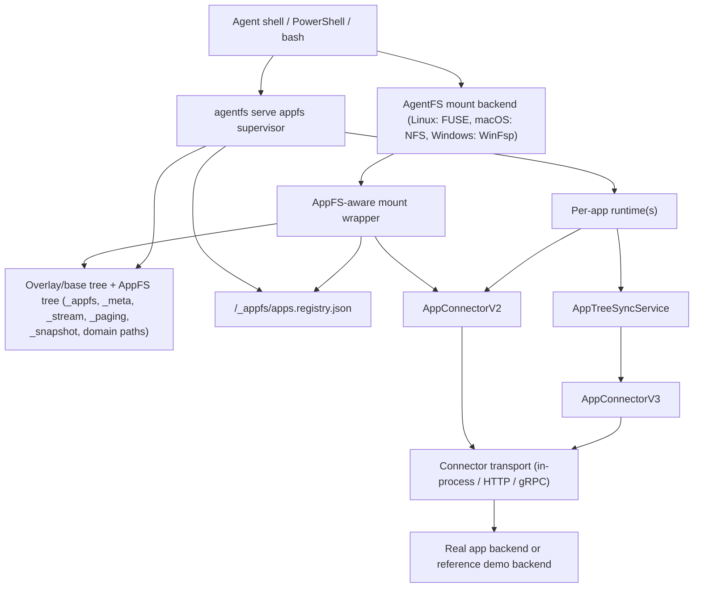

# AppFS

Filesystem-native app protocol for shell-first AI agents.

[中文 README](README.zh-CN.md)

AppFS makes different apps look and feel like one filesystem contract, so an agent can use the same primitives across tools:

1. `cat` for reading resources.
2. `>> *.act` (append JSONL) for triggering actions.
3. `tail -f` on stream files for async results.

This repository currently hosts the AppFS spec, adapter contracts, reference fixtures, conformance tests, and runtime implementation on top of AgentFS.

## Why AppFS

The design target is practical LLM + bash operation:

1. One interaction model across many apps instead of one MCP schema per app.
2. Low token overhead with path-native operations.
3. Stream-first async model with replay support.
4. Runtime-generated request IDs, so clients do not need UUID management.
5. Cross-language adapter compatibility through a frozen contract surface.

## Core Interaction Model

```bash
# 1) subscribe app event stream first
tail -f /app/aiim/_stream/events.evt.jsonl

# 2) trigger an action by append ActionLineV2 JSONL
echo '{"version":2,"client_token":"msg-001","payload":{"text":"hello"}}' >> /app/aiim/contacts/zhangsan/send_message.act

# 3) read resources directly
cat /app/aiim/contacts/zhangsan/profile.res.json

# 4) snapshot resources are full files (.res.jsonl), live resources keep paging
cat /app/aiim/chats/chat-001/messages.res.jsonl | rg "hello"
cat /app/aiim/feed/recommendations.res.json
echo '{"version":2,"client_token":"page-001","payload":{"handle_id":"<from-page>"}}' >> /app/aiim/_paging/fetch_next.act
```

## Available Actions (AIIM Fixture)

Source of truth: `examples/appfs/aiim/_meta/manifest.res.json`.

1. `contacts/{contact_id}/send_message.act`
   - `kind`: `action`
   - `execution_mode`: `inline`
   - `input_mode`: `json`
2. `files/{file_id}/download.act`
   - `kind`: `action`
   - `execution_mode`: `streaming`
   - `input_mode`: `json`
3. `/_paging/fetch_next.act`
   - `kind`: `action`
   - `execution_mode`: `inline`
   - `input_mode`: `json`
4. `/_paging/close.act`
   - `kind`: `action`
   - `execution_mode`: `inline`
   - `input_mode`: `json`
5. `/_snapshot/refresh.act`
   - `kind`: `action`
   - `execution_mode`: `inline`
   - `input_mode`: `json`

## Runtime Modes

The repository currently exposes two practical AppFS runtime modes:

1. Explicit bootstrap mode (`v0.3` baseline)
   - `agentfs mount` uses `--appfs-app-id` / `--appfs-app`
   - `agentfs serve appfs` uses `--app-id` / `--app`
   - connector endpoints are passed directly on the CLI
   - best for fixed demos, compatibility testing, and simple single-app setups
2. Managed registry mode (current `v0.4` development path)
   - `agentfs mount` uses `--managed-appfs`
   - `agentfs serve appfs` uses `--managed`
   - shared app/runtime routing lives in `/_appfs/apps.registry.json`
   - apps can be added or removed at runtime with `/_appfs/register_app.act` and `/_appfs/unregister_app.act`
   - app structure bootstrap, scope switching, and refresh use `AppConnectorV3`

Both modes still rely on mount-side snapshot read-through and runtime-side action/event/control processing.

## Runtime Quick Start

### Mode A: Explicit Single-App HTTP Bridge (`v0.3` Baseline)

This quick start runs the stable single-app bootstrap path:

1. `agentfs mount` exposes the app tree from a `--base` fixture and performs snapshot cold-read auto-expand on ordinary file reads.
2. `agentfs serve appfs` owns the action/event/control plane.
3. Both mount and runtime route connector calls through `AppConnectorV2`, with the reference/demo connector exposed by the Python HTTP bridge.

Prerequisites:

1. Rust toolchain with `cargo` available.
2. Python environment with `uv` available for the bridge example.
3. Port `127.0.0.1:8080` available for the HTTP bridge.
4. Windows: WinFsp installed before running `agentfs mount`.
5. Linux: FUSE mount support available and a writable mount path prepared.

The runtime demo has four moving parts:

1. AgentFS overlay initialized with `examples/appfs` as `--base`
2. HTTP bridge connector
3. `agentfs mount` with AppFS read-through enabled
4. `agentfs serve appfs` backend runtime

The AIIM fixture is no longer copied into the mountpoint. It is exposed directly from the `--base` tree. Snapshot resources materialize on first ordinary read; `.act` processing still requires `serve appfs`.

### Windows (PowerShell, 5 Steps)

1. Initialize AgentFS overlay on top of the demo fixture (Terminal A).

```powershell
cd C:\Users\esp3j\rep\agentfs\cli
cargo run -- init win-real --force --base ..\examples\appfs
```

2. Start HTTP bridge (Terminal B).

```powershell
cd C:\Users\esp3j\rep\agentfs\examples\appfs\http-bridge\python
uv run python bridge_server.py
```

3. Mount AgentFS with AppFS read-through enabled (Terminal C).

```powershell
cd C:\Users\esp3j\rep\agentfs\cli
cargo run -- mount .agentfs\win-real.db C:\mnt\win-real --backend winfsp --foreground --appfs-app-id aiim --adapter-http-endpoint http://127.0.0.1:8080
```

4. Start AppFS backend runtime (Terminal D).

```powershell
cd C:\Users\esp3j\rep\agentfs\cli
cargo run -- serve appfs --root C:\mnt\win-real --app-id aiim --adapter-http-endpoint http://127.0.0.1:8080
```

Expected startup signal:

```text
AppFS adapter using HTTP bridge endpoint: http://127.0.0.1:8080
AppFS adapter started for ...
```

5. Operate files and watch events (Terminal E).

```powershell
# watch stream (separate terminal)
Get-Content C:\mnt\win-real\aiim\_stream\events.evt.jsonl -Wait

# trigger action (append ActionLineV2 JSONL, one JSON object per line)
Add-Content C:\mnt\win-real\aiim\contacts\zhangsan\send_message.act '{"version":2,"client_token":"msg-001","payload":{"text":"hello"}}'

# snapshot cold miss expands on ordinary read
Get-Content C:\mnt\win-real\aiim\chats\chat-001\messages.res.jsonl | Select-String "hello"

# live resource keeps paging
Get-Content C:\mnt\win-real\aiim\feed\recommendations.res.json -Raw
Add-Content C:\mnt\win-real\aiim\_paging\fetch_next.act '{"version":2,"client_token":"page-001","payload":{"handle_id":"ph_live_7f2c"}}'
Add-Content C:\mnt\win-real\aiim\_paging\close.act '{"version":2,"client_token":"page-close-001","payload":{"handle_id":"ph_live_7f2c"}}'

# explicit snapshot refresh is still available as control plane
Add-Content C:\mnt\win-real\aiim\_snapshot\refresh.act '{"version":2,"client_token":"refresh-001","payload":{"resource_path":"/chats/chat-001/messages.res.jsonl"}}'

# read resource
Get-Content C:\mnt\win-real\aiim\contacts\zhangsan\profile.res.json -Raw
```

### Linux (bash, 5 Steps)

1. Initialize AgentFS overlay on top of the demo fixture (Terminal A).

```bash
cd /path/to/agentfs/cli
cargo run -- init linux-real --force --base ../examples/appfs
```

2. Start HTTP bridge (Terminal B).

```bash
cd /path/to/agentfs/examples/appfs/http-bridge/python
uv run python bridge_server.py
```

3. Mount AgentFS with AppFS read-through enabled (Terminal C).

```bash
cd /path/to/agentfs/cli
mkdir -p /tmp/appfs-real
cargo run -- mount .agentfs/linux-real.db /tmp/appfs-real --backend fuse --foreground --appfs-app-id aiim --adapter-http-endpoint http://127.0.0.1:8080
```

4. Start AppFS backend runtime (Terminal D).

```bash
cd /path/to/agentfs/cli
cargo run -- serve appfs --root /tmp/appfs-real --app-id aiim --adapter-http-endpoint http://127.0.0.1:8080
```

Expected startup signal:

```text
AppFS adapter using HTTP bridge endpoint: http://127.0.0.1:8080
AppFS adapter started for ...
```

5. Operate files and watch events (Terminal E).

```bash
# watch stream (separate terminal)
tail -f /tmp/appfs-real/aiim/_stream/events.evt.jsonl

# trigger action (append ActionLineV2 JSONL)
echo '{"version":2,"client_token":"msg-001","payload":{"text":"hello"}}' >> /tmp/appfs-real/aiim/contacts/zhangsan/send_message.act

# snapshot cold miss expands on ordinary read
cat /tmp/appfs-real/aiim/chats/chat-001/messages.res.jsonl | rg "hello"

# live resource keeps paging
cat /tmp/appfs-real/aiim/feed/recommendations.res.json
echo '{"version":2,"client_token":"page-001","payload":{"handle_id":"ph_live_7f2c"}}' >> /tmp/appfs-real/aiim/_paging/fetch_next.act
echo '{"version":2,"client_token":"page-close-001","payload":{"handle_id":"ph_live_7f2c"}}' >> /tmp/appfs-real/aiim/_paging/close.act

# explicit snapshot refresh is still available as control plane
echo '{"version":2,"client_token":"refresh-001","payload":{"resource_path":"/chats/chat-001/messages.res.jsonl"}}' >> /tmp/appfs-real/aiim/_snapshot/refresh.act

# read resource
cat /tmp/appfs-real/aiim/contacts/zhangsan/profile.res.json
```

Notes:

1. `.act` sink semantics are append-only JSONL. Submit with `>>` (or PowerShell `Add-Content`) and write one ActionLineV2 JSON object per line.
2. The app tree comes from `--base`; the demo no longer requires manually copying `examples/appfs/aiim` into the mountpoint.
3. Snapshot `*.res.jsonl` cold misses now expand on ordinary reads (`cat`, `Get-Content`, `head`, `sed`) when mount-side AppFS is enabled.
4. `serve appfs` must be running before `.act` lines will be consumed. The mount and the bridge do not process action files by themselves.
5. `/_snapshot/refresh.act` remains available for explicit prefetch, forced rematerialization, and revalidation.
6. For real apps, replace `../examples/appfs` with your own app fixture/root that already contains the app directory and `_meta/manifest.res.json`.
7. `>` overwrite/truncate on `.act` is treated as illegal mutation and skipped by runtime (with diagnostic logs).
8. Runtime delivery is `at-least-once` for observed lines. Use `client_token`/`request_id` for idempotent dedupe in app logic.
9. Runtime also has compatibility recovery for shell-expanded multiline JSON fragments; it may merge adjacent lines back into one JSON request. Preferred client format is still single-line JSON with escaped `\\n`.

### Mode B: Managed Registry + Dynamic App Lifecycle (Windows PowerShell Example)

Use this path when you want runtime-managed app registration, structure sync, scope refresh, or multi-app routing. The mount and runtime share one persisted registry at `/_appfs/apps.registry.json`, so you do not pass app IDs and connector endpoints twice at startup.

1. Start HTTP bridge (Terminal A).

```powershell
cd C:\Users\esp3j\rep\agentfs\examples\appfs\http-bridge\python
uv run python bridge_server.py
```

2. Initialize an empty AgentFS (Terminal B).

```powershell
cd C:\Users\esp3j\rep\agentfs\cli
cargo run -- init managed-http --force
```

3. Mount AgentFS in managed mode (Terminal C).

```powershell
cd C:\Users\esp3j\rep\agentfs\cli
cargo run -- mount .agentfs\managed-http.db C:\mnt\appfs-managed-http --backend winfsp --foreground --managed-appfs
```

4. Start runtime supervisor in managed mode (Terminal D).

```powershell
cd C:\Users\esp3j\rep\agentfs\cli
cargo run -- serve appfs --root C:\mnt\appfs-managed-http --managed
```

5. Watch the root-level lifecycle stream (Terminal E).

```powershell
Get-Content C:\mnt\appfs-managed-http\_appfs\_stream\events.evt.jsonl -Wait
```

6. Register an app at runtime (Terminal F).

```powershell
Add-Content C:\mnt\appfs-managed-http\_appfs\register_app.act '{"app_id":"aiim","transport":{"kind":"http","endpoint":"http://127.0.0.1:8080","http_timeout_ms":5000,"grpc_timeout_ms":5000,"bridge_max_retries":2,"bridge_initial_backoff_ms":100,"bridge_max_backoff_ms":1000,"bridge_circuit_breaker_failures":5,"bridge_circuit_breaker_cooldown_ms":3000},"client_token":"reg-http-001"}'
```

7. Switch scope and read a snapshot through the managed mount path.

```powershell
Add-Content C:\mnt\appfs-managed-http\aiim\_app\enter_scope.act '{"target_scope":"chat-long","client_token":"scope-http-001"}'
Get-Content C:\mnt\appfs-managed-http\aiim\chats\chat-long\messages.res.jsonl | Select-Object -First 5
```

8. Unregister the app when finished.

```powershell
Add-Content C:\mnt\appfs-managed-http\_appfs\unregister_app.act '{"app_id":"aiim","client_token":"unreg-http-001"}'
Get-Content C:\mnt\appfs-managed-http\_appfs\apps.registry.json -Raw
```

Managed-mode notes:

1. `serve appfs --managed` can start from an empty registry; the root-level `/_appfs` control plane exists even before the first app is registered.
2. `register_app.act` persists the transport/session config into `/_appfs/apps.registry.json`, and `mount --managed-appfs` reuses that registry for read-through routing.
3. `/_app/enter_scope.act` and `/_app/refresh_structure.act` are per-app control actions driven by `AppConnectorV3`.
4. `unregister_app.act` removes runtime ownership and registry membership, but intentionally does not delete the app directory from disk.
5. The same pattern works on Linux with `--backend fuse`; swap the mountpoint and shell commands accordingly.

## Architecture

### Current Runtime Topology



### Responsibilities Split

The current architecture is intentionally split between `mount` and `serve appfs`, with `AppConnectorV2` and `AppConnectorV3` serving different responsibilities.

`agentfs mount` is responsible for:

1. exposing the overlay/base tree and AppFS view;
2. loading app routing either from explicit CLI flags (`--appfs-app-id` / `--appfs-app`) or from the shared managed registry (`--managed-appfs`);
3. loading manifest/snapshot declarations needed for ordinary-read interception;
4. performing snapshot cold-miss auto-expand on `lookup/open` for declared `*.res.jsonl`;
5. writing materialized snapshot JSONL, journal state, and recovery artifacts back into the mounted tree.

`agentfs serve appfs` is responsible for:

1. owning the action/event/control plane;
2. selecting and initializing connector transport (in-process / HTTP bridge / gRPC bridge);
3. enforcing ActionLineV2 validation and submit-time reject behavior;
4. driving action submit, event emission, live paging, startup prewarm, explicit `/_snapshot/refresh.act`, and runtime recovery through `AppConnectorV2`;
5. bootstrapping and refreshing connector-owned app structure through `AppConnectorV3`;
6. in managed mode, owning `/_appfs/register_app.act`, `/_appfs/unregister_app.act`, `/_appfs/list_apps.act`, and syncing `/_appfs/apps.registry.json`.

Contract split:

1. `AppConnectorV2` handles action submit, startup prewarm, snapshot chunk fetch, and live paging.
2. `AppConnectorV3` handles app structure bootstrap, `enter_scope`, and structure refresh.
3. ordinary file reads still go through the mount path; action/event/control still go through `serve appfs`.

## Release Tracks

### v0.3 Released Baseline

`v0.3` remains the released connectorization baseline in this repository.

Done and shipped in `v0.3`:

1. runtime default path routes through `AppConnectorV2` (in-process / HTTP bridge / gRPC bridge).
2. startup prewarm, snapshot chunk fetch, live paging, and action submit all route through connector V2 surface.
3. HTTP and gRPC reference bridges expose V2 connector endpoints/services.
4. CT2/CI gate includes runtime-derived connector evidence checks.

See release closeout details:

1. [APPFS-v0.3-完成总结-2026-03-24.zh-CN.md](docs/v3/APPFS-v0.3-完成总结-2026-03-24.zh-CN.md)

### v0.4 In-Tree Development Track

The current branch of the repository also includes the `v0.4` app-structure-sync and managed-runtime workstream. This is available for testing in-tree, but is not yet called out as a separate repository release note.

Currently implemented in-tree:

1. `AppConnectorV3` structure sync for in-process, HTTP bridge, and gRPC bridge paths.
2. `AppTreeSyncService` with bootstrap, `/_app/enter_scope.act`, and `/_app/refresh_structure.act`.
3. shared managed registry at `/_appfs/apps.registry.json`.
4. dynamic app lifecycle via `/_appfs/register_app.act`, `/_appfs/unregister_app.act`, and `/_appfs/list_apps.act`.
5. multi-app runtime supervisor and mount-side `--managed-appfs` routing.
6. Windows manual regression coverage via [`cli/test-windows-appfs-managed.ps1`](cli/test-windows-appfs-managed.ps1) and [`cli/TEST-WINDOWS.md`](cli/TEST-WINDOWS.md).

## Breaking Changes and Migration Notes (v0.3)

1. Connector mainline moved from legacy `AppAdapterV1` path to `AppConnectorV2` path.
2. Bridge V2 protocols are now the default runtime path (`/v2/connector/*` for HTTP; V2 connector service for gRPC).
3. Runner/CI env naming is migrating from `APPFS_V2_*` to `APPFS_V3_*`.
4. During the migration window, `APPFS_V2_*` remains as compatibility aliases; if both are set, `APPFS_V3_*` wins.
5. CI check-run names are intentionally frozen during the migration window to avoid branch-protection expected-check drift:
   - `AppFS Contract Gate (required, linux, inprocess v2)`
   - `AppFS Contract Signal (informational, linux, http bridge v2)`
   - `AppFS Contract Signal (informational, linux, http bridge v2 high-risk)`
   - `AppFS Contract Signal (informational, linux, grpc bridge v2)`

## v0.1 Legacy Reference

`v0.1` is frozen and retained as legacy/reference/baseline material. New integrations should target the `v0.3` connectorization path by default.

For v0.1 reference materials, see:

1. [APPFS-v0.1.md](docs/v1/APPFS-v0.1.md)
2. [APPFS-adapter-developer-guide-v0.1.md](docs/v1/APPFS-adapter-developer-guide-v0.1.md)
3. [APPFS-contract-tests-v0.1.md](docs/v1/APPFS-contract-tests-v0.1.md)

## Repository Map (AppFS-Relevant)

1. `docs/v3/APPFS-v0.3-Connectorization-ADR.zh-CN.md`: v0.3 architecture decisions and boundaries.
2. `docs/v3/APPFS-v0.3-Connector接口.zh-CN.md`: frozen connector V2 contract surface.
3. `docs/v3/APPFS-v0.3-完成总结-2026-03-24.zh-CN.md`: v0.3 closeout, migration window, and CI semantics.
4. `docs/v3/APPFS-v0.3-实施计划.zh-CN.md`: execution plan/status alignment and issue map.
5. `docs/v4/APPFS-v0.4-AppStructureSync-ADR.zh-CN.md`: structure sync, managed registry, and multi-app decisions.
6. `docs/v4/APPFS-v0.4-Connector结构接口.zh-CN.md`: frozen `AppConnectorV3` structure contract.
7. `examples/appfs/`: fixtures and bridge references.
8. `cli/src/cmd/appfs/`: runtime modules (`core`, `tree_sync`, `registry`, `supervisor_control`, `snapshot_cache`, `events`, `paging`).
9. `cli/TEST-WINDOWS.md`: Windows manual validation guide.
10. `cli/test-windows-appfs-managed.ps1`: Windows managed-lifecycle regression script.

## Current Status

AppFS currently has two active lines in-tree:

1. `v0.3` connectorization is merged, documented, and remains the release baseline.
2. `v0.4` structure sync, managed runtime lifecycle, and multi-app supervisor are implemented in-tree and ready for manual validation.
3. Linux remains the primary required CI platform; Windows now has a dedicated managed-lifecycle regression script for local verification.
4. `v0.1` remains as legacy baseline/reference context.
5. broad real-app production onboarding is still intentionally outside the repository-level release claim.

For release, design, and execution details, see:

1. [APPFS-v0.3-完成总结-2026-03-24.zh-CN.md](docs/v3/APPFS-v0.3-完成总结-2026-03-24.zh-CN.md)
2. [APPFS-v0.3-实施计划.zh-CN.md](docs/v3/APPFS-v0.3-实施计划.zh-CN.md)
3. [APPFS-v0.4-AppStructureSync-ADR.zh-CN.md](docs/v4/APPFS-v0.4-AppStructureSync-ADR.zh-CN.md)
4. [APPFS-v0.4-Connector结构接口.zh-CN.md](docs/v4/APPFS-v0.4-Connector结构接口.zh-CN.md)

## License

MIT
