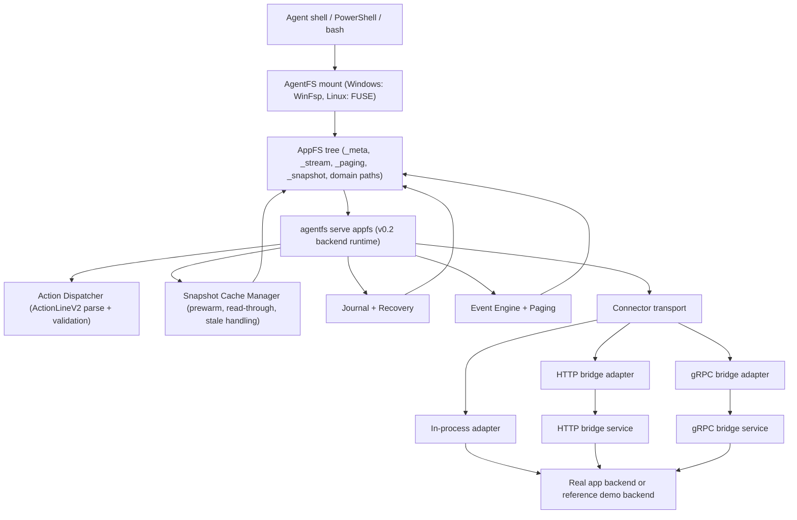

# AppFS

Filesystem-native app protocol for shell-first AI agents.

[中文 README](README.zh-CN.md)

AppFS makes different apps look and feel like one filesystem contract, so an agent can use the same primitives across tools:

1. `cat` for reading resources.
2. `>> *.act` (append JSONL) for triggering actions.
3. `tail -f` on stream files for async results.

This repository currently hosts the AppFS spec, adapter contracts, reference fixtures, conformance tests, and runtime implementation on top of AgentFS.

## Why AppFS

The design target is practical LLM + bash operation:

1. One interaction model across many apps instead of one MCP schema per app.
2. Low token overhead with path-native operations.
3. Stream-first async model with replay support.
4. Runtime-generated request IDs, so clients do not need UUID management.
5. Cross-language adapter compatibility through a frozen contract surface.

## Core Interaction Model

```bash
# 1) subscribe app event stream first
tail -f /app/aiim/_stream/events.evt.jsonl

# 2) trigger an action by append ActionLineV2 JSONL
echo '{"version":2,"client_token":"msg-001","payload":{"text":"hello"}}' >> /app/aiim/contacts/zhangsan/send_message.act

# 3) read resources directly
cat /app/aiim/contacts/zhangsan/profile.res.json

# 4) snapshot resources are full files (.res.jsonl), live resources keep paging
cat /app/aiim/chats/chat-001/messages.res.jsonl | rg "hello"
cat /app/aiim/feed/recommendations.res.json
echo '{"version":2,"client_token":"page-001","payload":{"handle_id":"<from-page>"}}' >> /app/aiim/_paging/fetch_next.act
```

## Available Actions (AIIM Fixture)

Source of truth: `examples/appfs/aiim/_meta/manifest.res.json`.

1. `contacts/{contact_id}/send_message.act`
   - `kind`: `action`
   - `execution_mode`: `inline`
   - `input_mode`: `json`
2. `files/{file_id}/download.act`
   - `kind`: `action`
   - `execution_mode`: `streaming`
   - `input_mode`: `json`
3. `/_paging/fetch_next.act`
   - `kind`: `action`
   - `execution_mode`: `inline`
   - `input_mode`: `json`
4. `/_paging/close.act`
   - `kind`: `action`
   - `execution_mode`: `inline`
   - `input_mode`: `json`
5. `/_snapshot/refresh.act`
   - `kind`: `action`
   - `execution_mode`: `inline`
   - `input_mode`: `json`

## Runtime Quick Start (HTTP Bridge)

This quick start runs the `v0.2` backend runtime with a reference/demo connector exposed through the Python HTTP bridge. It demonstrates the backend protocol path and runtime behavior; it is not a production connector rollout.

Prerequisites:

1. Rust toolchain with `cargo` available.
2. Python environment with `uv` available for the bridge example.
3. Port `127.0.0.1:8080` available for the HTTP bridge.
4. Windows: WinFsp installed before running `agentfs mount`.
5. Linux: FUSE mount support available and a writable mount path prepared.

The runtime demo has five moving parts:

1. AgentFS mount
2. AIIM fixture copied into the mounted tree
3. HTTP bridge connector
4. `agentfs serve appfs` backend runtime
5. A separate terminal that appends `.act` lines and tails `_stream/events.evt.jsonl`

If step 4 is missing, `.act` lines will not be consumed. Mount + bridge alone are not enough.

### Windows (PowerShell, 5 Steps)

1. Mount AgentFS (Terminal A).

```powershell
cd C:\Users\esp3j\rep\agentfs\cli
cargo run -- init win-real
cargo run -- mount .agentfs\win-real.db C:\mnt\win-real --foreground
```

2. Place AIIM fixture into the mountpoint (Terminal B).

```powershell
cd C:\Users\esp3j\rep\agentfs
Copy-Item -Recurse -Force .\examples\appfs\aiim C:\mnt\win-real\aiim
```

3. Start HTTP bridge (Terminal C).

```powershell
cd C:\Users\esp3j\rep\agentfs\examples\appfs\http-bridge\python
uv run python bridge_server.py
```

4. Start AppFS backend runtime (Terminal D).

```powershell
cd C:\Users\esp3j\rep\agentfs\cli
$env:APPFS_ADAPTER_HTTP_ENDPOINT = "http://127.0.0.1:8080"
cargo run -- serve appfs --root C:\mnt\win-real --app-id aiim
```

Expected startup signal:

```text
AppFS adapter using HTTP bridge endpoint: http://127.0.0.1:8080
AppFS adapter started for ...
```

5. Operate files and watch events (Terminal E).

```powershell
# watch stream (separate terminal)
Get-Content C:\mnt\win-real\aiim\_stream\events.evt.jsonl -Wait

# trigger action (append ActionLineV2 JSONL, one JSON object per line)
Add-Content C:\mnt\win-real\aiim\contacts\zhangsan\send_message.act '{"version":2,"client_token":"msg-001","payload":{"text":"hello"}}'

# snapshot resource is directly searchable
Get-Content C:\mnt\win-real\aiim\chats\chat-001\messages.res.jsonl | Select-String "hello"

# live resource keeps paging
Get-Content C:\mnt\win-real\aiim\feed\recommendations.res.json -Raw
Add-Content C:\mnt\win-real\aiim\_paging\fetch_next.act '{"version":2,"client_token":"page-001","payload":{"handle_id":"ph_live_7f2c"}}'
Add-Content C:\mnt\win-real\aiim\_paging\close.act '{"version":2,"client_token":"page-close-001","payload":{"handle_id":"ph_live_7f2c"}}'

# explicit snapshot refresh (cache/materialization checkpoint)
Add-Content C:\mnt\win-real\aiim\_snapshot\refresh.act '{"version":2,"client_token":"refresh-001","payload":{"resource_path":"/chats/chat-001/messages.res.jsonl"}}'

# read resource
Get-Content C:\mnt\win-real\aiim\contacts\zhangsan\profile.res.json -Raw
```

### Linux (bash, 5 Steps)

1. Mount AgentFS (Terminal A).

```bash
cd /path/to/agentfs/cli
cargo run -- init linux-real
mkdir -p /tmp/appfs-real
cargo run -- mount .agentfs/linux-real.db /tmp/appfs-real --foreground
```

2. Place AIIM fixture into the mountpoint (Terminal B).

```bash
cd /path/to/agentfs
cp -R ./examples/appfs/aiim /tmp/appfs-real/aiim
```

3. Start HTTP bridge (Terminal C).

```bash
cd /path/to/agentfs/examples/appfs/http-bridge/python
uv run python bridge_server.py
```

4. Start AppFS backend runtime (Terminal D).

```bash
cd /path/to/agentfs/cli
APPFS_ADAPTER_HTTP_ENDPOINT=http://127.0.0.1:8080 cargo run -- serve appfs --root /tmp/appfs-real --app-id aiim
```

Expected startup signal:

```text
AppFS adapter using HTTP bridge endpoint: http://127.0.0.1:8080
AppFS adapter started for ...
```

5. Operate files and watch events (Terminal E).

```bash
# watch stream (separate terminal)
tail -f /tmp/appfs-real/aiim/_stream/events.evt.jsonl

# trigger action (append ActionLineV2 JSONL)
echo '{"version":2,"client_token":"msg-001","payload":{"text":"hello"}}' >> /tmp/appfs-real/aiim/contacts/zhangsan/send_message.act

# snapshot resource is directly searchable
cat /tmp/appfs-real/aiim/chats/chat-001/messages.res.jsonl | rg "hello"

# live resource keeps paging
cat /tmp/appfs-real/aiim/feed/recommendations.res.json
echo '{"version":2,"client_token":"page-001","payload":{"handle_id":"ph_live_7f2c"}}' >> /tmp/appfs-real/aiim/_paging/fetch_next.act
echo '{"version":2,"client_token":"page-close-001","payload":{"handle_id":"ph_live_7f2c"}}' >> /tmp/appfs-real/aiim/_paging/close.act

# explicit snapshot refresh (cache/materialization checkpoint)
echo '{"version":2,"client_token":"refresh-001","payload":{"resource_path":"/chats/chat-001/messages.res.jsonl"}}' >> /tmp/appfs-real/aiim/_snapshot/refresh.act

# read resource
cat /tmp/appfs-real/aiim/contacts/zhangsan/profile.res.json
```

Notes:

1. `.act` sink semantics are append-only JSONL. Submit with `>>` (or PowerShell `Add-Content`) and write one ActionLineV2 JSON object per line.
2. `serve appfs` must be running before `.act` lines will be consumed. The mount and the bridge do not process action files by themselves.
3. `>` overwrite/truncate on `.act` is treated as illegal mutation and skipped by runtime (with diagnostic logs).
4. Runtime delivery is `at-least-once` for observed lines. Use `client_token`/`request_id` for idempotent dedupe in app logic.
5. Runtime also has compatibility recovery for shell-expanded multiline JSON fragments; it may merge adjacent lines back into one JSON request. Preferred client format is still single-line JSON with escaped `\\n`.

## Architecture

### v0.2 Backend + Connector Call Chain



### What `serve appfs` Does in v0.2

`cargo run -- serve appfs --root ... --app-id ...` starts the AppFS backend runtime. In the current implementation it is a long-running process with a poll/event loop, but its role is no longer a thin v0.1 sidecar.

In v0.2 it is responsible for:

1. loading manifest, action specs, snapshot specs, paging controls, and runtime policy;
2. selecting and initializing the connector transport (in-process / HTTP bridge / gRPC bridge);
3. enforcing ActionLineV2 validation and submit-time reject behavior;
4. driving snapshot prewarm, read-through expansion, timeout fallback, journal recovery, and paging;
5. writing events, replay artifacts, cursors, and materialized resource files back into the mounted tree.

Put differently:

1. **v0.1** `serve appfs`: primarily a sidecar/reference runtime around action sinks and bridge dispatch.
2. **v0.2** `serve appfs`: the backend runtime that owns AppFS protocol semantics, while the connector only provides app-specific upstream calls.

## v0.2 Connector Status

`v0.2.0` should be treated as backend/runtime baseline and contract-gate closure only. Real-app connector onboarding is not claimed as a completed `v0.2` capability and has been moved to the `v0.3` connectorization line.

For current planning and execution baseline, see:

1. [APPFS-v0.3-实施计划.zh-CN.md](docs/v3/APPFS-v0.3-实施计划.zh-CN.md)

## v0.1 Legacy Reference

`v0.1` is frozen and retained as legacy/reference/baseline material. New integrations should target the `v0.3` connectorization path by default.

For v0.1 reference materials, see:

1. [APPFS-v0.1.md](docs/v1/APPFS-v0.1.md)
2. [APPFS-adapter-developer-guide-v0.1.md](docs/v1/APPFS-adapter-developer-guide-v0.1.md)
3. [APPFS-contract-tests-v0.1.md](docs/v1/APPFS-contract-tests-v0.1.md)

## Repository Map (AppFS-Relevant)

1. `docs/v2/APPFS-v0.2-总览.zh-CN.md`: v0.2 goals, terminology, and scope.
2. `docs/v2/APPFS-v0.2-Connector接口.zh-CN.md`: connector contract and minimum capability surface.
3. `docs/v2/APPFS-v0.2-后端架构.zh-CN.md`: backend component boundaries, state machine, and data flow.
4. `docs/v2/APPFS-v0.2-合同测试CT2.zh-CN.md`: required and informational contract cases.
5. `docs/v3/APPFS-v0.3-实施计划.zh-CN.md`: v0.3 connectorization scope, issue map, and gates.
6. `examples/appfs/`: reference fixtures and bridge examples.
7. `cli/src/cmd/appfs/`: AppFS runtime modules (`core`, `snapshot_cache`, `recovery`, `events`, `paging`).

## Current Status

AppFS v0.2 implementation is complete for the current round:

1. Phase A through Phase E are completed.
2. Linux required contract set `CT2-001..009` is green.
3. `CT2-010` minimal cross-platform matrix is available as informational evidence.
4. Real-app connector onboarding is not a claimed `v0.2` completion item; it is tracked in the `v0.3` line.
5. `v0.1` remains in the repo as baseline/reference material and regression context.

For release and closeout details, see:

1. [APPFS-v0.2-实施计划.zh-CN.md](docs/v2/APPFS-v0.2-实施计划.zh-CN.md)
2. [APPFS-v0.2-完成总结-2026-03-22.zh-CN.md](docs/v2/APPFS-v0.2-完成总结-2026-03-22.zh-CN.md)
3. [APPFS-v0.2-RC迁移与上线包.zh-CN.md](docs/v2/APPFS-v0.2-RC迁移与上线包.zh-CN.md)
4. [APPFS-v0.2-RC门禁证据包.zh-CN.md](docs/v2/APPFS-v0.2-RC门禁证据包.zh-CN.md)

## License

MIT
