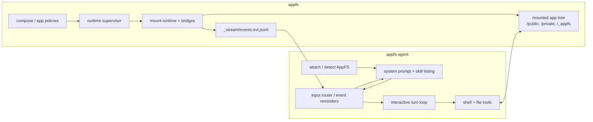
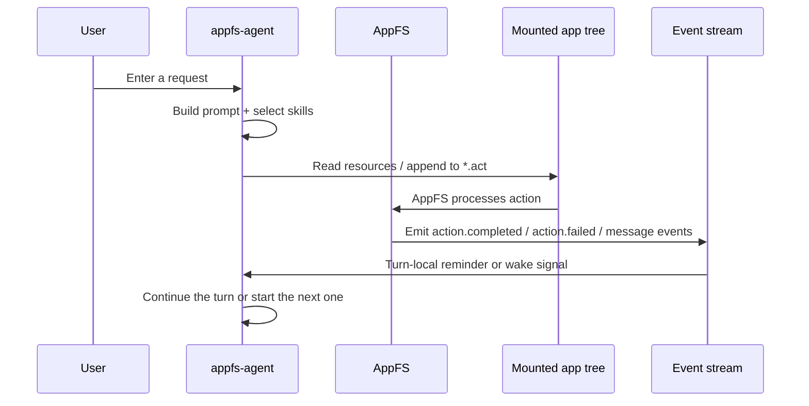

# appfs-platform

Monorepo for the AppFS stack:

- `appfs/`: the filesystem protocol, runtime, bridges, SDKs, and contract suites
- `appfs-agent/`: the agent runtime that operates on top of AppFS
- `integration/`: cross-project scripts, fixtures, and end-to-end test scaffolding

## Why This Repo Exists

`appfs` and `appfs-agent` are separate layers, but they now evolve together:

- AppFS defines the filesystem-native app contract
- `appfs-agent` consumes that contract as an agent runtime
- integration work frequently changes both layers at once

This monorepo keeps those layers separate in code layout while making joint development, CI, and end-to-end testing easier.

## Stack Architecture

At a high level, AppFS owns the mounted app surface and runtime state, while `appfs-agent` owns the model loop, prompt assembly, and tool-driven interaction.



## Interaction Flow

The usual loop is:



In practice this means:

- AppFS materializes app state as files and streams.
- `appfs-agent` reads those files, writes actions, and reacts to AppFS events.
- `integration/` holds the scripts that verify both sides together.

## Layout

```text
.
├── appfs/
├── appfs-agent/
├── docs/
│   └── adr/
└── integration/
    ├── fixtures/
    ├── scripts/
    └── tests/
```

## Recommended Workflow

Treat the standalone repositories as the source of truth for component code, and treat this monorepo as the integration repo:

- `appfs/` code originates in the standalone `appfs` repository
- `appfs-agent/` code originates in the standalone `appfs-agent` repository
- `integration/` assets, end-to-end scenarios, and cross-project glue live here

Work in the subproject that owns the change:

- AppFS protocol, mount/runtime, bridges, adapters: `appfs/`
- agent runtime, tools, sessions, hooks, providers: `appfs-agent/`
- end-to-end mount + agent scenarios: `integration/`

Prefer adding integration assets only when a scenario truly spans both systems.

Default sync flow:

1. `claw-code-parity` -> standalone `appfs-agent`
2. standalone `appfs-agent` -> `appfs-platform/appfs-agent`
3. standalone `appfs` -> `appfs-platform/appfs`

Avoid syncing `claw-code-parity` directly into this monorepo.

## Sync Scripts

The monorepo includes subtree sync helpers under [integration/scripts](C:/Users/esp3j/rep/appfs-platform/integration/scripts):

- `sync-appfs.ps1`
- `sync-appfs-agent.ps1`

They pull the latest standalone repositories into the matching monorepo subdirectories with `git subtree pull --squash`.

## Source Of Truth

This repository is the source of truth for:

- integration scripts
- end-to-end fixtures
- combined CI
- cross-project documentation and ADRs

This repository is not the default source of truth for component internals. If a change belongs purely to `appfs` or `appfs-agent`, land it in the standalone repository first and then sync it here.

## Initial CI Scope

The root CI currently covers:

- `appfs-agent` Rust workspace on Ubuntu, Windows, and macOS
- `appfs-agent` repository-level Python tests
- `appfs` core Linux contract gate

This keeps the combined repo practical to work in while preserving the highest-signal checks for the two active layers.

## Current Import Points

This monorepo was initialized from the current working branches of the two source repositories:

- `appfs`: imported from the current `agentfs` HEAD
- `appfs-agent`: imported from the current `claw-code` HEAD

See [ADR 0002](C:/Users/esp3j/rep/appfs-platform/docs/adr/0002-repo-workflow.md) for the ongoing repository workflow and sync policy.
