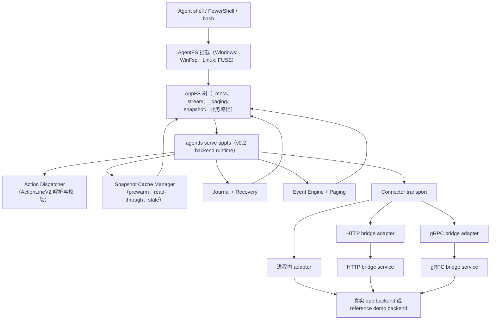

# AppFS

面向 shell-first AI agent 的文件系统原生应用协议。

[English README](README.md)

AppFS 的目标是把不同应用统一成一套文件系统交互模型，让 agent 用一致命令操作不同 app：

1. 用 `cat` 读取资源。
2. 用 `>> *.act`（append JSONL）触发动作。
3. 用 `tail -f` 订阅异步事件流。

本仓库当前包含 AppFS 规范、适配器契约、参考夹具、一致性测试，以及基于 AgentFS 的 runtime 实现。

## 为什么是 AppFS

核心设计面向 LLM + bash 的实际操作：

1. 不再为每个 App 记一套 MCP 参数格式。
2. 路径即语义，token 开销更低。
3. 流优先的异步模型，支持重放。
4. 运行时自动生成 request_id，模型不用自己造 UUID。
5. 契约冻结后，可跨语言实现适配器。

## 核心交互模型

```bash
# 1) 先订阅事件流
tail -f /app/aiim/_stream/events.evt.jsonl

# 2) 以 append ActionLineV2 JSONL 触发动作
echo '{"version":2,"client_token":"msg-001","payload":{"text":"hello"}}' >> /app/aiim/contacts/zhangsan/send_message.act

# 3) 直接读取资源
cat /app/aiim/contacts/zhangsan/profile.res.json

# 4) snapshot 资源是完整文件（.res.jsonl），live 资源继续分页
cat /app/aiim/chats/chat-001/messages.res.jsonl | rg "hello"
cat /app/aiim/feed/recommendations.res.json
echo '{"version":2,"client_token":"page-001","payload":{"handle_id":"<from-page>"}}' >> /app/aiim/_paging/fetch_next.act
```

## 可用动作（AIIM 夹具）

事实来源：`examples/appfs/aiim/_meta/manifest.res.json`。

1. `contacts/{contact_id}/send_message.act`
   - `kind`: `action`
   - `execution_mode`: `inline`
   - `input_mode`: `json`
2. `files/{file_id}/download.act`
   - `kind`: `action`
   - `execution_mode`: `streaming`
   - `input_mode`: `json`
3. `/_paging/fetch_next.act`
   - `kind`: `action`
   - `execution_mode`: `inline`
   - `input_mode`: `json`
4. `/_paging/close.act`
   - `kind`: `action`
   - `execution_mode`: `inline`
   - `input_mode`: `json`
5. `/_snapshot/refresh.act`
   - `kind`: `action`
   - `execution_mode`: `inline`
   - `input_mode`: `json`

## 运行时快速开始（HTTP Bridge）

这套 quick start 运行的是 `v0.2` backend runtime，加上通过 Python HTTP bridge 暴露的 reference/demo connector。它展示的是 backend 协议链路和 runtime 行为，不等于生产 connector 已接入完成。

环境前置条件：

1. 已安装 Rust toolchain，且 `cargo` 可用。
2. 已准备 Python 环境，且 bridge 示例可通过 `uv` 运行。
3. `127.0.0.1:8080` 端口未被占用。
4. Windows：运行 `agentfs mount` 前已安装 WinFsp。
5. Linux：具备 FUSE 挂载能力，且已准备可写挂载目录。

这个 runtime demo 有五个组成部分：

1. AgentFS 挂载
2. 将 AIIM fixture 拷入挂载树
3. 启动 HTTP bridge connector
4. 启动 `agentfs serve appfs` backend runtime
5. 用单独终端 append `.act` 并 tail `_stream/events.evt.jsonl`

如果缺少第 4 步，`.act` 写入不会被消费。只有 mount 和 bridge 还不够。

### Windows（PowerShell，5 步）

1. 挂载 AgentFS（终端 A）。

```powershell
cd C:\Users\esp3j\rep\agentfs\cli
cargo run -- init win-real
cargo run -- mount .agentfs\win-real.db C:\mnt\win-real --foreground
```

2. 把 AIIM fixture 放到挂载点（终端 B）。

```powershell
cd C:\Users\esp3j\rep\agentfs
Copy-Item -Recurse -Force .\examples\appfs\aiim C:\mnt\win-real\aiim
```

3. 启动 HTTP bridge（终端 C）。

```powershell
cd C:\Users\esp3j\rep\agentfs\examples\appfs\http-bridge\python
uv run python bridge_server.py
```

4. 启动 AppFS backend runtime（终端 D）。

```powershell
cd C:\Users\esp3j\rep\agentfs\cli
$env:APPFS_ADAPTER_HTTP_ENDPOINT = "http://127.0.0.1:8080"
cargo run -- serve appfs --root C:\mnt\win-real --app-id aiim
```

预期启动信号：

```text
AppFS adapter using HTTP bridge endpoint: http://127.0.0.1:8080
AppFS adapter started for ...
```

5. 操作文件并观察事件（终端 E）。

```powershell
# 订阅事件流（单独终端）
Get-Content C:\mnt\win-real\aiim\_stream\events.evt.jsonl -Wait

# 触发动作（append ActionLineV2 JSONL，一行一个 JSON 对象）
Add-Content C:\mnt\win-real\aiim\contacts\zhangsan\send_message.act '{"version":2,"client_token":"msg-001","payload":{"text":"hello"}}'

# snapshot 资源可直接检索
Get-Content C:\mnt\win-real\aiim\chats\chat-001\messages.res.jsonl | Select-String "hello"

# live 资源继续分页
Get-Content C:\mnt\win-real\aiim\feed\recommendations.res.json -Raw
Add-Content C:\mnt\win-real\aiim\_paging\fetch_next.act '{"version":2,"client_token":"page-001","payload":{"handle_id":"ph_live_7f2c"}}'
Add-Content C:\mnt\win-real\aiim\_paging\close.act '{"version":2,"client_token":"page-close-001","payload":{"handle_id":"ph_live_7f2c"}}'

# 显式触发 snapshot 刷新（缓存/物化检查点）
Add-Content C:\mnt\win-real\aiim\_snapshot\refresh.act '{"version":2,"client_token":"refresh-001","payload":{"resource_path":"/chats/chat-001/messages.res.jsonl"}}'

# 读取资源
Get-Content C:\mnt\win-real\aiim\contacts\zhangsan\profile.res.json -Raw
```

### Linux（bash，5 步）

1. 挂载 AgentFS（终端 A）。

```bash
cd /path/to/agentfs/cli
cargo run -- init linux-real
mkdir -p /tmp/appfs-real
cargo run -- mount .agentfs/linux-real.db /tmp/appfs-real --foreground
```

2. 把 AIIM fixture 放到挂载点（终端 B）。

```bash
cd /path/to/agentfs
cp -R ./examples/appfs/aiim /tmp/appfs-real/aiim
```

3. 启动 HTTP bridge（终端 C）。

```bash
cd /path/to/agentfs/examples/appfs/http-bridge/python
uv run python bridge_server.py
```

4. 启动 AppFS backend runtime（终端 D）。

```bash
cd /path/to/agentfs/cli
APPFS_ADAPTER_HTTP_ENDPOINT=http://127.0.0.1:8080 cargo run -- serve appfs --root /tmp/appfs-real --app-id aiim
```

预期启动信号：

```text
AppFS adapter using HTTP bridge endpoint: http://127.0.0.1:8080
AppFS adapter started for ...
```

5. 操作文件并观察事件（终端 E）。

```bash
# 订阅事件流（单独终端）
tail -f /tmp/appfs-real/aiim/_stream/events.evt.jsonl

# 触发动作（append ActionLineV2 JSONL）
echo '{"version":2,"client_token":"msg-001","payload":{"text":"hello"}}' >> /tmp/appfs-real/aiim/contacts/zhangsan/send_message.act

# snapshot 资源可直接检索
cat /tmp/appfs-real/aiim/chats/chat-001/messages.res.jsonl | rg "hello"

# live 资源继续分页
cat /tmp/appfs-real/aiim/feed/recommendations.res.json
echo '{"version":2,"client_token":"page-001","payload":{"handle_id":"ph_live_7f2c"}}' >> /tmp/appfs-real/aiim/_paging/fetch_next.act
echo '{"version":2,"client_token":"page-close-001","payload":{"handle_id":"ph_live_7f2c"}}' >> /tmp/appfs-real/aiim/_paging/close.act

# 显式触发 snapshot 刷新（缓存/物化检查点）
echo '{"version":2,"client_token":"refresh-001","payload":{"resource_path":"/chats/chat-001/messages.res.jsonl"}}' >> /tmp/appfs-real/aiim/_snapshot/refresh.act

# 读取资源
cat /tmp/appfs-real/aiim/contacts/zhangsan/profile.res.json
```

注意：

1. `.act` 统一为 append-only JSONL：使用 `>>`（或 PowerShell `Add-Content`）提交，一行一个 ActionLineV2 JSON 对象。
2. `serve appfs` 必须运行，`.act` 写入才会被消费。仅有 mount 和 bridge 不会处理动作文件。
3. 对 `.act` 使用 `>` 覆写/截断会被视为非法变更，runtime 只记录诊断日志并跳过该批内容。
4. 运行时语义为 `at-least-once`，建议业务层基于 `client_token`/`request_id` 做幂等去重。
5. runtime 会兼容 shell 展开导致的多行 JSON 片段，并尝试合并相邻行恢复为单次请求；推荐写法仍是单行 JSON，并在字符串中使用转义 `\\n`。

## 架构

### v0.2 Backend + Connector 调用链



### v0.2 中 `serve appfs` 的职责

`cargo run -- serve appfs --root ... --app-id ...` 启动的是 AppFS backend runtime。当前实现里它仍然是一个长驻进程，内部有 poll/event loop，但它已经不再是 v0.1 那种薄 sidecar。

在 v0.2 里它负责：

1. 装载 manifest、action spec、snapshot spec、paging 控制与运行策略；
2. 选择并初始化 connector transport（进程内 / HTTP bridge / gRPC bridge）；
3. 执行 ActionLineV2 校验与 submit-time reject；
4. 驱动 snapshot prewarm、read-through、timeout fallback、journal recovery 与 paging；
5. 把事件、重放、cursor 与物化资源文件回写到挂载树。

换句话说：

1. **v0.1** 的 `serve appfs`：更接近 sidecar/reference runtime，主要围绕 action sink 和 bridge 转发。
2. **v0.2** 的 `serve appfs`：是承接 AppFS 协议语义的 backend runtime，connector 只负责 app-specific 的上游调用。

## v0.2 Connector 状态说明

`v0.2.0` 的定位是 backend/runtime 基线与合同门禁收口，不再作为“真实 app connector 可直接对接”的完成能力声明。真实 app 的 connector 化已转入 `v0.3` 主线。

当前规划与执行基线请看：

1. [APPFS-v0.3-实施计划.zh-CN.md](docs/v3/APPFS-v0.3-实施计划.zh-CN.md)

## v0.1 Legacy Reference（遗留参考）

`v0.1` 已冻结，当前定位是 legacy/reference/baseline。新的接入默认走 `v0.3 connectorization` 路线。

如需查看 v0.1 参考资料，请跳转：

1. [APPFS-v0.1.md](docs/v1/APPFS-v0.1.md)
2. [APPFS-adapter-developer-guide-v0.1.zh-CN.md](docs/v1/APPFS-adapter-developer-guide-v0.1.zh-CN.md)
3. [APPFS-contract-tests-v0.1.zh-CN.md](docs/v1/APPFS-contract-tests-v0.1.zh-CN.md)

## AppFS 相关目录

1. `docs/v2/APPFS-v0.2-总览.zh-CN.md`：v0.2 目标、边界与术语。
2. `docs/v2/APPFS-v0.2-Connector接口.zh-CN.md`：connector 契约与最小能力面。
3. `docs/v2/APPFS-v0.2-后端架构.zh-CN.md`：backend 组件边界、状态机与数据流。
4. `docs/v2/APPFS-v0.2-合同测试CT2.zh-CN.md`：required / informational 合同测试集。
5. `docs/v3/APPFS-v0.3-实施计划.zh-CN.md`：v0.3 connectorization 范围、issue 清单与门禁口径。
6. `examples/appfs/`：参考夹具与 bridge 示例。
7. `cli/src/cmd/appfs/`：AppFS runtime 分层模块（`core`、`snapshot_cache`、`recovery`、`events`、`paging`）。

## 当前状态

当前仓库中的 AppFS v0.2 本轮实现已完成：

1. Phase A ~ E 已收口。
2. Linux required 集 `CT2-001..009` 已完成。
3. `CT2-010` 最小跨平台矩阵已完成，作为 informational 证据保留。
4. 真实 app connector 对接不作为 `v0.2` 已完成项，已转入 `v0.3` 主线跟进。
5. `v0.1` 保留为 baseline/reference 与回归对照材料。

收口与发布相关文档：

1. [APPFS-v0.2-实施计划.zh-CN.md](docs/v2/APPFS-v0.2-实施计划.zh-CN.md)
2. [APPFS-v0.2-完成总结-2026-03-22.zh-CN.md](docs/v2/APPFS-v0.2-完成总结-2026-03-22.zh-CN.md)
3. [APPFS-v0.2-RC迁移与上线包.zh-CN.md](docs/v2/APPFS-v0.2-RC迁移与上线包.zh-CN.md)
4. [APPFS-v0.2-RC门禁证据包.zh-CN.md](docs/v2/APPFS-v0.2-RC门禁证据包.zh-CN.md)

## 许可证

MIT
