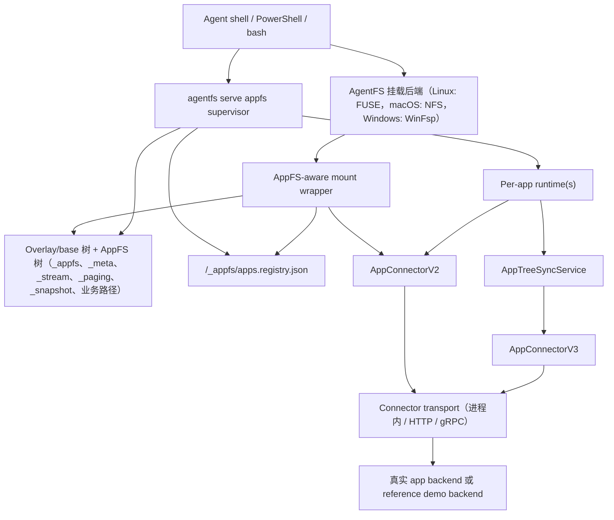

# AppFS

面向 shell-first AI agent 的文件系统原生应用协议。

[English README](README.md)

AppFS 的目标是把不同应用统一成一套文件系统交互模型，让 agent 用一致命令操作不同 app：

1. 用 `cat` 读取资源。
2. 用 `>> *.act`（append JSONL）触发动作。
3. 用 `tail -f` 订阅异步事件流。

本仓库当前包含 AppFS 规范、适配器契约、参考夹具、一致性测试，以及基于 AgentFS 的 runtime 实现。

## 为什么是 AppFS

核心设计面向 LLM + bash 的实际操作：

1. 不再为每个 App 记一套 MCP 参数格式。
2. 路径即语义，token 开销更低。
3. 流优先的异步模型，支持重放。
4. 运行时自动生成 request_id，模型不用自己造 UUID。
5. 契约冻结后，可跨语言实现适配器。

## 核心交互模型

```bash
# 1) 先订阅事件流
tail -f /app/aiim/_stream/events.evt.jsonl

# 2) 以 append ActionLineV2 JSONL 触发动作
echo '{"version":2,"client_token":"msg-001","payload":{"text":"hello"}}' >> /app/aiim/contacts/zhangsan/send_message.act

# 3) 直接读取资源
cat /app/aiim/contacts/zhangsan/profile.res.json

# 4) snapshot 资源是完整文件（.res.jsonl），live 资源继续分页
cat /app/aiim/chats/chat-001/messages.res.jsonl | rg "hello"
cat /app/aiim/feed/recommendations.res.json
echo '{"version":2,"client_token":"page-001","payload":{"handle_id":"<from-page>"}}' >> /app/aiim/_paging/fetch_next.act
```

## 可用动作（AIIM 夹具）

事实来源：`examples/appfs/aiim/_meta/manifest.res.json`。

1. `contacts/{contact_id}/send_message.act`
   - `kind`: `action`
   - `execution_mode`: `inline`
   - `input_mode`: `json`
2. `files/{file_id}/download.act`
   - `kind`: `action`
   - `execution_mode`: `streaming`
   - `input_mode`: `json`
3. `/_paging/fetch_next.act`
   - `kind`: `action`
   - `execution_mode`: `inline`
   - `input_mode`: `json`
4. `/_paging/close.act`
   - `kind`: `action`
   - `execution_mode`: `inline`
   - `input_mode`: `json`
5. `/_snapshot/refresh.act`
   - `kind`: `action`
   - `execution_mode`: `inline`
   - `input_mode`: `json`

## 运行时模式

仓库当前有两条实际可用的 AppFS 运行时模式：

1. 显式 bootstrap 模式（`v0.3` 基线）
   - `agentfs mount` 使用 `--appfs-app-id` / `--appfs-app`
   - `agentfs serve appfs` 使用 `--app-id` / `--app`
   - connector endpoint 直接通过 CLI 传入
   - 适合固定 demo、兼容性测试和简单单 app 场景
2. managed registry 模式（当前 `v0.4` 开发主路径）
   - `agentfs mount` 使用 `--managed-appfs`
   - `agentfs serve appfs` 使用 `--managed`
   - 共享的 app/runtime 路由落在 `/_appfs/apps.registry.json`
   - app 可在运行时通过 `/_appfs/register_app.act` / `/_appfs/unregister_app.act` 动态增删
   - app 结构初始化、scope 切换和刷新走 `AppConnectorV3`

这两种模式都保留了 mount-side snapshot read-through，以及 runtime-side action/event/control 处理。

## 运行时快速开始

### 模式 A：显式单 App HTTP Bridge（`v0.3` 基线）

这套 quick start 对应稳定的单 app bootstrap 主路径：

1. `agentfs mount` 从 `--base` 夹具暴露 app 树，并在普通文件读取时自动扩展 cold snapshot。
2. `agentfs serve appfs` 负责 action/event/control plane。
3. mount 和 runtime 都通过 `AppConnectorV2` 走 connector 调用，reference/demo connector 由 Python HTTP bridge 暴露。

环境前置条件：

1. 已安装 Rust toolchain，且 `cargo` 可用。
2. 已准备 Python 环境，且 bridge 示例可通过 `uv` 运行。
3. `127.0.0.1:8080` 端口未被占用。
4. Windows：运行 `agentfs mount` 前已安装 WinFsp。
5. Linux：具备 FUSE 挂载能力，且已准备可写挂载目录。

这个 runtime demo 有四个组成部分：

1. 以 `examples/appfs` 作为 `--base` 初始化 AgentFS overlay
2. 启动 HTTP bridge connector
3. 启动带 AppFS read-through 的 `agentfs mount`
4. 启动 `agentfs serve appfs` backend runtime

AIIM fixture 不再需要手动拷入挂载点。它会直接从 `--base` 树暴露出来；snapshot 在第一次普通读取时物化，`.act` 处理仍然需要 `serve appfs`。

### Windows（PowerShell，5 步）

1. 以 demo fixture 初始化 AgentFS overlay（终端 A）。

```powershell
cd C:\Users\esp3j\rep\agentfs\cli
cargo run -- init win-real --force --base ..\examples\appfs
```

2. 启动 HTTP bridge（终端 B）。

```powershell
cd C:\Users\esp3j\rep\agentfs\examples\appfs\http-bridge\python
uv run python bridge_server.py
```

3. 启动带 AppFS read-through 的挂载（终端 C）。

```powershell
cd C:\Users\esp3j\rep\agentfs\cli
cargo run -- mount .agentfs\win-real.db C:\mnt\win-real --backend winfsp --foreground --appfs-app-id aiim --adapter-http-endpoint http://127.0.0.1:8080
```

4. 启动 AppFS backend runtime（终端 D）。

```powershell
cd C:\Users\esp3j\rep\agentfs\cli
cargo run -- serve appfs --root C:\mnt\win-real --app-id aiim --adapter-http-endpoint http://127.0.0.1:8080
```

预期启动信号：

```text
AppFS adapter using HTTP bridge endpoint: http://127.0.0.1:8080
AppFS adapter started for ...
```

5. 操作文件并观察事件（终端 E）。

```powershell
# 订阅事件流（单独终端）
Get-Content C:\mnt\win-real\aiim\_stream\events.evt.jsonl -Wait

# 触发动作（append ActionLineV2 JSONL，一行一个 JSON 对象）
Add-Content C:\mnt\win-real\aiim\contacts\zhangsan\send_message.act '{"version":2,"client_token":"msg-001","payload":{"text":"hello"}}'

# snapshot cold miss 会在普通读取时自动扩展
Get-Content C:\mnt\win-real\aiim\chats\chat-001\messages.res.jsonl | Select-String "hello"

# live 资源继续分页
Get-Content C:\mnt\win-real\aiim\feed\recommendations.res.json -Raw
Add-Content C:\mnt\win-real\aiim\_paging\fetch_next.act '{"version":2,"client_token":"page-001","payload":{"handle_id":"ph_live_7f2c"}}'
Add-Content C:\mnt\win-real\aiim\_paging\close.act '{"version":2,"client_token":"page-close-001","payload":{"handle_id":"ph_live_7f2c"}}'

# 显式 snapshot refresh 仍保留为控制面
Add-Content C:\mnt\win-real\aiim\_snapshot\refresh.act '{"version":2,"client_token":"refresh-001","payload":{"resource_path":"/chats/chat-001/messages.res.jsonl"}}'

# 读取资源
Get-Content C:\mnt\win-real\aiim\contacts\zhangsan\profile.res.json -Raw
```

### Linux（bash，5 步）

1. 以 demo fixture 初始化 AgentFS overlay（终端 A）。

```bash
cd /path/to/agentfs/cli
cargo run -- init linux-real --force --base ../examples/appfs
```

2. 启动 HTTP bridge（终端 B）。

```bash
cd /path/to/agentfs/examples/appfs/http-bridge/python
uv run python bridge_server.py
```

3. 启动带 AppFS read-through 的挂载（终端 C）。

```bash
cd /path/to/agentfs/cli
mkdir -p /tmp/appfs-real
cargo run -- mount .agentfs/linux-real.db /tmp/appfs-real --backend fuse --foreground --appfs-app-id aiim --adapter-http-endpoint http://127.0.0.1:8080
```

4. 启动 AppFS backend runtime（终端 D）。

```bash
cd /path/to/agentfs/cli
cargo run -- serve appfs --root /tmp/appfs-real --app-id aiim --adapter-http-endpoint http://127.0.0.1:8080
```

预期启动信号：

```text
AppFS adapter using HTTP bridge endpoint: http://127.0.0.1:8080
AppFS adapter started for ...
```

5. 操作文件并观察事件（终端 E）。

```bash
# 订阅事件流（单独终端）
tail -f /tmp/appfs-real/aiim/_stream/events.evt.jsonl

# 触发动作（append ActionLineV2 JSONL）
echo '{"version":2,"client_token":"msg-001","payload":{"text":"hello"}}' >> /tmp/appfs-real/aiim/contacts/zhangsan/send_message.act

# snapshot cold miss 会在普通读取时自动扩展
cat /tmp/appfs-real/aiim/chats/chat-001/messages.res.jsonl | rg "hello"

# live 资源继续分页
cat /tmp/appfs-real/aiim/feed/recommendations.res.json
echo '{"version":2,"client_token":"page-001","payload":{"handle_id":"ph_live_7f2c"}}' >> /tmp/appfs-real/aiim/_paging/fetch_next.act
echo '{"version":2,"client_token":"page-close-001","payload":{"handle_id":"ph_live_7f2c"}}' >> /tmp/appfs-real/aiim/_paging/close.act

# 显式 snapshot refresh 仍保留为控制面
echo '{"version":2,"client_token":"refresh-001","payload":{"resource_path":"/chats/chat-001/messages.res.jsonl"}}' >> /tmp/appfs-real/aiim/_snapshot/refresh.act

# 读取资源
cat /tmp/appfs-real/aiim/contacts/zhangsan/profile.res.json
```

注意：

1. `.act` 统一为 append-only JSONL：使用 `>>`（或 PowerShell `Add-Content`）提交，一行一个 ActionLineV2 JSON 对象。
2. app 树来自 `--base`；demo 不再需要手工把 `examples/appfs/aiim` 拷到挂载点。
3. 启用 mount-side AppFS 后，snapshot `*.res.jsonl` 在 `cat`、`Get-Content`、`head`、`sed` 等普通读取 cold miss 时会自动扩展。
4. `serve appfs` 必须运行，`.act` 写入才会被消费。仅有 mount 和 bridge 不会处理动作文件。
5. `/_snapshot/refresh.act` 仍然保留，用于显式预取、强制重物化和 revalidate。
6. 真实 app 接入时，把 `../examples/appfs` 换成你自己的 app root/fixture，并确保其中已经包含 app 目录和 `_meta/manifest.res.json`。
7. 对 `.act` 使用 `>` 覆写/截断会被视为非法变更，runtime 只记录诊断日志并跳过该批内容。
8. 运行时语义为 `at-least-once`，建议业务层基于 `client_token`/`request_id` 做幂等去重。
9. runtime 会兼容 shell 展开导致的多行 JSON 片段，并尝试合并相邻行恢复为单次请求；推荐写法仍是单行 JSON，并在字符串中使用转义 `\\n`。

### 模式 B：Managed Registry + 动态 App 生命周期（Windows PowerShell 示例）

当你要测试运行时动态注册 app、结构同步、scope 切换或多 app 路由时，使用这条路径更合适。mount 和 runtime 共享同一份 `/_appfs/apps.registry.json`，因此启动时不需要重复传 app ID 和 connector endpoint。

1. 启动 HTTP bridge（终端 A）。

```powershell
cd C:\Users\esp3j\rep\agentfs\examples\appfs\http-bridge\python
uv run python bridge_server.py
```

2. 初始化一个空 AgentFS（终端 B）。

```powershell
cd C:\Users\esp3j\rep\agentfs\cli
cargo run -- init managed-http --force
```

3. 以 managed 模式挂载 AgentFS（终端 C）。

```powershell
cd C:\Users\esp3j\rep\agentfs\cli
cargo run -- mount .agentfs\managed-http.db C:\mnt\appfs-managed-http --backend winfsp --foreground --managed-appfs
```

4. 以 managed 模式启动 runtime supervisor（终端 D）。

```powershell
cd C:\Users\esp3j\rep\agentfs\cli
cargo run -- serve appfs --root C:\mnt\appfs-managed-http --managed
```

5. 订阅 root-level 生命周期事件流（终端 E）。

```powershell
Get-Content C:\mnt\appfs-managed-http\_appfs\_stream\events.evt.jsonl -Wait
```

6. 运行时注册一个 app（终端 F）。

```powershell
Add-Content C:\mnt\appfs-managed-http\_appfs\register_app.act '{"app_id":"aiim","transport":{"kind":"http","endpoint":"http://127.0.0.1:8080","http_timeout_ms":5000,"grpc_timeout_ms":5000,"bridge_max_retries":2,"bridge_initial_backoff_ms":100,"bridge_max_backoff_ms":1000,"bridge_circuit_breaker_failures":5,"bridge_circuit_breaker_cooldown_ms":3000},"client_token":"reg-http-001"}'
```

7. 切换 scope，并从 managed mount 路径直接读取 snapshot。

```powershell
Add-Content C:\mnt\appfs-managed-http\aiim\_app\enter_scope.act '{"target_scope":"chat-long","client_token":"scope-http-001"}'
Get-Content C:\mnt\appfs-managed-http\aiim\chats\chat-long\messages.res.jsonl | Select-Object -First 5
```

8. 使用完成后注销 app。

```powershell
Add-Content C:\mnt\appfs-managed-http\_appfs\unregister_app.act '{"app_id":"aiim","client_token":"unreg-http-001"}'
Get-Content C:\mnt\appfs-managed-http\_appfs\apps.registry.json -Raw
```

Managed 模式说明：

1. `serve appfs --managed` 可以从空 registry 启动；即使还没有任何 app，root-level 的 `/_appfs` 控制面也已经存在。
2. `register_app.act` 会把 transport/session 配置持久化进 `/_appfs/apps.registry.json`，`mount --managed-appfs` 会复用这份 registry 做 read-through 路由。
3. `/_app/enter_scope.act` 和 `/_app/refresh_structure.act` 是 per-app 控制动作，由 `AppConnectorV3` 驱动。
4. `unregister_app.act` 会移除 runtime ownership 和 registry membership，但默认不会删除磁盘上的 app 目录。
5. Linux 下也可使用同一套模式，只需把 `--backend` 换成 `fuse`，并替换挂载点与 shell 命令。

## 架构

### 当前 Runtime 拓扑



### 当前职责拆分

现在的架构仍然是显式分成 `mount` 和 `serve appfs` 两部分，但 `AppConnectorV2` 与 `AppConnectorV3` 的职责已经分层。

`agentfs mount` 负责：

1. 暴露 overlay/base 树与 AppFS 视图；
2. 从显式 CLI 参数（`--appfs-app-id` / `--appfs-app`）或 shared managed registry（`--managed-appfs`）装载 app 路由；
3. 装载普通读取拦截所需的 manifest/snapshot 声明；
4. 在已声明 `*.res.jsonl` 的 `lookup/open` 上执行 snapshot cold-miss 自动扩展；
5. 把物化后的 snapshot JSONL、journal 状态和 recovery 工件写回挂载树。

`agentfs serve appfs` 负责：

1. 拥有 action/event/control plane；
2. 选择并初始化 connector transport（进程内 / HTTP bridge / gRPC bridge）；
3. 执行 ActionLineV2 校验与 submit-time reject；
4. 通过 `AppConnectorV2` 驱动 action submit、事件发射、live paging、startup prewarm、显式 `/_snapshot/refresh.act` 和 runtime recovery；
5. 通过 `AppConnectorV3` 完成 connector-owned 结构初始化与刷新；
6. 在 managed 模式下，负责 `/_appfs/register_app.act`、`/_appfs/unregister_app.act`、`/_appfs/list_apps.act` 以及 `/_appfs/apps.registry.json` 的同步。

契约面拆分：

1. `AppConnectorV2` 负责 action submit、startup prewarm、snapshot chunk fetch 和 live paging。
2. `AppConnectorV3` 负责 app 结构 bootstrap、`enter_scope` 和 structure refresh。
3. 普通文件读取仍走 mount 路径；action/event/control 仍走 `serve appfs`。

## 发布轨道

### v0.3 已发布基线

`v0.3` 仍然是当前仓库对外发布的 connectorization 基线。

已完成并可稳定宣称：

1. runtime 默认主路径切到 `AppConnectorV2`（in-process / HTTP bridge / gRPC bridge）。
2. prewarm、snapshot chunk、live paging、submit action 全部走 connector V2 能力面。
3. HTTP/gRPC reference bridge 已提供 V2 connector 协议面。
4. CT2/CI 门禁已加入 runtime-derived connector evidence 断言。

收口详情见：

1. [APPFS-v0.3-完成总结-2026-03-24.zh-CN.md](docs/v3/APPFS-v0.3-完成总结-2026-03-24.zh-CN.md)

### v0.4 仓库内开发主线

仓库当前分支还包含 `v0.4` 的 app structure sync + managed runtime 工作流。这部分已经可以在仓库内测试，但目前还没有单独作为新的仓库级 release note 对外宣称。

当前已在树内完成：

1. in-process / HTTP bridge / gRPC bridge 三条路径的 `AppConnectorV3` 结构同步能力。
2. `AppTreeSyncService`，以及 `/_app/enter_scope.act` / `/_app/refresh_structure.act`。
3. shared managed registry：`/_appfs/apps.registry.json`。
4. 动态 app 生命周期：`/_appfs/register_app.act`、`/_appfs/unregister_app.act`、`/_appfs/list_apps.act`。
5. multi-app runtime supervisor 与 mount-side `--managed-appfs` 路由。
6. Windows 手动回归验证脚本：[cli/test-windows-appfs-managed.ps1](cli/test-windows-appfs-managed.ps1) 和 [cli/TEST-WINDOWS.md](cli/TEST-WINDOWS.md)。

## 破坏性变更与迁移说明（v0.3）

1. connector 主路径已从 legacy `AppAdapterV1` 切换为 `AppConnectorV2`。
2. bridge 默认协议面切到 V2（HTTP: `/v2/connector/*`，gRPC: V2 connector service）。
3. runner/CI 环境变量命名正在从 `APPFS_V2_*` 迁移到 `APPFS_V3_*`。
4. 迁移窗口内保留 `APPFS_V2_*` 兼容别名；同一开关同时设置时，`APPFS_V3_*` 优先。
5. 为避免 branch protection / ruleset 的 expected-check 漂移，迁移窗口内冻结以下 check-run 名称：
   - `AppFS Contract Gate (required, linux, inprocess v2)`
   - `AppFS Contract Signal (informational, linux, http bridge v2)`
   - `AppFS Contract Signal (informational, linux, http bridge v2 high-risk)`
   - `AppFS Contract Signal (informational, linux, grpc bridge v2)`

## v0.1 Legacy Reference（遗留参考）

`v0.1` 已冻结，当前定位是 legacy/reference/baseline。新的接入默认走 `v0.3 connectorization` 路线。

如需查看 v0.1 参考资料，请跳转：

1. [APPFS-v0.1.md](docs/v1/APPFS-v0.1.md)
2. [APPFS-adapter-developer-guide-v0.1.zh-CN.md](docs/v1/APPFS-adapter-developer-guide-v0.1.zh-CN.md)
3. [APPFS-contract-tests-v0.1.zh-CN.md](docs/v1/APPFS-contract-tests-v0.1.zh-CN.md)

## AppFS 相关目录

1. `docs/v3/APPFS-v0.3-Connectorization-ADR.zh-CN.md`：v0.3 架构决策与边界。
2. `docs/v3/APPFS-v0.3-Connector接口.zh-CN.md`：冻结的 connector V2 契约面。
3. `docs/v3/APPFS-v0.3-完成总结-2026-03-24.zh-CN.md`：v0.3 收口、迁移窗口与 CI 语义。
4. `docs/v3/APPFS-v0.3-实施计划.zh-CN.md`：执行计划与状态对齐。
5. `docs/v4/APPFS-v0.4-AppStructureSync-ADR.zh-CN.md`：structure sync、managed registry 与 multi-app 决策。
6. `docs/v4/APPFS-v0.4-Connector结构接口.zh-CN.md`：冻结的 `AppConnectorV3` 结构契约。
7. `examples/appfs/`：参考夹具与 bridge 示例。
8. `cli/src/cmd/appfs/`：AppFS runtime 分层模块（`core`、`tree_sync`、`registry`、`supervisor_control`、`snapshot_cache`、`events`、`paging`）。
9. `cli/TEST-WINDOWS.md`：Windows 手动验证指南。
10. `cli/test-windows-appfs-managed.ps1`：Windows managed lifecycle 回归脚本。

## 当前状态

当前仓库里有两条同时存在的主线：

1. `v0.3` connectorization 已合入、已对齐文档，并保持 release baseline。
2. `v0.4` structure sync、managed runtime lifecycle 和 multi-app supervisor 已在树内实现，可做手动验证。
3. Linux 仍是主要 required CI 平台；Windows 现在补了专门的 managed lifecycle 手动回归脚本。
4. `v0.1` 继续保留为 baseline/reference 与回归对照材料。
5. 更广泛的真实 app 生产级接入，仍然不在当前仓库级 release claim 内。

收口、设计与执行文档：

1. [APPFS-v0.3-完成总结-2026-03-24.zh-CN.md](docs/v3/APPFS-v0.3-完成总结-2026-03-24.zh-CN.md)
2. [APPFS-v0.3-实施计划.zh-CN.md](docs/v3/APPFS-v0.3-实施计划.zh-CN.md)
3. [APPFS-v0.4-AppStructureSync-ADR.zh-CN.md](docs/v4/APPFS-v0.4-AppStructureSync-ADR.zh-CN.md)
4. [APPFS-v0.4-Connector结构接口.zh-CN.md](docs/v4/APPFS-v0.4-Connector结构接口.zh-CN.md)

## 许可证

MIT
