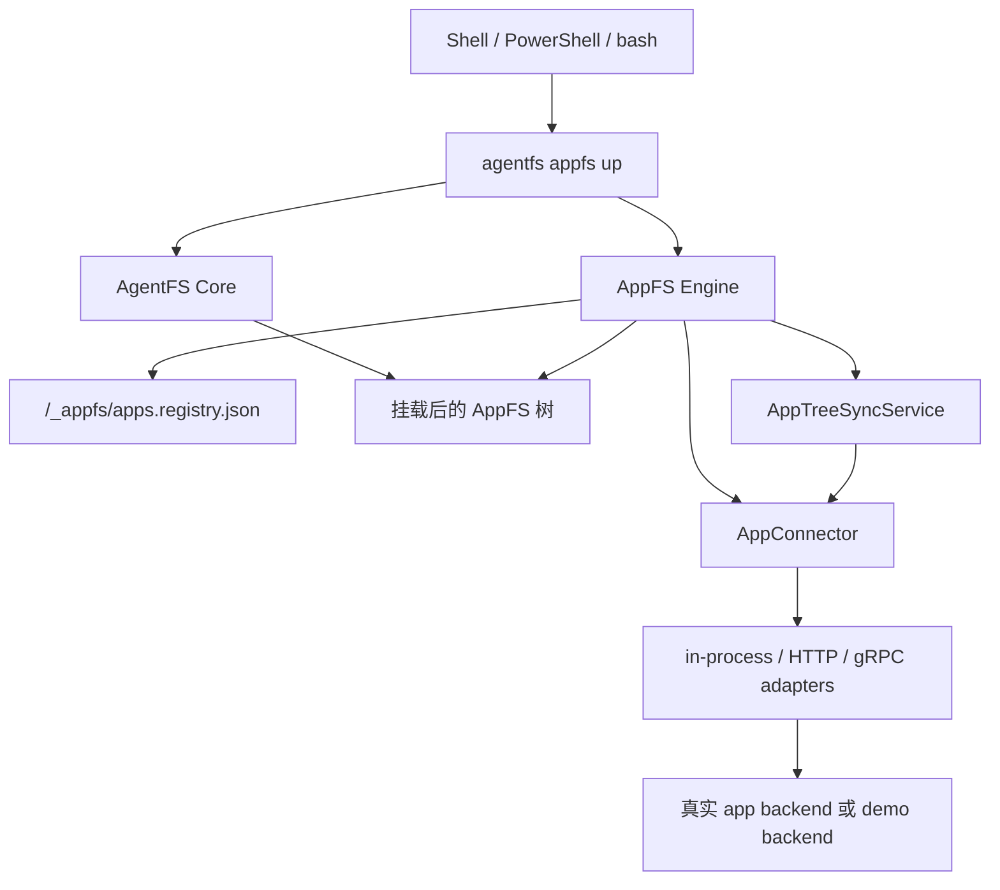

# AppFS

面向 shell-first AI agent 的文件系统原生应用协议。

[English README](README.md)

AppFS 把不同应用统一成一套文件系统契约，让 agent 始终使用同一种操作方式：

- 用 `cat` 读取资源
- 用 `>> *.act` 以 JSONL 追加方式触发动作
- 用 `tail -f` 订阅异步事件流

本仓库包含 AppFS 协议文档、runtime、参考夹具、bridge adapter 和一致性测试，底层构建在 AgentFS Core 之上。

## 简介

AppFS 主要面向真实的 LLM + shell 工作流：

- 不再为每个 app 记一套不同的 schema
- 路径即语义，token 开销更低
- 流优先的异步交互模型，支持重放
- managed runtime lifecycle，支持动态注册 app
- connector 可走 in-process、HTTP、gRPC 三条路径

推荐启动入口：

```bash
agentfs appfs up <id-or-path> <mountpoint>
```

managed runtime 的共享状态文件位于：

```text
/_appfs/apps.registry.json
```

底层调试入口仍然保留：

- `agentfs mount ... --managed-appfs`
- `agentfs serve appfs --managed`

## Quick Start

标准 AppFS 流程如下：

1. 启动 bridge 或进程内 connector
2. 初始化一个空的 AgentFS 数据库
3. 用 `agentfs appfs up` 启动 AppFS
4. 通过 `/_appfs/register_app.act` 注册 app
5. 在挂载树中直接读文件、切换 scope、触发动作

环境前置：

- 已安装 Rust toolchain，且 `cargo` 可用
- 参考 HTTP bridge 需要 Python 和 `uv`
- `127.0.0.1:8080` 端口可用
- Windows：已安装 WinFsp
- Linux：具备 FUSE 能力
- macOS：具备 NFS 挂载能力

### Windows

启动参考 HTTP bridge：

```powershell
cd C:\Users\esp3j\rep\agentfs\examples\appfs\http-bridge\python
uv run python bridge_server.py
```

初始化空数据库：

```powershell
cd C:\Users\esp3j\rep\agentfs\cli
cargo run -- init managed-http --force
```

启动 AppFS：

```powershell
cd C:\Users\esp3j\rep\agentfs\cli
cargo run -- appfs up .agentfs\managed-http.db C:\mnt\appfs-managed-http --backend winfsp
```

注册 app：

```powershell
Add-Content C:\mnt\appfs-managed-http\_appfs\register_app.act '{"app_id":"aiim","transport":{"kind":"http","endpoint":"http://127.0.0.1:8080","http_timeout_ms":5000,"grpc_timeout_ms":5000,"bridge_max_retries":2,"bridge_initial_backoff_ms":100,"bridge_max_backoff_ms":1000,"bridge_circuit_breaker_failures":5,"bridge_circuit_breaker_cooldown_ms":3000},"client_token":"reg-http-001"}'
```

读取 snapshot 并触发动作：

```powershell
Get-Content C:\mnt\appfs-managed-http\aiim\chats\chat-001\messages.res.jsonl | Select-Object -First 5
Add-Content C:\mnt\appfs-managed-http\aiim\contacts\zhangsan\send_message.act '{"version":2,"client_token":"msg-001","payload":{"text":"hello"}}'
```

### Linux

启动参考 HTTP bridge：

```bash
cd /path/to/agentfs/examples/appfs/bridges/http-python
uv run python bridge_server.py
```

初始化空数据库：

```bash
cd /path/to/agentfs/cli
cargo run -- init managed-http --force
```

启动 AppFS：

```bash
cd /path/to/agentfs/cli
mkdir -p /tmp/appfs-managed-http
cargo run -- appfs up .agentfs/managed-http.db /tmp/appfs-managed-http --backend fuse
```

注册 app：

```bash
echo '{"app_id":"aiim","transport":{"kind":"http","endpoint":"http://127.0.0.1:8080","http_timeout_ms":5000,"grpc_timeout_ms":5000,"bridge_max_retries":2,"bridge_initial_backoff_ms":100,"bridge_max_backoff_ms":1000,"bridge_circuit_breaker_failures":5,"bridge_circuit_breaker_cooldown_ms":3000},"client_token":"reg-http-001"}' >> /tmp/appfs-managed-http/_appfs/register_app.act
```

读取 snapshot 并触发动作：

```bash
head -n 5 /tmp/appfs-managed-http/aiim/chats/chat-001/messages.res.jsonl
echo '{"version":2,"client_token":"msg-001","payload":{"text":"hello"}}' >> /tmp/appfs-managed-http/aiim/contacts/zhangsan/send_message.act
```

### macOS

macOS 使用 AgentFS 的 NFS backend，而不是 FUSE。AppFS 的 managed 流程保持一致，但新的 runtime 行为仍建议优先在 Linux 上做首轮验证。

初始化空数据库：

```bash
cd /path/to/agentfs/cli
cargo run -- init managed-http --force
```

启动 AppFS：

```bash
cd /path/to/agentfs/cli
mkdir -p /tmp/appfs-managed-http
cargo run -- appfs up .agentfs/managed-http.db /tmp/appfs-managed-http --backend nfs
```

后续注册 app、触发动作、读取 snapshot 的方式与上面的 Windows / Linux 流程一致。

## 手动编译

### CLI 与 Rust SDK

```bash
cd cli
cargo build
cargo build --release
cargo test --package agentfs
```

```bash
cd sdk/rust
cargo test
```

### TypeScript SDK

```bash
cd sdk/typescript
npm install
npm run build
npm test
```

### Python SDK

```bash
cd sdk/python
uv sync
uv run pytest
uv run ruff check .
uv run ruff format .
```

## 文档

推荐先看这些入口：

- [文档总索引](docs/README.md)
- [当前 AppFS 文档主入口（v4）](docs/v4/README.md)
- [Connectorization 里程碑（v3）](docs/v3/README.md)
- [Backend-native 里程碑（v2）](docs/v2/README.md)
- [cli/TEST-WINDOWS.md](cli/TEST-WINDOWS.md)
- [Runtime 收口设计计划](docs/plans/2026-03-26-appfs-runtime-closure-design.md)

## 架构

AppFS 现在按三层组织：

- AgentFS Core：SQLite 文件系统、通用 overlay 语义、平台挂载后端
- AppFS Engine：registry、structure sync、runtime lifecycle、snapshot read-through、connector adapter
- AppFS UX：`agentfs appfs up` 和挂载树上的 `/_appfs/*` 控制面



补充说明：

- `AppConnector` 是运行时 canonical connector surface
- `_meta/manifest.res.json` 是派生视图，不是运行态主真相
- snapshot cold miss 会在普通文件读取时自动扩展
- `agentfs init --base` 仍保留为 AgentFS 功能，但不属于推荐的 AppFS 主路径

## 仓库结构

- `cli/`：CLI、runtime 与挂载集成
- `sdk/rust/`：Rust SDK 与文件系统实现
- `sdk/typescript/`：TypeScript SDK
- `sdk/python/`：Python SDK
- `sandbox/`：Linux-only syscall interception sandbox
- `examples/appfs/`：夹具与 bridge 参考实现
- `docs/`：ADR、计划、契约与发布文档

## 测试

核心验证入口：

- Rust CLI 测试：`cargo test --manifest-path cli/Cargo.toml --package agentfs`
- Rust SDK 测试：`cargo test --manifest-path sdk/rust/Cargo.toml`
- Linux 合同测试：`cli/tests/test-appfs-connector-contract.sh`
- Windows managed lifecycle 回归：`cli/test-windows-appfs-managed.ps1`

Linux 仍然是主要 required CI 平台；Windows 已补齐 managed AppFS 流程的专门手动回归脚本。

## 当前状态

当前仓库状态：

- `v0.3` connectorization 已合入，并保持 release baseline
- `v0.4` structure sync、统一 connector、managed lifecycle 和 `appfs up` 已在树内实现
- multi-app managed runtime 已可用
- 真实 app pilot 是稳定发布前的下一步关键验证

## 许可证

MIT
