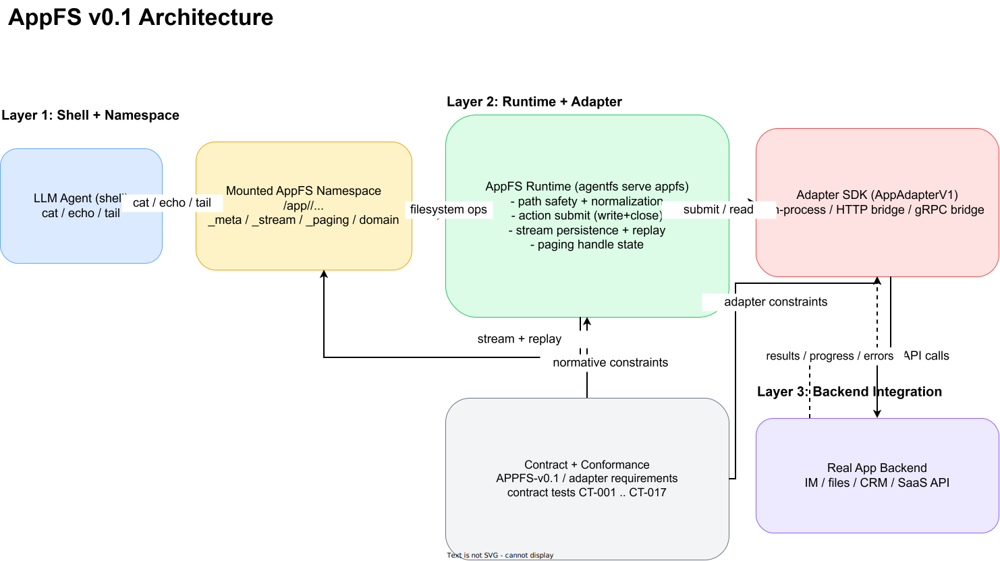

# AppFS

面向 shell-first AI agent 的文件系统原生应用协议。

[English README](README.md)

AppFS 的目标是把不同应用统一成一套文件系统交互模型，让 agent 用一致命令操作不同 app：

1. 用 `cat` 读取资源。
2. 用 `>> *.act`（append JSONL）触发动作。
3. 用 `tail -f` 订阅异步事件流。

本仓库当前包含 AppFS 规范、适配器契约、参考夹具、一致性测试，以及基于 AgentFS 的 runtime 实现。

## 为什么是 AppFS

核心设计面向 LLM + bash 的实际操作：

1. 不再为每个 App 记一套 MCP 参数格式。
2. 路径即语义，token 开销更低。
3. 流优先的异步模型，支持重放。
4. 运行时自动生成 request_id，模型不用自己造 UUID。
5. 契约冻结后，可跨语言实现适配器。

## 核心交互模型

```bash
# 1) 先订阅事件流
tail -f /app/aiim/_stream/events.evt.jsonl

# 2) 以 append JSONL 触发动作
printf '{"text":"hello"}\n' >> /app/aiim/contacts/zhangsan/send_message.act

# 3) 直接读取资源
cat /app/aiim/contacts/zhangsan/profile.res.json

# 4) 用统一分页动作读取长内容
cat /app/aiim/chats/chat-001/messages.res.json
printf '{"handle_id":"<from-page>"}\n' >> /app/aiim/_paging/fetch_next.act
```

## 可用动作（AIIM 夹具）

事实来源：`examples/appfs/aiim/_meta/manifest.res.json`。

1. `contacts/{contact_id}/send_message.act`
   - `kind`: `action`
   - `execution_mode`: `inline`
   - `input_mode`: `json`
2. `files/{file_id}/download.act`
   - `kind`: `action`
   - `execution_mode`: `streaming`
   - `input_mode`: `json`
3. `/_paging/fetch_next.act`
   - `kind`: `action`
   - `execution_mode`: `inline`
   - `input_mode`: `json`
4. `/_paging/close.act`
   - `kind`: `action`
   - `execution_mode`: `inline`
   - `input_mode`: `json`

## 运行时快速开始（HTTP Bridge）

### Windows（PowerShell，4 步）

1. 挂载 AgentFS（终端 A）。

```powershell
cd C:\Users\esp3j\rep\agentfs\cli
cargo run -- init win-real
cargo run -- mount .agentfs\win-real.db C:\mnt\win-real --foreground
```

2. 把 AIIM fixture 放到挂载点（终端 B）。

```powershell
cd C:\Users\esp3j\rep\agentfs
Copy-Item -Recurse -Force .\examples\appfs\aiim C:\mnt\win-real\aiim
```

3. 启动 HTTP bridge（终端 C）。

```powershell
cd C:\Users\esp3j\rep\agentfs\examples\appfs\http-bridge\python
uv run python bridge_server.py
```

4. 启动 AppFS runtime 并操作文件（终端 D/E）。

```powershell
cd C:\Users\esp3j\rep\agentfs\cli
$env:APPFS_ADAPTER_HTTP_ENDPOINT = "http://127.0.0.1:8080"
cargo run -- serve appfs --root C:\mnt\win-real --app-id aiim
```

```powershell
# 订阅事件流（单独终端）
Get-Content C:\mnt\win-real\aiim\_stream\events.evt.jsonl -Wait

# 触发动作（append JSONL，一行一个 JSON）
Add-Content C:\mnt\win-real\aiim\contacts\zhangsan\send_message.act '{"text":"hello"}'

# 分页动作同样是 JSON-only
Add-Content C:\mnt\win-real\aiim\_paging\fetch_next.act '{"handle_id":"ph_001"}'
Add-Content C:\mnt\win-real\aiim\_paging\close.act '{"handle_id":"ph_001"}'

# 读取资源
Get-Content C:\mnt\win-real\aiim\contacts\zhangsan\profile.res.json -Raw
```

### Linux（bash，4 步）

1. 挂载 AgentFS（终端 A）。

```bash
cd /path/to/agentfs/cli
cargo run -- init linux-real
mkdir -p /tmp/appfs-real
cargo run -- mount .agentfs/linux-real.db /tmp/appfs-real --foreground
```

2. 把 AIIM fixture 放到挂载点（终端 B）。

```bash
cd /path/to/agentfs
cp -R ./examples/appfs/aiim /tmp/appfs-real/aiim
```

3. 启动 HTTP bridge（终端 C）。

```bash
cd /path/to/agentfs/examples/appfs/http-bridge/python
uv run python bridge_server.py
```

4. 启动 AppFS runtime 并操作文件（终端 D/E）。

```bash
cd /path/to/agentfs/cli
APPFS_ADAPTER_HTTP_ENDPOINT=http://127.0.0.1:8080 cargo run -- serve appfs --root /tmp/appfs-real --app-id aiim
```

```bash
# 订阅事件流（单独终端）
tail -f /tmp/appfs-real/aiim/_stream/events.evt.jsonl

# 触发动作（append JSONL）
printf '{"text":"hello"}\n' >> /tmp/appfs-real/aiim/contacts/zhangsan/send_message.act

# 分页动作同样是 JSON-only
printf '{"handle_id":"ph_001"}\n' >> /tmp/appfs-real/aiim/_paging/fetch_next.act
printf '{"handle_id":"ph_001"}\n' >> /tmp/appfs-real/aiim/_paging/close.act

# 读取资源
cat /tmp/appfs-real/aiim/contacts/zhangsan/profile.res.json
```

注意：

1. `.act` 统一为 append-only JSONL：使用 `>>`（或 PowerShell `Add-Content`）提交，一行一个 JSON。
2. 对 `.act` 使用 `>` 覆写/截断会被视为非法变更，runtime 只记录诊断日志并跳过该批内容。
3. 运行时语义为 `at-least-once`，建议业务层基于 `client_token`/`request_id` 做幂等去重。

## 架构

- Draw.io 源文件：[docs/v1/architecture/appfs-v0.1-architecture.drawio](docs/v1/architecture/appfs-v0.1-architecture.drawio)
- SVG 预览：[docs/v1/architecture/appfs-v0.1-architecture.svg](docs/v1/architecture/appfs-v0.1-architecture.svg)
- 规范基线：[APPFS-v0.1.md](docs/v1/APPFS-v0.1.md)

架构共四层：

1. Agent shell 操作层（`cat`、`echo`、`tail`）。
2. AppFS 命名空间与契约文件层（`_meta`、`_stream`、`_paging`、业务路径）。
3. `agentfs serve appfs` runtime 层（路由、校验、流持久化、重放）。
4. 业务适配器层（进程内，或 HTTP/gRPC bridge）对接真实应用后端。



## 一致性快速开始

### 1) 静态契约检查

```bash
cd cli
APPFS_CONTRACT_TESTS=1 APPFS_STATIC_FIXTURE=1 APPFS_ROOT="$PWD/../examples/appfs" sh ./tests/test-appfs-contract.sh
```

### 2) Live 一致性（进程内适配器）

Linux + FUSE 环境：

```bash
cd examples/appfs
sh ./run-conformance.sh inprocess
```

### 3) Live 一致性（进程外 bridge）

```bash
cd examples/appfs
sh ./run-conformance.sh http-python
sh ./run-conformance.sh grpc-python
```

## Adapter Developer Path（中文）

建议阅读顺序：

1. [APPFS-adapter-developer-guide-v0.1.zh-CN.md](docs/v1/APPFS-adapter-developer-guide-v0.1.zh-CN.md)
2. [ADAPTER-QUICKSTART.zh-CN.md](examples/appfs/ADAPTER-QUICKSTART.zh-CN.md)
3. [APPFS-adapter-requirements-v0.1.zh-CN.md](docs/v1/APPFS-adapter-requirements-v0.1.zh-CN.md)
4. [APPFS-compatibility-matrix-v0.1.zh-CN.md](docs/v1/APPFS-compatibility-matrix-v0.1.zh-CN.md)
5. [APPFS-conformance-v0.1.zh-CN.md](docs/v1/APPFS-conformance-v0.1.zh-CN.md)
6. [APPFS-contract-tests-v0.1.zh-CN.md](docs/v1/APPFS-contract-tests-v0.1.zh-CN.md)
7. [APPFS-adapter-structure-mapping-v0.1.zh-CN.md](docs/v1/APPFS-adapter-structure-mapping-v0.1.zh-CN.md)

兼容性承诺：

1. 允许任意语言实现，只要协议行为一致。
2. 兼容性以行为与一致性测试结果判定。
3. `v0.1.x` 期间接口面冻结，仅允许向后兼容增量扩展。
4. 常见排障基线统一在开发指南中维护。

## AppFS 相关目录

1. `docs/v1/APPFS-v0.1.md`：核心协议。
2. `docs/v1/APPFS-adapter-requirements-v0.1.md`：适配器要求。
3. `docs/v1/APPFS-adapter-developer-guide-v0.1.md`：英文开发指南。
4. `docs/v1/APPFS-adapter-developer-guide-v0.1.zh-CN.md`：中文开发指南。
5. `docs/v1/APPFS-adapter-structure-mapping-v0.1.md`：结构定义与桥接映射（英文）。
6. `docs/v1/APPFS-adapter-structure-mapping-v0.1.zh-CN.md`：结构定义与桥接映射（中文）。
7. `docs/v1/APPFS-compatibility-matrix-v0.1.md`：兼容性矩阵（英文）。
8. `docs/v1/APPFS-compatibility-matrix-v0.1.zh-CN.md`：兼容性矩阵（中文）。
9. `examples/appfs/`：参考夹具、bridge 示例与脚手架。
10. `cli/src/cmd/appfs.rs`：AppFS runtime 命令实现。
11. `cli/tests/appfs/`：live 契约与韧性测试（`CT-001` 到 `CT-019`）。

## 当前状态

当前分支已包含 AppFS v0.1 契约套件与 RC 收口产物，包括：

1. 发布检查清单与发布说明。
2. RC 收口记录。
3. 进程内与 bridge 模式的 static/live 一致性门禁。

发布相关文档：

1. [APPFS-release-checklist-v0.1-rc1.md](docs/v1/APPFS-release-checklist-v0.1-rc1.md)
2. [APPFS-release-notes-v0.1-rc1.md](docs/v1/APPFS-release-notes-v0.1-rc1.md)
3. [APPFS-rc-closure-v0.1.md](docs/v1/APPFS-rc-closure-v0.1.md)
4. [APPFS-v0.1.0-rc2-freeze.md](docs/v1/APPFS-v0.1.0-rc2-freeze.md)
5. [APPFS-migration-note-v0.1.0-rc2.md](docs/v1/APPFS-migration-note-v0.1.0-rc2.md)
6. [APPFS-project-status-and-roadmap-2026-03-17.md](docs/v1/APPFS-project-status-and-roadmap-2026-03-17.md)

## 许可证

MIT
