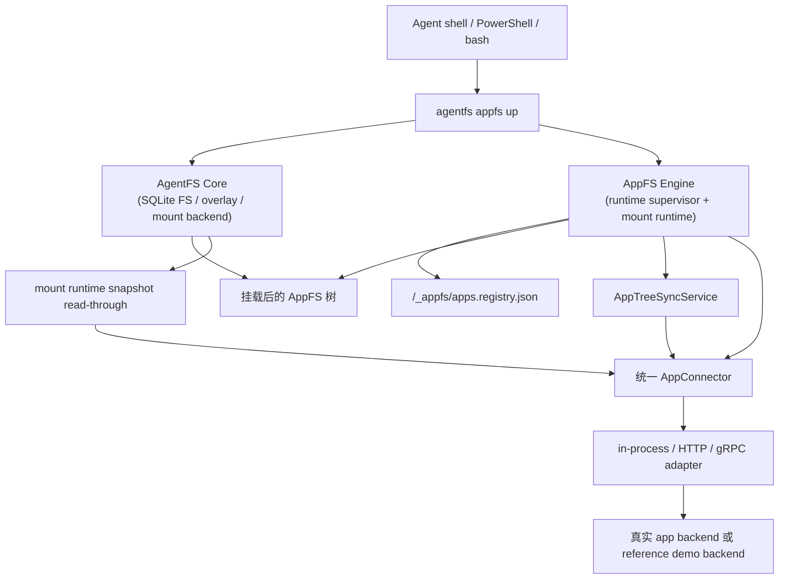

# AppFS

面向 shell-first AI agent 的文件系统原生应用协议。

[English README](README.md)

AppFS 的目标是把不同应用统一成一套文件系统交互模型，让 agent 用一致命令操作不同 app：

1. 用 `cat` 读取资源。
2. 用 `>> *.act`（append JSONL）触发动作。
3. 用 `tail -f` 订阅异步事件流。

本仓库当前包含 AppFS 规范、适配器契约、参考夹具、一致性测试，以及基于 AgentFS 的 runtime 实现。

## 为什么是 AppFS

核心设计面向 LLM + bash 的实际操作：

1. 不再为每个 App 记一套 MCP 参数格式。
2. 路径即语义，token 开销更低。
3. 流优先的异步模型，支持重放。
4. 运行时自动生成 request_id，模型不用自己造 UUID。
5. 契约冻结后，可跨语言实现适配器。

## 核心交互模型

```bash
# 1) 先订阅事件流
tail -f /app/aiim/_stream/events.evt.jsonl

# 2) 以 append ActionLineV2 JSONL 触发动作
echo '{"version":2,"client_token":"msg-001","payload":{"text":"hello"}}' >> /app/aiim/contacts/zhangsan/send_message.act

# 3) 直接读取资源
cat /app/aiim/contacts/zhangsan/profile.res.json

# 4) snapshot 资源是完整文件（.res.jsonl），live 资源继续分页
cat /app/aiim/chats/chat-001/messages.res.jsonl | rg "hello"
cat /app/aiim/feed/recommendations.res.json
echo '{"version":2,"client_token":"page-001","payload":{"handle_id":"<from-page>"}}' >> /app/aiim/_paging/fetch_next.act
```

## 可用动作（AIIM 夹具）

事实来源：`examples/appfs/aiim/_meta/manifest.res.json`。

1. `contacts/{contact_id}/send_message.act`
   - `kind`: `action`
   - `execution_mode`: `inline`
   - `input_mode`: `json`
2. `files/{file_id}/download.act`
   - `kind`: `action`
   - `execution_mode`: `streaming`
   - `input_mode`: `json`
3. `/_paging/fetch_next.act`
   - `kind`: `action`
   - `execution_mode`: `inline`
   - `input_mode`: `json`
4. `/_paging/close.act`
   - `kind`: `action`
   - `execution_mode`: `inline`
   - `input_mode`: `json`
5. `/_snapshot/refresh.act`
   - `kind`: `action`
   - `execution_mode`: `inline`
   - `input_mode`: `json`

## 运行时模式

AppFS 现在有一条明确的主运行时模型：

1. 推荐入口是 `agentfs appfs up <id-or-path> <mountpoint>`。
2. `/_appfs/apps.registry.json` 是 app 路由、transport 配置、session 和 active scope 的共享真相源。
3. app 的注册、删除和枚举统一走 root 控制面：
   - `/_appfs/register_app.act`
   - `/_appfs/unregister_app.act`
   - `/_appfs/list_apps.act`
4. 普通文件读取仍走挂载路径，所以 snapshot cold miss 会在读文件时自动扩展。
5. action、event、structure sync 和 lifecycle 统一由 AppFS runtime supervisor 承载。

低层调试入口仍然保留：

1. `agentfs mount ... --managed-appfs`
2. `agentfs serve appfs --managed`
3. 显式单 app bootstrap 参数，仅用于协议调试和底层排错

`agentfs init --base` 仍然保留为 AgentFS 的 overlay 能力，但不再属于 AppFS 推荐主路径。

## 运行时快速开始

### managed-first HTTP bridge 流程

这是现在推荐的 AppFS 主路径：

1. 先启动 bridge 或进程内 connector；
2. 用 `agentfs init` 初始化一个空数据库；
3. 用 `agentfs appfs up` 一次性启动 mount + runtime；
4. 通过 `/_appfs/register_app.act` 注册 app；
5. 直接读文件、切换 scope，并通过挂载树上的控制面注销 app。

环境前置条件：

1. 已安装 Rust toolchain，且 `cargo` 可用
2. 已准备 Python 环境，且 bridge 示例可通过 `uv` 运行
3. `127.0.0.1:8080` 端口未被占用
4. Windows：已安装 WinFsp
5. Linux：具备 FUSE 能力并已准备可写挂载点

### Windows（PowerShell）

1. 启动 HTTP bridge。

```powershell
cd C:\Users\esp3j\rep\agentfs\examples\appfs\http-bridge\python
uv run python bridge_server.py
```

2. 初始化一个空 AgentFS 数据库。

```powershell
cd C:\Users\esp3j\rep\agentfs\cli
cargo run -- init managed-http --force
```

3. 启动 managed 模式的 AppFS。

```powershell
cd C:\Users\esp3j\rep\agentfs\cli
cargo run -- appfs up .agentfs\managed-http.db C:\mnt\appfs-managed-http --backend winfsp
```

4. 观察 root 生命周期事件流并注册一个 app。

```powershell
Get-Content C:\mnt\appfs-managed-http\_appfs\_stream\events.evt.jsonl -Wait
Add-Content C:\mnt\appfs-managed-http\_appfs\register_app.act '{"app_id":"aiim","transport":{"kind":"http","endpoint":"http://127.0.0.1:8080","http_timeout_ms":5000,"grpc_timeout_ms":5000,"bridge_max_retries":2,"bridge_initial_backoff_ms":100,"bridge_max_backoff_ms":1000,"bridge_circuit_breaker_failures":5,"bridge_circuit_breaker_cooldown_ms":3000},"client_token":"reg-http-001"}'
```

5. 操作注册后的 app。

```powershell
# 观察 per-app 事件
Get-Content C:\mnt\appfs-managed-http\aiim\_stream\events.evt.jsonl -Wait

# 触发动作
Add-Content C:\mnt\appfs-managed-http\aiim\contacts\zhangsan\send_message.act '{"version":2,"client_token":"msg-001","payload":{"text":"hello"}}'

# 切换 scope，并通过普通文件读取触发 snapshot 扩展
Add-Content C:\mnt\appfs-managed-http\aiim\_app\enter_scope.act '{"target_scope":"chat-long","client_token":"scope-http-001"}'
Get-Content C:\mnt\appfs-managed-http\aiim\chats\chat-long\messages.res.jsonl | Select-Object -First 5

# 使用完成后注销 app
Add-Content C:\mnt\appfs-managed-http\_appfs\unregister_app.act '{"app_id":"aiim","client_token":"unreg-http-001"}'
```

### Linux（bash）

1. 启动 HTTP bridge。

```bash
cd /path/to/agentfs/examples/appfs/http-bridge/python
uv run python bridge_server.py
```

2. 初始化一个空 AgentFS 数据库。

```bash
cd /path/to/agentfs/cli
cargo run -- init managed-http --force
```

3. 启动 managed 模式的 AppFS。

```bash
cd /path/to/agentfs/cli
mkdir -p /tmp/appfs-managed-http
cargo run -- appfs up .agentfs/managed-http.db /tmp/appfs-managed-http --backend fuse
```

4. 观察 root 生命周期事件流并注册一个 app。

```bash
tail -f /tmp/appfs-managed-http/_appfs/_stream/events.evt.jsonl
echo '{"app_id":"aiim","transport":{"kind":"http","endpoint":"http://127.0.0.1:8080","http_timeout_ms":5000,"grpc_timeout_ms":5000,"bridge_max_retries":2,"bridge_initial_backoff_ms":100,"bridge_max_backoff_ms":1000,"bridge_circuit_breaker_failures":5,"bridge_circuit_breaker_cooldown_ms":3000},"client_token":"reg-http-001"}' >> /tmp/appfs-managed-http/_appfs/register_app.act
```

5. 操作注册后的 app。

```bash
# 观察 per-app 事件
tail -f /tmp/appfs-managed-http/aiim/_stream/events.evt.jsonl

# 触发动作
echo '{"version":2,"client_token":"msg-001","payload":{"text":"hello"}}' >> /tmp/appfs-managed-http/aiim/contacts/zhangsan/send_message.act

# 切换 scope，并通过普通文件读取触发 snapshot 扩展
echo '{"target_scope":"chat-long","client_token":"scope-http-001"}' >> /tmp/appfs-managed-http/aiim/_app/enter_scope.act
head -n 5 /tmp/appfs-managed-http/aiim/chats/chat-long/messages.res.jsonl

# 使用完成后注销 app
echo '{"app_id":"aiim","client_token":"unreg-http-001"}' >> /tmp/appfs-managed-http/_appfs/unregister_app.act
```

注意：

1. `.act` 是 append-only JSONL：使用 `>>` 或 `Add-Content`，每行一个 JSON 对象。
2. snapshot `*.res.jsonl` 是普通可读文件；首次读取 cold miss 会自动扩展。
3. `/_app/enter_scope.act` 和 `/_app/refresh_structure.act` 是 per-app 控制动作。
4. `/_snapshot/refresh.act` 仍保留用于显式预取或强制重物化，但不再属于推荐 happy path。
5. `unregister_app.act` 会移除 runtime ownership 和 registry membership，但默认保留 app 目录以便排查。
6. `agentfs mount ... --managed-appfs` 和 `agentfs serve appfs --managed` 仍可用于底层调试。

## 架构

### 分层 Runtime 拓扑



### 职责整理

1. AgentFS Core 负责 SQLite 存储、通用 overlay 语义和平台挂载后端。
2. AppFS Engine 负责 registry、action/event/control、structure sync、snapshot read-through 和 runtime lifecycle。
3. `/_appfs/apps.registry.json` 是 managed runtime 的主真相源。
4. `_meta/manifest.res.json` 是从结构快照派生出来的 AppFS 视图，不再是运行态主真相。
5. 运行时 canonical connector surface 是 `AppConnector`。现有 `AppConnectorV2` / `AppConnectorV3` 继续作为 transport 兼容层保留在 adapter 边界。
6. `agentfs mount` 和 `agentfs serve appfs` 仍在，但定位已经降为调试入口，而不是主产品入口。

## 发布轨道

### v0.3 已发布基线

`v0.3` 仍然是当前仓库对外发布的 connectorization 基线。

已完成并可稳定宣称：

1. runtime 默认主路径切到 `AppConnectorV2`（in-process / HTTP bridge / gRPC bridge）。
2. prewarm、snapshot chunk、live paging、submit action 全部走 connector V2 能力面。
3. HTTP/gRPC reference bridge 已提供 V2 connector 协议面。
4. CT2/CI 门禁已加入 runtime-derived connector evidence 断言。

收口详情见：

1. [APPFS-v0.3-完成总结-2026-03-24.zh-CN.md](docs/v3/APPFS-v0.3-完成总结-2026-03-24.zh-CN.md)

### v0.4 仓库内开发主线

仓库当前分支还包含 `v0.4` 的 app structure sync + managed runtime 工作流。这部分已经可以在仓库内测试，但目前还没有单独作为新的仓库级 release note 对外宣称。

当前已在树内完成：

1. 统一的 runtime-facing `AppConnector`，HTTP / gRPC / in-process adapter 在边界内继续兼容现有 V2/V3 transport 协议。
2. `AppTreeSyncService`，以及 `/_app/enter_scope.act` / `/_app/refresh_structure.act`。
3. shared managed registry：`/_appfs/apps.registry.json`。
4. 动态 app 生命周期：`/_appfs/register_app.act`、`/_appfs/unregister_app.act`、`/_appfs/list_apps.act`。
5. `agentfs appfs up` 作为 managed-first 编排入口。
6. multi-app runtime supervisor 与 managed mount 路由。
7. Windows 手动回归验证脚本：[cli/test-windows-appfs-managed.ps1](cli/test-windows-appfs-managed.ps1) 和 [cli/TEST-WINDOWS.md](cli/TEST-WINDOWS.md)。

## 破坏性变更与迁移说明（v0.3）

1. connector 主路径已从 legacy `AppAdapterV1` 切换为 `AppConnectorV2`。
2. bridge 默认协议面切到 V2（HTTP: `/v2/connector/*`，gRPC: V2 connector service）。
3. runner/CI 环境变量命名正在从 `APPFS_V2_*` 迁移到 `APPFS_V3_*`。
4. 迁移窗口内保留 `APPFS_V2_*` 兼容别名；同一开关同时设置时，`APPFS_V3_*` 优先。
5. 为避免 branch protection / ruleset 的 expected-check 漂移，迁移窗口内冻结以下 check-run 名称：
   - `AppFS Contract Gate (required, linux, inprocess v2)`
   - `AppFS Contract Signal (informational, linux, http bridge v2)`
   - `AppFS Contract Signal (informational, linux, http bridge v2 high-risk)`
   - `AppFS Contract Signal (informational, linux, grpc bridge v2)`

## v0.1 Legacy Reference（遗留参考）

`v0.1` 已冻结，当前定位是 legacy/reference/baseline。新的接入默认走 `v0.3 connectorization` 路线。

如需查看 v0.1 参考资料，请跳转：

1. [APPFS-v0.1.md](docs/v1/APPFS-v0.1.md)
2. [APPFS-adapter-developer-guide-v0.1.zh-CN.md](docs/v1/APPFS-adapter-developer-guide-v0.1.zh-CN.md)
3. [APPFS-contract-tests-v0.1.zh-CN.md](docs/v1/APPFS-contract-tests-v0.1.zh-CN.md)

## AppFS 相关目录

1. `docs/v3/APPFS-v0.3-Connectorization-ADR.zh-CN.md`：v0.3 架构决策与边界。
2. `docs/v3/APPFS-v0.3-Connector接口.zh-CN.md`：冻结的 connector V2 契约面。
3. `docs/v3/APPFS-v0.3-完成总结-2026-03-24.zh-CN.md`：v0.3 收口、迁移窗口与 CI 语义。
4. `docs/v3/APPFS-v0.3-实施计划.zh-CN.md`：执行计划与状态对齐。
5. `docs/v4/APPFS-v0.4-AppStructureSync-ADR.zh-CN.md`：structure sync、managed registry 与 multi-app 决策。
6. `docs/v4/APPFS-v0.4-Connector结构接口.zh-CN.md`：冻结的 `AppConnectorV3` 结构契约。
7. `examples/appfs/`：参考夹具与 bridge 示例。
8. `cli/src/cmd/appfs/`：AppFS engine 分层模块（`core`、`tree_sync`、`registry`、`registry_manager`、`runtime_config`、`runtime_entry`、`runtime_supervisor`、`mount_runtime`、`supervisor_control`、`snapshot_cache`、`events`、`paging`）。
9. `docs/plans/2026-03-26-appfs-runtime-closure-design.md`：managed-first 收口设计。
10. `cli/TEST-WINDOWS.md`：Windows 手动验证指南。
11. `cli/test-windows-appfs-managed.ps1`：Windows managed lifecycle 回归脚本。

## 当前状态

当前仓库里有两条同时存在的主线：

1. `v0.3` connectorization 已合入、已对齐文档，并保持 release baseline。
2. `v0.4` structure sync、统一 `AppConnector`、managed runtime lifecycle、`appfs up` 和 multi-app supervisor 已在树内实现，可做手动验证。
3. Linux 仍是主要 required CI 平台；Windows 现在补了专门的 managed lifecycle 手动回归脚本。
4. `v0.1` 继续保留为 baseline/reference 与回归对照材料。
5. 更广泛的真实 app 生产级接入，仍然不在当前仓库级 release claim 内。

收口、设计与执行文档：

1. [APPFS-v0.3-完成总结-2026-03-24.zh-CN.md](docs/v3/APPFS-v0.3-完成总结-2026-03-24.zh-CN.md)
2. [APPFS-v0.3-实施计划.zh-CN.md](docs/v3/APPFS-v0.3-实施计划.zh-CN.md)
3. [APPFS-v0.4-AppStructureSync-ADR.zh-CN.md](docs/v4/APPFS-v0.4-AppStructureSync-ADR.zh-CN.md)
4. [APPFS-v0.4-Connector结构接口.zh-CN.md](docs/v4/APPFS-v0.4-Connector结构接口.zh-CN.md)

## 许可证

MIT
