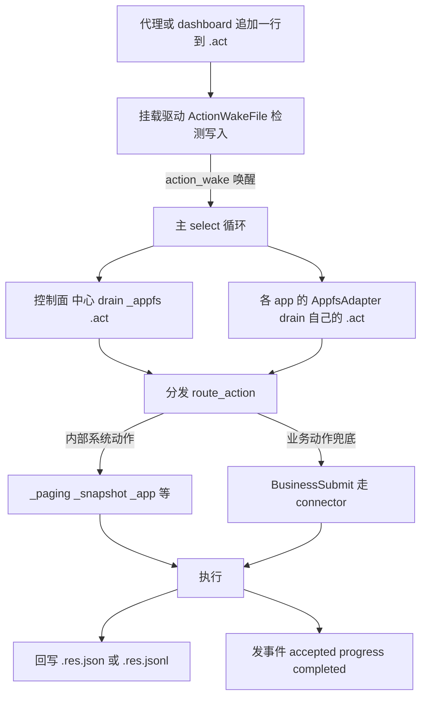

# 动作管线

前面几章反复出现「往一个 `.act` 文件追加一条动作」。这一章把这条动作的**一生**走完整：从被写进文件，到被消费、分发、执行，再到结果回写、事件发出。

一句话总览：**`.act` 是 append-only 的行式 JSON 日志；监督进程（supervisor）按游标增量消费每一行，分发执行，然后把结果写成 `.res.json` / `.res.jsonl`，并把进展发成事件。** 难点不在某一步，而在「控制面」和「app」这两类动作的**获取方式不一样**——这是本章的关键。

## 两条获取路径：控制面轮询，app 在驱动层

这是整条管线最该记住的区分。

挂载活着的时候，supervisor 跑在一个主 `select!` 循环里（`appfs/cli/src/cmd/appfs.rs:819`），有四条臂：**写唤醒**（`action_wake`）、**回退轮询**（`fallback_interval`）、**入站轮询**（`inbound_interval`）、**30s 陈旧清扫**。每 Cycle 醒来时，它调 `poll_action_work_once`，里面做两件**不同**的事：

- **控制面 `_appfs/*.act`：supervisor 中心化 drain（轮询获取）。** `_appfs/` 是 supervisor 自己的命名空间，它每个周期都亲自扫一遍那 8 个控制动作（创建/删除 principal、注册/注销 app 等），由 `SupervisorControlPlane` 集中消费。这部分是「**轮询**」——supervisor 主动、中心地拉取自己的控制面。
- **public/private app 的 `<app>/*.act`：在驱动/适配器层获取。** supervisor **不**中心扫描各个 app 目录，而是把消费委托给**每个 app 自己的 `AppfsAdapter`**（`appfs/cli/src/cmd/appfs/core.rs`）。每个 app 有独立的游标和动作 sink。触发也不是靠扫，而是靠**挂载驱动**：app 目录里的 `.act` 文件被一层 `ActionWakeFile` 包着（`mount_runtime.rs`），代理一往里写（`pwrite`），驱动就 `action_wake.signal()` 把主循环唤醒；主循环再让各 app 的适配器去 drain 自己的 sink。回退轮询臂是兜底——万一唤醒丢了，定时轮询也能补上。



> 为什么要分两路？因为两类动作的**归属**不同：控制面是平台自己的状态（谁注册了、谁在线），必须 supervisor 集中管；app 动作是各应用自己的业务，自然该由各 app 的适配器（连同它的 connector）各自处理。分两路也让游标和故障隔离——一个 app 的动作处理卡住，不拖累控制面。

## 分发：归一化路径决定走哪条

不管从哪条路来，一行动作最后都进 `route_action`（`action_dispatcher.rs`），按**归一化路径**分到不同的 `DispatchRoute`：

- **app 内部的系统动作**（路径形如 `/_paging/...`、`/_snapshot/...`、`/_app/...`）：分页拉取（`fetch_next`/`close`）、快照刷新、进入 scope、刷新结构、`ensure_credentials` 等。这些是平台替 app 干的「家务活」。
- **业务动作兜底 `BusinessSubmit`**：凡是不匹配上面任何一条的路径（比如 `<app>/contacts/<id>/send_message.act`），一律走兜底，交给这个 app 的 connector 去后端执行（`connector.submit_action`）。

也就是说：路径里认得出的「系统动作」走专用处理，认不出的就当业务动作转给 connector。

## 消费模型：游标 + 幂等

实际读 `.act` 文件靠的是**游标**（`ActionCursorState`：记录 `offset` 到哪了、还有一个 `boundary_probe` 用于检测覆盖，见下文）。消费是**增量**的：从上次的位置往后读新行，每行解码成一条动作交给处理函数。

每条动作的处理结果只有两种（`ProcessOutcome`）：

- **`Consumed`**：处理成功，**推进游标并持久化**（写到 `action-cursors.res.json`）。这条算彻底办完。
- **`RetryPending`**：暂时处理不了（比如依赖还没就绪），**不推进游标**，下次再来。这样卡住的动作不会丢、也不会被跳过。

每条动作行带一个 **`client_token`**（幂等键）和一个生成的 `request_id`。`client_token` 让「同一条动作被重复消费」能被识别成同一件事（幂等）；`request_id` 把动作和它产生的事件一一对应起来——两者都会被带进事件里，方便关联。

## `.act` 文件长什么样

每个 `.act` 文件是 **JSONL**——一行一个 JSON 对象，**只追加**。一行典型长这样：

```json
{"version":"2.0","client_token":"msg-001","payload":{"text":"你好"}}
```

- `version`：动作格式版本；
- `client_token`：幂等键；
- `payload`：真正的业务内容。

因为「追加一行」常常是代理用 shell 命令写的，消费侧做了不少**容错**：空行/半行跳过并推进；Windows PowerShell 常见的 UTF-16 换行（带 NUL 字节）能自动处理；shell 引号把一条 JSON 展开成多行写进去时，能靠 `pending_multiline_eof_len` 把多行重新合并成一条。这些细节让「用 shell 追加」这种最朴素的写入方式也稳。

## 结果回写：`.res.json` 与 `.res.jsonl`

动作办完后，结果要写回挂载点，让代理能读到。两种形态：

- **`.res.json`（单个 JSON 对象）**：用于控制面和 principal 的状态视图，比如 `_appfs/principals/<id>.res.json`。是「当前状态」的快照。
- **`.res.jsonl`（行式 JSON）**：用于 app 的资源视图，比如 `contacts/<contact>/messages.res.jsonl`——一行一条记录，适合流式、增量的大列表。

写入都是**原子**的：先写临时文件（`.{name}.{pid}.{counter}.tmp`），再 `fs::rename` 替换；遇到冲突就删目标重试。这样读者永远不会看到写了一半的内容。

## 事件：从 accepted 到 completed

动作的执行过程会发事件（经 `supervisor_control` 的 `emit_event`，每条事件分到一个递增的 `seq`，追加到事件流）。一个动作的生命周期事件通常是：

```
action.accepted  →  action.progress（可选，可多次）  →  action.completed（或 action.failed）
```

长动作不会让调用方干等——它会被建模成一个 **StreamingJob**（`events.rs`）：先发 `accepted`，干的过程中按阶段发 `progress`，最后发 `completed`/`failed`。这些在途的任务会持久化到 `inflight.jobs.res.json`，**进程重启后能接着把没发完的事件补上**，不会因为重启就丢半截。

（这些 `action.*` 事件，加上 `principal.*` 身份事件和 `message`，就是第 1 章说的「事件流」的全部内容。）

## 截断与覆盖：怎么 recover

`.act` 是 append-only，但现实里文件可能被截断、被覆盖、或者写到一半。消费侧靠两样东西兜底：

- **截断检测**：如果游标 `offset` 比文件实际长度还大（说明文件被截短了），就重置游标从头再对齐。
- **覆盖检测**：游标里存一个 `boundary_probe`——上次读到位置附近一段内容的 FNV-1a 哈希。下次读之前先算一下当前对应位置的哈希，对不上就说明中间被人改过（覆盖），按策略跳过被污染的部分。
- **坏行**：解析失败的行标记为 `InvalidActionPayload`，不中断整体消费。

加上游标本身持久化在 `action-cursors.res.json`、启动时恢复，这套机制保证：**即使发生截断、覆盖、进程重启，消费位置也不会错乱、不会丢动作、也不会重复处理已经办完的。**

## 下一步

到这里，`.act` 的整条路径就闭环了。想再深入：

- 回看两层（三层）怎么靠这些文件通信 → [整体架构](./two-layer-architecture)
- 身份与租约的七阶段（大量 `.act` 的产生方） → [Principal 生命周期](./principal-lifecycle)
- 字段级的动作与结果视图契约 → 参考手册（待补）
