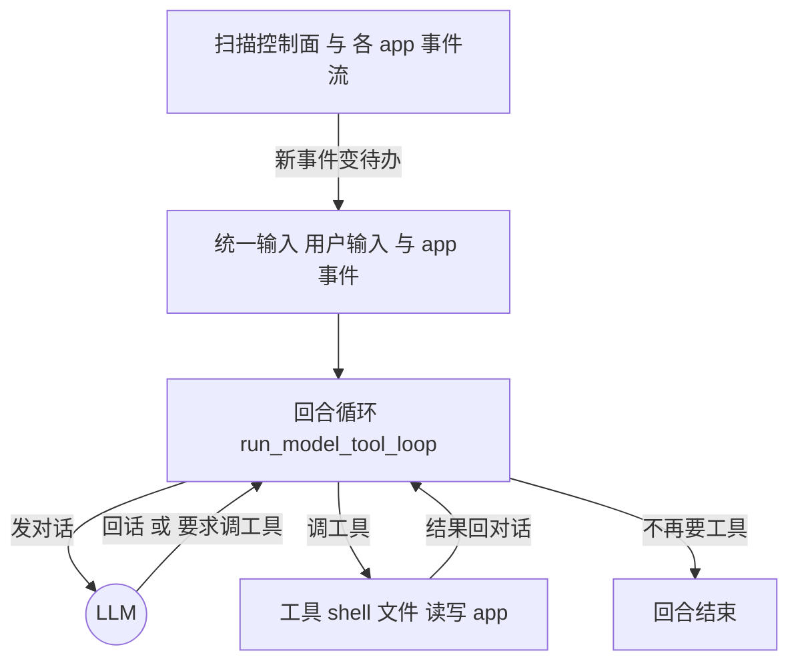

# appfs-agent 详解：改造过的 Claude Code

上一章我们看清了文件系统那层怎么把应用变成文件和事件流。这一章看代理那层——`appfs-agent`，它的命令行名字是 `claw`。

一句话定位：**`claw` 就是 Claude Code——把它接到 AppFS 挂载上，再对它的循环做两处关键改造。** 所以我们先讲它没改的内核，再讲这两处改造：统一输入让 app 事件能驱动 agent、改造 agent 工具实现多 agent。

## 内核：一个「选择动作并执行」的循环

Claude Code 的核心，说穿了就是一个循环。`claw` 保留了它，核心函数叫 `run_model_tool_loop`（`appfs-agent/rust/crates/runtime/src/conversation.rs`）。每一轮做的是：

1. 把当前对话发给 LLM；
2. LLM 要么直接回一段话，要么要求**调用某个工具**；
3. 如果要调用工具，就执行工具、把结果塞回对话；
4. 再把更新后的对话发给 LLM，回到第 2 步；
5. 直到 LLM 不再要求工具、直接回话为止——这一回合就结束了。

用大白话讲：代理一直在「**想一步、做一步、看结果、再想**」，直到把事情做完。工具就是它的手——跑 shell、读写文件、读 app 状态、发动作……都包装成工具供它调用。

这个循环有两个入口，复用同一段逻辑：交互式的 `run_turn`（先吃一句用户输入，再进循环）；事件驱动的 `run_event_turn`（不吃合成用户输入，靠别处注入的输入驱动）。第二个入口是后面「统一输入」改造的关键。

## 代理怎么知道怎么用一个 app：skills

接上 AppFS 之后，代理面对的是一堆目录和文件——它怎么知道**哪个 app 该怎么用**？靠 skills。

每个挂载出来的 app，会在自己的 `_app/` 目录下带一组资源文件（`skill.res.json`、`control.res.json`、`actions.res.json` 等，由上一章的 connector 提供、appfs 物化出来）。appfs-agent 启动时扫描挂载点、发现这些 app，读这些资源，**就地合成出一个 skill**，名字固定是 `appfs-<app_id>`。这个 skill 里既有 connector 写好的概览与使用规矩，也有按 app 当前实际状态**自动生成**的部分——有哪些动作可调、每个动作的路径、示例 payload、什么时候用、当前处在哪个 scope（视图）。（合成发生在 `appfs-agent/rust/crates/commands/src/lib.rs` 的 skill 解析里。）

于是这个 skill 和别的 skill 一样出现在代理的技能列表里。**代理要操作某个 app 之前，先加载它的 `appfs-<app_id>` skill**，就知道该往 `contacts/zhangsan/send_message.act` 这种路径写什么样的动作，而不是对着目录瞎猜。相当于每个 app 自带一份「使用说明」，跟着 app 一起挂出来。

> 把 agent 和 app 之间的通道凑齐：**skills** 让代理知道怎么动手、**文件读写**让它改变 app 状态、**事件流**让 app 反过来推动代理。三者合起来，代理才真正「会用」一个 app——skills 是本节，文件读写贯穿全章，事件流是下一节的主题。

## 改造一：统一输入，让 app 事件能驱动 agent

上一章结尾埋了伏笔：appfs 那层有事件流。Claude Code 原本只听**用户在终端敲的字**。`claw` 的第一处改造，就是开一条**统一输入**管线，让「用户输入」和「AppFS 事件输入」走同一条路，最终都变成投进上面那个循环的待办输入。

具体说，到达代理的输入被分成四种来源（`input_router.rs` 里的 `InputSource`）：用户终端输入、AppFS 事件、来自别的代理的消息、系统输入。每条输入按两种时机投递：**在下一次模型调用前注入**（`InjectAtNextBoundary`，会打断当前思路、尽快处理），或**在本回合结束后排队**（`QueueAfterTurn`）。

最直接的后果：**一个 app 事件可以「唤醒」代理。** 代理空闲时，会去扫描控制面事件流和每个 app 的事件流（`collect_appfs_event_streams`），一旦有需要关注的新事件（`scan_appfs_attention_events_for_idle_wake`），就把它变成待办输入、注入下一轮；而在每一轮模型调用之前，它也会先把积压的 app 事件排进对话。所以代理不只是「被用户戳一下才动」，它会被应用世界里发生的事主动推着走。

把两章连起来看：**文件读写是代理和应用之间的静态通道，事件流是动态通道。** 第 2 章讲的是这些文件和事件怎么产生，这一章讲的是代理怎么消费它们、被它们驱动。

## 改造二：命名一个同级 agent，实现真·多 agent

第二处改造，改的是 Claude Code 的「agent 工具」。

Claude Code 原本就有一个能「派活」的工具，但它派的本质上是**进程内的子 agent**——在父进程里开个线程，给子 agent 一份独立上下文，它干完把结果交还给父进程。这是「父派子」的临时帮手，跑完即销。

`claw` 在此基础上加了一条新路：**当你给要派的 agent 起一个名字（`name`），它就不再是进程内子 agent，而是通过 dashboard 拉起一个独立的 `claw --headless` 进程。** 这个新进程和你是**同级**的——它是独立的操作系统进程、有自己独立的对话上下文、有自己独立的接入身份（attach），但和你们共享同一个 AppFS 挂载。（对应的，不带 `name` 时仍是原来的进程内子 agent，老用法兼容。入口在 `appfs-agent/rust/crates/tools/src/lib.rs` 的 `Agent` 工具与 `execute_external_agent`；真正 spawn 进程的是 dashboard 的 `process-manager.ts`。）

「同级」之所以能协作，不是靠共享对话（它们没有共享对话），而是靠上一章那套 AppFS 机制：

- **共享任务看板**（`task_board.rs`）：代理们往同一块看板上写任务卡片，用认领（claim）和依赖（blocks）来分工，保证不撞车。
- **共享事件流**：彼此通过各自 app 的事件流和控制面事件流感知对方和外界的变化。

所以多个代理能在同一块挂载上各自独立地干活、又通过文件和事件互相协调。和「父派子」的区别就在于：每个都是**独立进程、独立会话、彼此对等、可长期存在**，而不是父进程里跑完就没了的线程。这才是真正意义上的「多 agent」，而不是把一个大任务拆成几段临时子任务。

## 回看：claw 在 Claude Code 上加了什么

把这些摆到一起（接上 AppFS 这个前提，加上面两处改造），就能看清 `claw` 相比 Claude Code 多了什么：

1. **接上 AppFS**：代理读写挂载点上的文件，就是读写应用状态。
2. **统一输入**：用户输入和应用事件走同一条路，应用事件能主动唤醒代理。
3. **改造 agent 工具**：给 agent 命名就能拉起一个共享同一挂载的**同级**进程，靠任务看板和事件流协作，实现真·多 agent。

贯穿三者的，还是第 1 章那句「两层靠文件通信」——这一章不过是把代理那一侧怎么用这些文件、怎么被这些事件驱动、怎么据此分化出多个对等同类，讲明白了。

## 下一步

- 想精确到身份和租约的每个阶段（创建/接入/心跳/清扫/删除） → [Principal 生命周期](./principal-lifecycle)
- 想精确到一条 `.act` 怎么被消费、怎么发出事件 → [动作管线](./action-pipeline)
- 想回顾两层怎么靠文件通信 → [整体架构](./two-layer-architecture)
