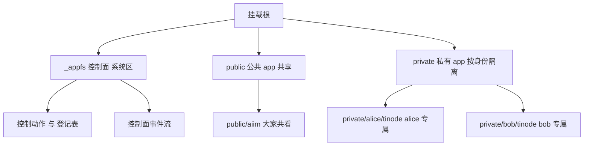

# appfs 详解：把应用映射成文件

第 1 章我们说「两层靠文件通信」。这一章拆开文件系统那层（appfs）看清楚：它怎么把一个「应用」变成挂载出来的一棵目录树，怎么管身份和凭证，怎么把一堆应用一起拉起来，又怎么产生事件。

## 核心理念：把 app 映射到文件系统

appfs 最根本的一个赌注是：**一个 AI 代理最自然、最熟练的能力，就是读写文件。**

所以与其给代理设计一套又一套专用 API，不如反过来——把每个应用的状态，**变成挂载出来的一棵目录树**。这样代理不需要学任何新东西：读应用状态就是 `cat` 一个文件，发一个动作就是往某个文件里追加一行，收到结果就是看到新文件或新事件。任何会操作文件的程序（不只是这个代理）都能直接用。

底层实现上，appfs 把所有数据装进一个 SQLite 数据库，再把这个数据库经 FUSE（Linux）、NFS（macOS）、WinFsp（Windows）挂载成操作系统里一个真实可用的目录。对代理和外部程序来说，它就是个普通文件夹；背后其实是数据库。核心入口是 `AgentFS`（`appfs/sdk/rust/src/lib.rs`）。

一个 **app**，在挂载点上就是**一棵目录树**。记住这个画面，后面全是在这棵树上做文章。

## 三类「app」：控制面 / 公共 / 私有

挂载出来的根目录底下，其实住着三类东西。理解它们的区别，就理解了 appfs 的结构：

- **控制面 `_appfs/`**：这是平台自己的「系统区」，**严格说不是普通 app**，而是控制面命名空间。它管两件事——登记有哪些应用、管理有哪些代理身份（principal），并把控制面发生的事写成事件。里面是 8 个控制动作文件（创建/删除 principal 等）、`apps.registry.json`（应用登记表）、`principals.registry.json`（身份登记表），以及一条控制面事件流。对应代码里的 `SupervisorControlPlane`（`appfs/cli/src/cmd/appfs/runtime_supervisor.rs`）。
- **公共 app `/public/<app>/`**：所有代理身份共享的同一棵树，大家看的是同一份内容。它的实例标识 `instance_id` 就等于 `app_id`。
- **私有 app `/private/<principal>/<app>/`**：每个代理身份一份**独立的实例**，互相看不到对方的私有数据。实例标识是 `<app>--<principal>`——看名字就知道属于哪个 app、哪个身份。私有 app 在身份创建/接入时才被「物化」出来（`materialize_private_apps_for_principal`）。



打个比方：控制面是这栋楼的物业前台（管住户名册和公共事务），公共 app 是大厅里人人能看的公告栏，私有 app 是每个住户自己带锁的办公室。

## 私有 app 的身份与 token 绑定（鉴权）

私有 app 通常要连一个**真实后端**——比如一个聊天服务。要连后端就得登录、就得有凭证（token）。问题是：一个挂载上可能有多个代理身份同时跑，每个身份得用**自己的账号**，绝不能串。

appfs 的做法是**按身份隔离凭证**，而且自己**不保管 token**：

1. **暖机**：代理以某身份接入后，对它的每个私有 app 写一条 `ensure_credentials.act`（「请给这个身份配好凭证」）。
2. **算出身份专属的 profile**：appfs 用一个模板（`profile_template`，比如 `tinode:{principal_id}`）把当前身份代进去，算出这个身份在这个 app 上的专属标识 `profile_id`（比如 `tinode:alice`）。
3. **交给 connector 去后端办**：真正去聊天服务登录、拿 token 的是 **connector**（下一节讲）。appfs 只是把请求转交过去。
4. **办好就通知**：connector 拿到凭证后，appfs 发一条 `profile.credentials.ready` 事件，代理看到这条事件，才正式进入工作循环。

这里有一个关键的安全设计：**token 自始至终由 connector 在上游（后端那一侧）管理，appfs 不存储 token。** appfs 往事件里只写「安全摘要」——凭证状态、profile_id、后端用户号、登录名——**绝不写 token 或密钥**。这样挂载点上的文件里不会泄露任何敏感凭证。

拆除也是对称的：当一个身份被删除，appfs 对它的每个私有实例发 `forget_credentials.act`，让 connector 去后端把对应凭证清掉。

隔离体现在三个层面，层层对应：实例标识 `<app>--<principal>`、profile 标识 `<app>:<principal>`、文件路径 `/private/<principal>/<app>/`。（相关代码：`appfs/cli/src/cmd/appfs/core.rs` 的 `handle_ensure_credentials`，以及 `runtime_supervisor.rs` 里模板渲染和 `forget_credentials` 的处理。）

## connector：定义一个连接器，app 就挂到目录上

上一节反复提到 connector。它是 appfs 里最重要的扩展点。

一个 app 的数据从哪儿来？来自一个 **connector**——你可以把它理解成「**懂某个后端、并愿意把它翻译成文件**的服务」。要注意它是个**被 appfs 调用的服务**，不是盯着文件的监视器。它对外提供几样能力：

- **给结构**：告诉 appfs 这个 app 有哪些目录、哪些文件（`get_app_structure`）。
- **喂内容**：appfs 要读某个文件时，按块向它要内容（`fetch_snapshot_chunk`）。
- **提交动作**：代理写了一条动作，转给它去后端执行（`submit_action`）。
- **推事件**：后端有新动态时，它主动把事件推进 app 的事件流（`drain_inbound_events`）。

**定义一个 connector，就是实现 `AppConnector` 这个 trait**（`appfs/sdk/rust/src/appfs_connector.rs`）。它的 `connector_info` 里带一个 `app_id`，于是这个 connector 就和某个 app 绑定。同一个 trait 有三种接法：gRPC 桥、HTTP 桥、InProcess（比如内置的 Tinode 连接器）——选哪种取决于你的后端怎么暴露。

数据怎么变成目录？两步：`tree_sync` 先根据 connector 报上来的结构，把目录骨架搭出来；之后你在目录里读某个文件时，`mount_runtime` 做「读穿透」——临时去问 connector 要这一段内容，展开成你能读的文件。所以 app 目录是**按需、读时才填充**的，不必一开始就把整个后端拉下来。

> 一句话：**你定义一个 connector，这个 app 就能挂在它的目录下被读写。**

connector 还会提供一样关键的东西：**这个 app 的「说明书」**。它在 app 结构里带一个特殊资源文件 `_app/skill.res.json`（连同 `_app/control.res.json`、`_app/actions.res.json` 等），写明这个 app 是干什么的、什么时候该用、允许用哪些工具、有哪些动作可调；appfs 把它们物化到 app 目录的 `_app/` 下。**下一章会看到**，appfs-agent 正是读这些文件，给每个 app 合成一个名叫 `appfs-<app_id>` 的 skill——有了它，代理才知道该怎么用这个 app。

## 多个 app 一起起：compose

现实里一台机器往往要同时挂好几个 app，每个还带自己的 connector。要是一个个手动注册、手动起 connector，太碎也太容易出错。于是有了 **compose**——受 docker-compose 启发，用**一个 YAML 文件**声明「这次我要哪些 app、各自用哪个 connector、各自是公共还是私有、挂到哪里」。

一份 compose 文件大致长这样（精简自 `appfs/appfs-compose.tinode.local.yaml`）：

```yaml
version: 1
name: tinode-compose-smoke

runtime:                 # 挂载本身：数据库、挂载点、后端
  db: ./compose-tinode.db
  mountpoint: /mnt/appfs-compose-tinode
  backend: winfsp

connectors:              # 这次要起哪些 connector、怎么起
  tinode-in-process:
    mode: in_process     # 也可以是 external（外部已有）或 command（起子进程）
    transport: in_process
    config: { kind: tinode, endpoint: http://... }

apps:                    # 声明 app：用哪个 connector、可见性、模板
  tinode:
    connector: tinode-in-process
    visibility: private
    path_template: private/{principal_id}/tinode      # 私有 app 的路径模板
    profile_template: tinode:{principal_id}           # 凭证 profile 模板
    credential_policy: auto-create
```

执行 `agentfs appfs compose up` 时，appfs 按顺序做：加载这个 YAML → 按 `mode` 把各个 connector 拉起来（必要时起子进程）并做健康检查 → 把应用写进登记表（公共 app 进 `apps.registry.json`，私有 app 的策略进 `app-policies.registry.json`）→ 给公共 app 同步出目录结构 → 进入挂载保活。（入口：`appfs/cli/src/cmd/appfs.rs` 的 `handle_appfs_compose_up_command`，细节在 `compose/connector_supervisor.rs` 和 `compose/reconcile.rs`。）

compose 和运行时的单条 `register_app.act` 是两种不同场景：compose 是**启动时批量声明、顺带托管 connector 子进程、写好策略**；`register_app.act` 是**挂载已经跑着的时候，动态再注册单个 app，且假设它的 connector 已经就位**。

## 每个 app 都有自己的事件流

最后一块拼图：每个 app 目录下，都有**自己的一条事件流** `<app>/_stream/events.evt.jsonl`，和控制面那条全局事件流是分开的。

这些事件从哪儿来？两类：

- **动作的生命周期事件**：你写的一条动作，会依次发出 `action.accepted` → `action.progress` → `action.completed`（或 `action.failed`），让你能追踪它的进展。
- **connector 主动推的入站事件**：后端发生了什么（比如有人发来一条新消息），connector 通过 `drain_inbound_events` 把它变成这个 app 事件流里的一条。

也就是说，一个 app 的事件流里，既流着自己动作的回执，也流着后端主动推过来的新鲜事。

> 这正是下一章的关键伏笔：**appfs-agent 会去监听这些事件流**——控制面的、以及每个 app 的。一旦某个 app 有新事件，它就能把对应的代理「唤醒」。文件读写是代理和应用之间的静态通道，事件流则是它们之间的动态通道。

## 下一步

- 去看代理那层怎么消费这些文件和事件 → [appfs-agent 详解](./appfs-agent)
- 想精确到身份和租约的每个阶段 → [Principal 生命周期](./principal-lifecycle)
- 想精确到一条 `.act` 怎么被消费、怎么发出事件 → [动作管线](./action-pipeline)
