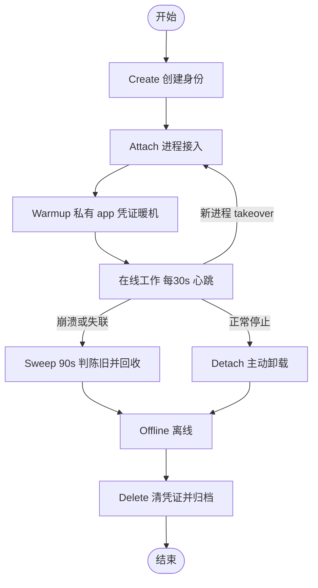

# Principal 生命周期

前几章我们反复提到「代理以某个身份（principal）接入」。这一章把这个身份的**一生**讲清楚：它怎么被创建、一个进程怎么绑上去、怎么保持在线、崩溃了怎么被自动回收、又怎么被彻底删除。

先区分两个词，整章都靠它们：

- **principal**：一个代理在 AppFS 里的**身份**（比如 `alice`）。它决定这个代理能看到哪些私有 app、用哪套凭证。
- **attach lease（租约）**：**一个进程**绑定到某个 principal 上的「在线凭证」，记录 `attach_id` 和 `last_seen_at`。principal 是身份，租约是「此刻哪个进程在代表这个身份」。

这套生命周期是多 agent 能稳定共存的基础：它让平台知道谁在线、谁掉线了、什么时候该把一个崩溃的代理回收掉——而不是任由僵尸身份占着位子。

## 一生的七个阶段

下面逐个阶段讲。每个阶段都是「往控制面写一条 `.act` 动作 → 监督进程（supervisor）消费它、改注册表、发事件」。（处理函数都在 `appfs/cli/src/cmd/appfs/runtime_supervisor.rs` 的 `handle_*` 系列。）

### 1. Create —— 创建身份

往 `_appfs/principals/create_principal.act` 写一条动作。supervisor 的 `handle_create_principal` 处理：

- 如果这个 principal **已存在**，不报错，而是重放一条 `principal.exists` 事件（幂等——重复创建不会出乱子），并照样把它的私有 app 物化好。
- 如果是**新的**，登记进 `principals.registry.json`，为每个 `visibility: Private` 的 app 物化出 `/private/<principal>/<app>/`（实例标识 `<app>--<principal>`），发 `principal.created`。

### 2. Attach —— 进程接入

代理进程写 `attach_principal.act`（带 `principal_id` + `attach_id`）。`handle_attach_principal` 决定能不能接：

- **正常接入**：建一条租约，记进该 principal 的 `active_attaches`，发 `principal.attached`。
- **同一个 `attach_id` 又来一次**（比如重连）：刷新这条租约的时间，发 `principal.attach_refreshed`，不新建。
- **有别的活跃租约挡路**：规则是「**一个 principal 同一时刻最多一个非陈旧租约**」。这时要么你显式带上 `takeover`，supervisor 就**清空所有现有租约**、把状态重置为未知、再接入新的；要么你不带 `takeover`，supervisor 直接拒绝并报 `PRINCIPAL_ATTACH_CONFLICT`。

> 「一个 principal 一个活跃租约」不等于「一个挂载只能一个代理」。多个代理各用**不同的 principal** 共享同一个挂载（模式名 `shared_mount_distinct_attach`），互不冲突；takeover 是**同一个身份**换进程接管时用的。

### 3. Warmup —— 私有 app 凭证暖机

接入之后，如果这个身份有**私有 app**，代理要先把凭证准备好（见 [appfs 详解](./appfs) 的鉴权一节）：对每个私有 app 写 `ensure_credentials.act`，等 `profile.credentials.ready` 事件回来，才正式进入工作循环。这一步保证代理开始干活前，它用的账号已经登录好了。

### 4. Heartbeat —— 保持在线

在线期间，代理每 **30 秒**写一条 `update_principal.act`，但**故意不带 `agent_status`**。supervisor 收到后只刷新这条租约的 `last_seen_at`，**不发任何事件**。

这是个有意的设计：心跳极其频繁，如果每次都发事件，事件流会被 30 秒一次的心跳淹没。所以心跳是「静默」的——它只续命，不广播。（相对地，**带 `agent_status` 的** `update_principal.act` 才是真正的状态更新，会改 principal 的状态并需要匹配一条活跃租约。）

### 5. Sweep —— 崩溃自动回收

监督进程每 **30 秒**跑一次 `sweep_stale_attaches_once`：把 `last_seen_at` 超过 **90 秒**（`PRINCIPAL_ATTACH_STALE_AFTER_SECS`，也就是漏报 3 次心跳）的租约判定为陈旧并剔除；如果一个 principal 的租约被全清掉，就把它的 `agent_status` 置空。

这一步的意义是**自动回收崩溃的代理**：进程挂了就不再心跳，90 秒后平台自动把它摘掉，身份回到 Offline，位子让出来。不需要谁手动去清理。

### 6. Detach —— 主动卸载

正常停止时，写 `detach_principal.act`。`handle_detach_principal` 移除指定的 `attach_id`；如果这是最后一条租约，就把状态置为 Stopped。如果这条 `detach` 指向的 `attach_id` 根本不在活跃租约里（比如进程早被 sweep 掉了），supervisor 不报错，发一条 `principal.detached_ignored` 了事——**卸载是尽力而为**。

### 7. Delete —— 彻底删除

写 `delete_principal.act`。`handle_delete_principal` 的规则：

- **不带 `force`** 时，如果这个 principal 还「在线」（有活跃租约），拒绝删除——不能删一个还活着的身份。
- **带 `force: true`** 时强行删除：对每个私有 app 实例发 `forget_credentials.act` 让 connector 清掉后端凭证，然后从注册表移除、发 `principal.deleted`。
- dashboard 那一层还会**先做一道前置检查**：如果存在「运行中的托管 agent、在线的已注册 agent、或活跃的 AppFS 租约」中的任何一种，直接返回 **409**，连删除动作都不发——避免删掉一个还在干活的代理。

删除后，这个 principal 的会话会被归档（不再出现在可恢复列表里）。

## 在线状态怎么算：presence

上面反复提到「在线 / 离线」，它不是一个字段，而是**从租约实时派生**出来的（`principal_presence`）：

- **Offline**：没有任何租约。
- **Online**：至少有一条**非陈旧**的租约（90 秒内心跳过）。
- **Stale**：有租约，但全都陈旧了（介于「刚崩、还没被 sweep」之间）。

这个派生状态是 delete 的判据（在线就不让删），也是 dashboard 决定一个代理「能不能安全停/删」的依据。

## 谁在驱动这套生命周期

这套流程横跨三层，靠 `.act` 文件传话（和第 1 章说的一样——两层靠文件通信，这里是三层）：

| 层 | 它写什么 | 它干什么 |
|------|----------|----------|
| **dashboard** | `create_principal.act` / `delete_principal.act` / `detach_principal.act` | 替你驱动身份的创建/停止/删除；同时把 `claw --headless` 子进程拉起或杀掉；delete 前 409 前置检查 |
| **appfs-agent（claw）** | `attach_principal.act` / `update_principal.act`（心跳） | 进程启动时接入身份、在线时每 30s 续命 |
| **appfs（supervisor）** | （独占写）`principals.registry.json`、各 `.res.json` 视图、事件流 | 消费上面所有 `.act`、维护租约、每 30s sweep、发 `principal.*` 事件 |

注意读写归属：`.act` 是代理和 dashboard **只追加**的；注册表和结果视图是 supervisor **独占写**、别人只读；事件流是 supervisor 追加、按游标读。这套归属规矩保证了三层不会写打架。

## 下一步

- 想精确到一条 `.act` 怎么被消费、怎么变成事件 → [动作管线](./action-pipeline)
- 想回顾两层（三层）怎么靠文件通信 → [整体架构](./two-layer-architecture)
- 在 dashboard 上手动驱动这套流程 → 实操：多 Agent（待补）
