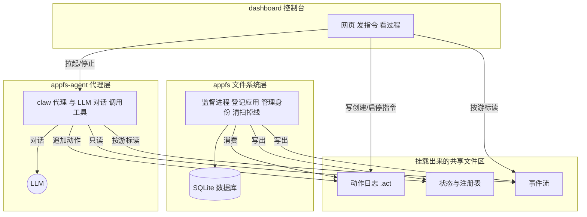

# 整体架构

## 先用一句话抓住它

appfs-platform 把两块东西拼成一个能跑 AI 代理的系统：一块负责**把应用状态存成文件、并管理这些文件**（叫 appfs），另一块是**会思考、会用工具、读写这些文件的代理**（叫 appfs-agent，命令行名字是 `claw`）。两者之间没有 RPC，没有消息队列——它们靠**挂载出来的一块共享文件区**对话：代理往里写「要做的事」，文件系统那头读走、办完、再把结果写回来。

这是理解整个平台唯一的钥匙。记住「两层靠文件通信」，后面所有机制都是它的推论。

## 三个角色

- **appfs（文件系统层）**：一个 Rust 库加上 `agentfs` 命令行。它把所有数据装进一个 SQLite 数据库，再把这个数据库挂载成操作系统里一个真实可用的目录（Linux 用 FUSE、macOS 用 NFS、Windows 用 WinFsp）。挂载活着的时候，它后台还跑一个「监督进程」，负责登记应用、管理代理身份、清掉掉线的代理。
- **appfs-agent / `claw`（代理层）**：一个交互式代理运行时，和 LLM 一来一回、能调用 shell 和文件工具。它启动时找到那块挂载的文件区，以某个身份接上去，然后把读写都当成普通文件操作。
- **dashboard**：一个网页控制台。它不直接跑代理逻辑，而是替你做两件事——往文件区里写「创建/启动/停止一个代理」的指令，以及把 `claw` 当子进程拉起来或杀掉，再把整个过程用网页展示给你看。

> 还有 `desktop/`，只是把上面这些打包成 Electron 桌面应用，理解框架时可以先忽略它。

## 那块共享文件区里有什么

把挂载出来的目录想象成一块**共享盘**，里面有几类文件，**每一类只允许特定的人写**。这是整个平台最该记住的一张表：

| 文件 | 谁写 | 谁读 | 它是什么 |
|------|------|------|----------|
| 动作日志 `*.act` | 代理、dashboard（只追加） | 文件系统那头逐行消费 | 一份「请做这件事」的清单，谁都能往上加一条 |
| 状态与注册表 `*.res.json` | **只有文件系统那头写** | 代理只读 | 当前的权威状态：有哪些应用、有哪些代理、各自什么状态 |
| 事件流 `events.evt.jsonl` | 文件系统那头追加 | 代理、dashboard 按位置读 | 「这件事办完了 / 状态变了」的通知流 |
| `runtime.json` | 文件系统那头写一次 | 代理启动时读 | 一份「地图」，告诉代理其它文件分别在哪 |
| 应用树（公开/私有目录） | 文件系统那头摆出来、代理读写 | 代理 | 应用本身的数据，长得就像普通文件夹 |

规矩只有三条，记住就够：

1. 动作日志**只追加**——谁都能加一条，谁都不改旧的。
2. 状态文件**只有文件系统那头能改**——代理永远只读，这样两边不会打架。
3. 事件流**只往后长**——代理记住自己读到哪了（一个叫「游标」的位置），下次接着读。

## 架构图

**怎么看这张图**：中间那块「共享文件区」是枢纽，所有协调都流经它。文件系统那头（左上）独占状态与事件的写；代理（右上）只能往动作日志里加条目、读状态和事件；dashboard（左下）通过写动作指令来指挥，并负责把 `claw` 进程拉起来或停掉。代理自己则单独去和 LLM 对话——那是它「思考」的部分，和文件区无关。

## 走一遍：代理发一条消息

讲个具体的故事。假设代理要替用户，在某个聊天应用里发一条消息：

1. 代理把「发这条消息」写进应用目录里的一个动作文件（追加一行）。
2. 文件系统那头发现来了新动作，读出来，按内容去执行（调用对应的应用后端）。
3. 办完后，它往事件流里追加一条「这件事办完了」。
4. 代理轮询事件流时读到这条通知，于是知道消息发出去了，可以把结果告诉用户。

整个往返里，代理和文件系统那头**从没直接对话**，全靠那几类文件「传话」。

## 走一遍：一个代理从上线到下线

代理不是一开机就一直在线，它有一个简单的生死周期：

1. **创建身份**：dashboard 写一条「创建 principal」，文件系统那头登记它，并为它私有的应用准备好独立目录。（principal 就是「代理在这套系统里的身份」。）
2. **接上去**：代理写一条「以这个身份 attach」，文件系统那头记下「这个进程现在代表这个身份」。同一身份同时只认一个活进程，除非你显式说「接管」。
3. **保持在线**：代理每 30 秒写一次「我还在」的心跳。文件系统那头每 30 秒扫一遍，**超过 90 秒没心跳就判定掉线**——这样代理崩溃时，系统能自动把它的身份回收掉。
4. **下线**：正常停的时候写一条 detach；要彻底删掉时写一条 delete，并清掉它的私有数据。

这套「心跳 + 自动回收」，是多代理能同时存在、又不互相打架的基础。

## 然后看哪里

到这里，你应该能在脑子里画出整个平台了。接下来按层深入：

- 想看清文件系统那层（app 怎么变成文件、身份与 token、connector、compose、事件流） → [appfs 详解](./appfs)
- 想看清代理那层（动作循环、统一输入、命名同级 agent） → [appfs-agent 详解](./appfs-agent)
- 想搞懂身份和租约的所有边界情况 → [Principal 生命周期](./principal-lifecycle)
- 想搞懂动作和事件怎么一行行流动 → [动作管线](./action-pipeline)
