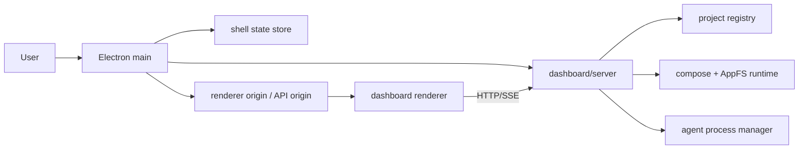

# APPFS Electron 壳层需求文档

> 2026-05-24 · Draft

## 背景

当前 `dashboard/server` 已经承担项目注册、AppFS 启停、agent 归组和 compose 路径约定。
Electron 不应重做这层逻辑。

Electron 只负责把现有 dashboard 包成桌面壳，补上原生文件夹选择、最近项目、窗口持久化，以及 packaged 模式下的 binary 路径解析与加载地址选择。

这份需求建立在现有 project runtime 方案之上：

- `docs/plans/2026-05-24-webui-control-appfs-project-runtime.md`
- `dashboard/server/src/project-registry.ts`
- `dashboard/server/src/routes/projects.ts`
- `dashboard/server/src/process-manager.ts`

## 目标

1. 用户可以从原生对话框选择 project folder。
2. shell 记住最近项目和上次打开的项目。
3. 可以在同一窗口里编辑并保存 `projectRoot/.appfs-compose.yaml`。
4. 可以从桌面壳里启动 / 停止当前项目的 AppFS runtime。
5. managed agent 在 dev / packaged 两种模式下都能正确启动。
6. Electron 只做壳层，不把 AppFS runtime 状态搬进桌面 store。
7. packaged 模式下，AppFS CLI 和 `appfs-agent` 都不依赖用户本机 Rust/Cargo。
8. packaged renderer 的 HTTP / SSE API 地址在 dev 和 packaged 两种模式下都明确可用。

## 非目标

1. 不重写 AppFS runtime。
2. 不重写 `appfs-agent`。
3. 不把 renderer 直接变成本地文件系统客户端。
4. 不在这一步做 overlay 整个 project root。
5. 不把最近项目写进 project 目录或 `.appfs` 目录。

## 当前边界

### Electron 负责

- 原生窗口创建与单实例控制
- 文件夹选择对话框
- 最近项目列表
- 窗口大小、位置、上次项目等 shell 状态
- dev / packaged 启动 profile 解析
- packaged 模式下的 AppFS CLI binary path 和 agent binary path 解析
- renderer 加载地址与 API origin 选择
- 启动 dashboard server 的外壳生命周期

### dashboard/server 负责

- project registry
- compose 文件读写与校验
- AppFS start / stop
- mountpoint 冲突检查
- managed agent spawn / resume / stop
- packaged profile 下消费 shell 注入的 CLI / agent binary 配置
- packaged profile 下按需 serve 已构建的 dashboard 静态资源

### dashboard renderer 负责

- project 选择 UI
- recent projects UI
- compose 编辑器
- runtime 状态展示
- start / stop / save 入口

## 推荐架构



## 核心路径模型

1. `projectRoot` 是用户真实工作区。
2. `projectRoot/.appfs-compose.yaml` 是 compose source of truth。
3. `projectRoot/.appfs` 是 AppFS mountpoint only。
4. `Electron userData` 只放 shell 状态，不放 runtime 状态。

## 启动与加载模型

Electron 必须解决两个独立的启动问题：

1. `dashboard/server` 可以在没有已选项目的情况下启动，保持空 project registry。
2. renderer 必须知道 API origin，不能依赖 dev-only 的 Vite proxy。

推荐规则：

1. dev 模式可以继续使用 Vite proxy，但 API origin 仍应能被 shell 明确注入或配置。
2. packaged 模式建议由 `dashboard/server` serve `dashboard/dist`，Electron 加载 `http://127.0.0.1:<port>`，renderer 使用同源 `/api` 和 `/api/events`。
3. 不推荐 packaged 模式直接加载 `file://dashboard/dist/index.html`，除非同时提供统一的 API client / SSE client 来拼接 shell 注入的 server origin。
4. server readiness 的定义必须包含：HTTP 监听成功、`GET /api/projects` 可返回、静态资源入口可加载。

## 当前项目模型

renderer 需要一个显式的 selected project 状态。

1. `selectedProjectRoot` 可以保存在 shell store 中，跨重启恢复。
2. `selectedProjectId` 由 server 注册项目后返回，renderer 运行时持有即可。
3. Start / Stop / Compose Editor / Spawn Agent 都必须绑定当前 selected project。
4. 如果 selected project 被删除、不可访问或 server 注册失败，renderer 应回到 project picker / recent projects 状态。

## 功能要求

### 1. Project picker

- 首次启动时，如果没有最近项目，展示原生 folder picker。
- 选择 folder 后，先通过 `POST /api/projects/open` 注册项目；注册成功后再加入最近项目。
- 选择结果应当只接受目录，不接受文件。
- 已知项目可以从最近列表一键重新打开。
- server 不应因为缺少初始 project root 而启动失败。

### 2. Recent projects

- 最近项目按 `lastOpenedAt` 排序。
- 最近项目至少保存 `projectRoot`、`displayName`、`lastOpenedAt`。
- shell 重启后，最近项目必须还在。
- 最近项目不是 AppFS runtime state，也不属于 compose 文件。
- 最近项目路径需要按平台规则规范化和去重。
- 最近项目指向的目录不存在时，应显示可移除 / 重新选择状态，而不是静默失败。

### 3. Compose editing

- 选择项目后，renderer 可以读取并编辑 `.appfs-compose.yaml`。
- 若 compose 缺失，应该进入可创建状态，而不是直接报死错。
- 保存前要做 AppFS compose schema 校验，不能只做 YAML 语法校验。
- 保存必须是原子写入，不能半写坏文件。
- 保存失败后要保留草稿和错误信息。
- schema 校验逻辑应尽量复用 AppFS CLI / Rust compose parser，避免 dashboard/server 与 AppFS runtime 维护两套规则。

### 4. Runtime control

- Start / Stop 入口属于当前项目。
- Start 前必须检查 compose 是否存在且有效。
- Start 前必须检查 `.appfs` 是否为空或不存在。
- Stop 只停当前项目关联的 managed agent 和 AppFS runtime。
- app quit cleanup 必须确保不会遗留由 shell/server 启动的 `appfs compose up` 子进程。

### 5. Launch profile 和 binaries

- dev 模式继续允许通过 cargo / manifest path 启动 AppFS CLI 和 managed agent。
- packaged 模式必须由 shell 解析内置的 AppFS CLI binary path 和 `appfs-agent` binary path。
- AppFS CLI binary path 可以通过 server bootstrap config 或 `APPFS_CLI_BIN` 注入给 `dashboard/server`。
- managed agent binary path 可以通过 server bootstrap config 或默认 spawn config 注入给 `process-manager`。
- binary path 不应写进 project 文件、compose 文件或 recent projects。
- 绝对路径只在当前 shell runtime profile / process env 中出现，不进入 project source of truth。

### 6. Window behavior

- 使用单实例锁。
- 窗口尺寸和位置要持久化。
- 区分 window close 和 app quit。
- window close 可以隐藏窗口或最小化到后台；它不应隐式停止 runtime。
- app quit 必须在 project 正在运行时给出明确确认。
- 用户确认 quit 后，shell 应通过 server 做 runtime / managed agent 清理，再销毁 server 子进程树。

## 数据与持久化

建议的 shell store 只保存这些字段：

```ts
interface ShellState {
  schemaVersion: 1;
  recentProjects: Array<{
    projectRoot: string;
    displayName: string;
    lastOpenedAt: number;
  }>;
  lastSelectedProjectRoot?: string;
  windowBounds?: { width: number; height: number; x?: number; y?: number };
  launchProfile: 'dev' | 'packaged';
}
```

不建议保存：

- AppFS mount 状态
- agent registry
- compose 内容全文
- project runtime status

## 风险

1. 如果 Electron 直接接管 runtime，会和现有 web dashboard 分叉。
2. 如果 compose 编辑绕过 server 校验，容易把项目写坏。
3. 如果 `binaryPath` 被持久化成绝对路径，packaged app 会变脆。
4. 如果最近项目写进 project 目录，会污染用户工作区。
5. 如果只打包 `appfs-agent` 而不打包 AppFS CLI，用户仍然需要本机 Rust/Cargo 才能启动 runtime。
6. 如果 packaged renderer 使用 `file://` 且继续调用相对 `/api`，HTTP 和 SSE 会在生产环境失效。
7. 如果 server 退出时不清理 project runtime 子进程，会遗留挂载或后台进程。

## 验收标准

1. 能从原生对话框打开 project folder。
2. 最近项目能跨重启保留。
3. 能编辑并保存 `.appfs-compose.yaml`。
4. 能启动 / 停止当前项目的 AppFS runtime。
5. packaged 模式下不需要手工配 `binaryPath`。
6. dashboard/server 仍然是 project runtime 的唯一事实来源。
7. 首次启动无最近项目时，server 仍能启动，renderer 能展示 project picker。
8. packaged 模式下 AppFS CLI 和 managed agent 都能从内置 binary 启动。
9. compose 保存会拒绝 AppFS schema 无效的配置，且不会覆盖原文件。
10. 关闭窗口、退出应用、停止 runtime 的行为对用户明确且无孤儿进程。

