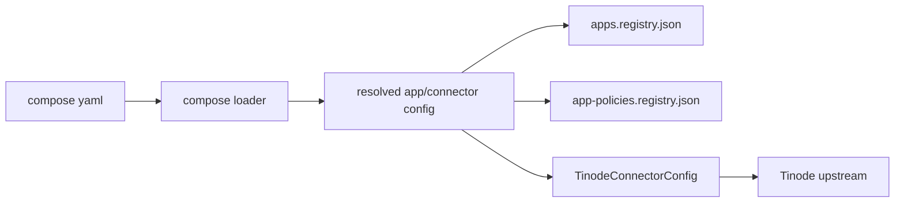

# APPFS Compose Typed Connector Config Requirements

## 背景

当前 Tinode 私有应用仍依赖启动时手工注入环境变量：

```powershell
$env:APPFS_TINODE_ENDPOINT = "http://101.34.216.193:6060"
$env:APPFS_TINODE_LOGIN_PREFIX = "dash$(Get-Date -Format yyyyMMddHHmmss)"
$env:APPFS_TINODE_CREDENTIAL_POLICY = "auto-create"
```

这对本地手测可用，但不适合作为长期配置方式，原因如下：

- 配置语义不清，容易把 connector 配置和运行环境混在一起。
- dashboard 未来要做模板编辑器和注册控制台，env var 不利于表单化管理。
- `APPFS_TINODE_LOGIN_PREFIX` 本质是命名空间策略，不是环境变量。
- `APPFS_TINODE_CREDENTIAL_POLICY` 已经属于 app policy，和 app 模板重复。

## 目标

把 Tinode 的关键运行参数从 shell env 收口到 compose 模板中，形成结构化、可视化、可由 dashboard 管理的配置。

目标配置项：

- upstream endpoint
- login prefix / login prefix template
- credential policy

## 非目标

- 不在本需求中实现 dashboard UI。
- 不在本需求中重构 Tinode 协议本身。
- 不要求保留旧 env-only 配置作为长期方案。

## 设计原则

1. 配置应按语义归属，而不是按“能不能塞进 env”来设计。
2. connector 级配置放在 connector 侧。
3. app policy 放在 app 侧。
4. dashboard 未来只编辑模板，不直接编辑 shell 环境。

## 建议的配置模型

### 1. Connector Config

新增 connector 的结构化配置块，专用于 connector 自身参数。

示例：

```yaml
connectors:
  tinode-in-process:
    mode: in_process
    transport: in_process
    config:
      kind: tinode
      endpoint: http://101.34.216.193:6060
      login_prefix_template: dash{compose_run_id}
```

### 2. App Policy

Tinode 的 credential policy 继续保留在 app 侧：

```yaml
apps:
  tinode:
    connector: tinode-in-process
    visibility: private
    path_template: private/{principal_id}/tinode
    profile_template: tinode:{principal_id}
    credential_policy: auto-create
    inbound_poll_ms: 1000
```

## 字段语义

### `endpoint`

- Tinode upstream 服务地址。
- 属于 connector config。
- 必须是 `http://` 或 `https://` URL。

### `login_prefix_template`

- Tinode 自动创建账号时的登录前缀策略。
- 属于 connector config。
- 不应要求用户在 shell 中拼接时间戳。
- 允许包含一次性解析占位符，例如 `{compose_run_id}`。

### `credential_policy`

- 由 app policy 决定。
- 当前 v0 仅支持 `auto-create`。
- 不应重复放入 connector env。

## 行为要求

1. compose loader 必须能解析结构化 Tinode config。
2. `compose up` 的 resolve 阶段必须把 `{compose_run_id}` 一次性展开成最终值，并写入 registry。
3. Tinode connector 初始化必须优先读取 compose config，而不是优先依赖 shell env。
4. 若 compose config 存在，shell env 仅作为兼容 fallback。
5. dashboard 后续编辑模板时，应直接编辑这些结构化字段。

## 数据流



## 验收标准

1. 无需手工设置 `APPFS_TINODE_ENDPOINT`、`APPFS_TINODE_LOGIN_PREFIX`、`APPFS_TINODE_CREDENTIAL_POLICY` 即可通过 compose 启动 Tinode。
2. Tinode 的 endpoint、login prefix、credential policy 能在 compose 中被明确声明。
3. `apps.registry.json` 和 `app-policies.registry.json` 仍保持现有职责，不混入 shell env 概念。
4. dashboard 未来可以直接把这些字段做成表单，不需要先生成 shell 命令。

## 实施建议

### Phase 1

- 为 Tinode connector 增加结构化 config schema。
- 让 compose loader 解析并验证新字段。
- 让 Tinode connector 优先读取 compose config。

### Phase 2

- dashboard 增加 Tinode app template 编辑表单。
- dashboard 从表单生成 compose 模板，而不是生成 shell env。

## 风险

- 如果 login prefix template 设计过于自由，可能引入不稳定账号命名。
- 如果 connector config 和 app policy 边界不清，可能出现重复字段。
- 如果 dashboard 继续生成 env var，结构化配置会被绕回去。

## 建议结论

不要把这三个值继续作为本地启动环境变量来管理。
应该把它们收口到 compose 模板中的 typed connector config + app policy。
