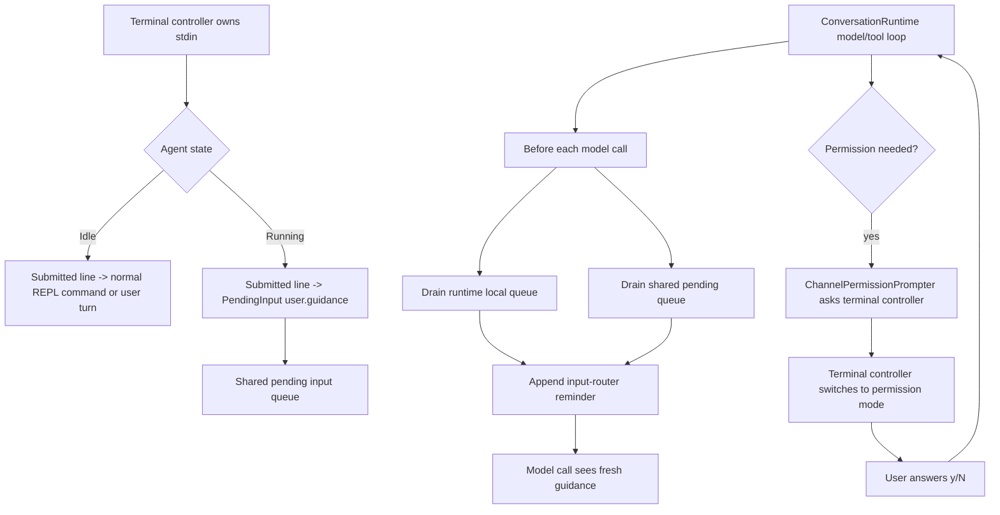

# AppFS Agent PR7 Running Guidance Input Implementation Plan

> **For Claude:** REQUIRED SUB-SKILL: Use superpowers:executing-plans to implement this plan task-by-task.

**Goal:** Let users type guidance while an agent turn is running, and inject that guidance at the next safe model-call boundary by default.

**Architecture:** Keep `ConversationRuntime` on the main execution path and add a thread-safe pending-input bridge that the runtime drains before every model call. Replace the unsafe broad AppFS watcher with a single-stdin-owner terminal controller: it reads terminal input while the runtime is busy, routes submitted lines as `UserTerminal` envelopes, and also owns permission prompt input so guidance and approval responses never race for `stdin`.

**Tech Stack:** Rust, `crossterm`, existing `runtime::input_router`, existing `ConversationRuntime` model/tool loop, existing `rusty-claude-cli` REPL.

---

## Status

This plan covers the deferred PR7 from:

- `docs/plans/2026-05-09-appfs-agent-event-boundary-and-idle-wake.md`
- `docs/plans/2026-05-09-appfs-agent-unified-input-router-implementation.md`

PR1-6 are assumed complete:

1. broad `--watch-appfs-events` watcher is disabled;
2. AppFS event classification exists;
3. AppFS event boundary injection exists;
4. `InputEnvelope` and `PendingInputQueue` scaffolding exists;
5. attention-only `--appfs-idle-wake` exists;
6. Tinode `message.received + requires_attention=true` wakes idle agents safely.

PR7 should not reintroduce broad event wake. It only adds running-turn terminal guidance.

Current implementation status:

1. PR7.1 shared runtime queue is implemented and covered by runtime tests.
2. PR7.2 terminal event routing types and `pending_input_from_running_line` are implemented.
3. PR7.3 channel-backed permission prompting is implemented and covered by CLI tests.
4. PR7.4 experimental `--running-input` REPL is implemented behind an opt-in flag; the default `rustyline` REPL is unchanged.

Current REPL closure:

1. Two REPL loops intentionally coexist in v0:
   - `run_repl()` is the stable default path. It uses the existing `rustyline`-style line editor and only observes AppFS idle wake at safe turn boundaries.
   - `run_repl_with_running_input()` is the experimental `--running-input` path. It uses the crossterm terminal controller, owns stdin, routes submitted text while a turn is active as guidance, and supports attention-only AppFS idle wake through the shared input queue.
2. The two functions duplicate startup, slash-command, prompt-history, and turn-running glue. This is accepted for PR7 because terminal input is fragile and the default REPL must remain a reliable fallback while the new controller soaks.
3. The duplicate code should not grow new product behavior independently. New AppFS/input-router behavior should be added through shared `LiveCli` helpers where possible, then both REPL entry points should call those helpers.
4. A future default-REPL migration should first extract shared REPL turn handling, then either make `--running-input` default or delete the old `run_repl()` path after history/completion/permission behavior has parity.

## Requirements

### Functional

1. When the agent is idle, user input behaves like today: submit a normal user turn.
2. When the agent is running, user input defaults to guidance:
   `InputSource::UserTerminal`, `input_type = "user.guidance"`, `delivery = InjectAtNextBoundary`.
3. Running guidance is injected before the next model call, using the existing input-router reminder format.
4. Permission approval prompts remain usable and must not be mistaken for guidance.
5. `Ctrl+C` / cancel behavior must remain understandable.
6. Non-TTY mode keeps the existing synchronous fallback.

### Non-Functional

1. Do not move `ConversationRuntime` to a background thread in v0.
2. Do not rewrite the whole CLI into a full-screen TUI.
3. Keep the first implementation behind an explicit flag until manual smoke is stable.
4. Preserve existing slash command behavior in idle mode.
5. Avoid stdin races between normal input, running guidance, and permission approval.

## Architecture Decisions

### ADR 1. One Component Owns `stdin`

Decision: introduce a terminal controller that owns terminal input whenever running-input mode is enabled.

Rationale: a background `read_line()` thread plus the existing permission prompter would race on `stdin`. The user could type `y` for a permission prompt and accidentally enqueue `y` as guidance, or type guidance while the prompter consumes it.

Trade-off: this requires a small crossterm-based line editor for the experimental mode. The default `rustyline` REPL remains available as fallback.

### ADR 2. Runtime Drains A Shared Pending Queue At Boundaries

Decision: add a shared pending-input queue handle that can be written by the terminal controller and drained by `ConversationRuntime::sync_pending_inputs_before_model_call()`.

Rationale: the runtime already has the correct model-call boundary. The terminal controller should not mutate session state directly.

Trade-off: the queue is process-local in v0. Restart persistence can be added later if needed.

### ADR 3. Permission Prompt Uses The Same Terminal Controller

Decision: add a channel-backed `PermissionPrompter` for running-input mode. When runtime needs permission, it sends a permission request to the terminal controller and blocks waiting for a decision.

Rationale: permission approval is another kind of terminal interaction. It must temporarily take precedence over guidance input.

Trade-off: v0 only needs yes/no permission prompts. Richer prompt UI can be added later.

### ADR 4. PR7 Is Initially Opt-In

Decision: add a flag such as `--running-input` or `--input-router` for the first PR7 slice.

Rationale: terminal UX is fragile. We can ship the runtime plumbing and manual-smoke it without destabilizing the default REPL.

Recommended flag: `--running-input`.

After manual smoke is stable, a follow-up PR can make it default.

## High-Level Flow



## Implementation Slices

Keep these as small PRs or commits. Do not jump directly to a polished terminal UI.

## PR7.1: Runtime Shared Pending Input Queue

**Goal:** Allow another thread/component to enqueue `PendingInput` while a turn is running.

**Files:**

- Modify: `appfs-agent/rust/crates/runtime/src/input_router.rs`
- Modify: `appfs-agent/rust/crates/runtime/src/conversation.rs`
- Modify: `appfs-agent/rust/crates/runtime/src/lib.rs`
- Test: `appfs-agent/rust/crates/runtime/src/input_router.rs`
- Test: `appfs-agent/rust/crates/runtime/src/conversation.rs`

### Step 1: Add Shared Queue Type

Add a cloneable handle:

```rust
#[derive(Clone, Default)]
pub struct SharedPendingInputQueue {
    inner: Arc<Mutex<PendingInputQueue>>,
}
```

Methods:

```rust
impl SharedPendingInputQueue {
    pub fn push(&self, input: PendingInput);
    pub fn drain_boundary_pending_inputs(&self) -> Vec<PendingInput>;
    pub fn len(&self) -> usize;
    pub fn is_empty(&self) -> bool;
}
```

Keep `PendingInputQueue` as the non-shared internal queue.

### Step 2: Add Runtime Hook

Add to `ConversationRuntime`:

```rust
external_pending_inputs: Option<SharedPendingInputQueue>
```

Add builder:

```rust
pub fn with_external_pending_inputs(mut self, queue: SharedPendingInputQueue) -> Self
```

Update `sync_pending_inputs_before_model_call()`:

1. drain local `pending_inputs`;
2. drain `external_pending_inputs`;
3. combine in deterministic order: local first, external second;
4. restore both correctly on push-message failure.

For v0, restoring external queue can restore to front via a method:

```rust
pub fn restore_front<I>(&self, inputs: I)
```

### Step 3: Test Boundary Injection From External Queue

Add a runtime test:

1. fake API call 1 emits a tool use;
2. fake tool handler pushes `user.guidance` into the shared queue;
3. before API call 2, runtime drains the shared queue;
4. API call 2 request contains the input-router attachment.

Run:

```powershell
cargo test --manifest-path appfs-agent\rust\Cargo.toml -p runtime external_pending -- --test-threads=1
```

Expected: new test passes.

### Step 4: Verify Existing Runtime Tests

Run:

```powershell
cargo test --manifest-path appfs-agent\rust\Cargo.toml -p runtime input_router pending appfs -- --test-threads=1
```

Rollback: remove `SharedPendingInputQueue` and the optional runtime field.

## PR7.2: Terminal Input Event Model

**Goal:** Add testable input events without changing the active REPL yet.

**Files:**

- Create: `appfs-agent/rust/crates/rusty-claude-cli/src/terminal_controller.rs`
- Modify: `appfs-agent/rust/crates/rusty-claude-cli/src/main.rs`
- Test: `appfs-agent/rust/crates/rusty-claude-cli/src/terminal_controller.rs`

### Step 1: Add Event Types

Define:

```rust
pub enum TerminalMode {
    IdlePrompt,
    RunningGuidance,
    PermissionPrompt,
}

pub enum TerminalEvent {
    SubmittedLine(String),
    Cancel,
    Exit,
}

pub enum TerminalCommand {
    SetMode(TerminalMode),
    SetCompletions(Vec<String>),
    AskPermission(PermissionPromptView),
    Shutdown,
}
```

### Step 2: Add Pure Line Routing Helper

Add:

```rust
pub fn pending_input_from_running_line(line: &str) -> Option<PendingInput>
```

Rules:

1. empty line -> none;
2. `/queue <text>` -> `QueueAfterTurn`;
3. anything else -> `InjectAtNextBoundary` with `input_type = "user.guidance"`;
4. sanitize `<system-reminder>` through existing renderer.

Do not implement the full terminal loop yet.

### Step 3: Tests

Test:

1. normal running line becomes `user.guidance`;
2. `/queue` becomes `QueueAfterTurn`;
3. empty line is ignored;
4. source is `UserTerminal`.

Run:

```powershell
cargo test --manifest-path appfs-agent\rust\Cargo.toml -p rusty-claude-cli terminal_controller -- --test-threads=1
```

Rollback: remove the new module.

## PR7.3: Channel-Backed Permission Prompter

**Goal:** Make permission approval compatible with a single stdin owner.

**Files:**

- Modify: `appfs-agent/rust/crates/rusty-claude-cli/src/terminal_controller.rs`
- Modify: `appfs-agent/rust/crates/rusty-claude-cli/src/main.rs`
- Test: `appfs-agent/rust/crates/rusty-claude-cli/src/main.rs`

### Step 1: Add Permission Channels

Define:

```rust
pub struct PermissionPromptView {
    pub tool_name: String,
    pub current_mode: String,
    pub required_mode: String,
    pub reason: Option<String>,
    pub input: String,
}

pub struct PermissionPromptTicket {
    pub view: PermissionPromptView,
    pub response_tx: Sender<runtime::PermissionPromptDecision>,
}
```

### Step 2: Add `ChannelPermissionPrompter`

In `main.rs`, add:

```rust
struct ChannelPermissionPrompter {
    current_mode: PermissionMode,
    permission_tx: Sender<PermissionPromptTicket>,
}
```

Behavior:

1. preserve `CLAW_TEST_PERMISSION_PROMPT_RESPONSE` shortcut;
2. otherwise send ticket to terminal controller;
3. block on response;
4. if channel closes, deny safely.

### Step 3: Tests

Test:

1. env response still works;
2. channel response `Allow` returns allow;
3. dropped channel returns deny.

Run:

```powershell
cargo test --manifest-path appfs-agent\rust\Cargo.toml -p rusty-claude-cli permission_prompt -- --test-threads=1
```

Rollback: keep old `CliPermissionPrompter`.

## PR7.4: Experimental Running-Input REPL

**Goal:** Wire the terminal controller into REPL behind `--running-input`.

**Files:**

- Modify: `appfs-agent/rust/crates/rusty-claude-cli/src/input.rs`
- Modify: `appfs-agent/rust/crates/rusty-claude-cli/src/main.rs`
- Modify: `appfs-agent/rust/README.md`
- Test: `appfs-agent/rust/crates/rusty-claude-cli/src/main.rs`

### Step 1: Add CLI Flag

Add parser support:

```text
--running-input
```

Rules:

1. only valid in interactive REPL mode;
2. can be combined with `--appfs-idle-wake`;
3. not valid with `prompt`.

Tests:

```rust
parses_running_input_flag_for_interactive_repl
rejects_running_input_with_prompt_mode
```

### Step 2: Add Running-Input REPL Function

Keep existing `run_repl()` unchanged for default mode.

Add:

```rust
fn run_repl_with_running_input(...)
```

Flow:

1. create `SharedPendingInputQueue`;
2. start terminal controller;
3. while idle, wait for `TerminalEvent::SubmittedLine`;
4. slash commands execute as today;
5. normal prompt starts `cli.run_turn_with_external_inputs(input, queue, permission_tx)`;
6. before running the turn, set terminal mode to `RunningGuidance`;
7. after turn, set mode back to `IdlePrompt`;
8. while running, terminal submitted lines are pushed to shared pending queue;
9. if `--appfs-idle-wake` is enabled, keep existing idle wake checks between idle events.

### Step 3: Add `LiveCli` Runtime Entry

Add:

```rust
fn run_turn_with_external_inputs(
    &mut self,
    input: &str,
    external_queue: SharedPendingInputQueue,
    permission_tx: Sender<PermissionPromptTicket>,
) -> Result<(), Box<dyn std::error::Error>>
```

This mirrors `run_turn()` but:

1. installs `external_queue` into the prepared runtime;
2. uses `ChannelPermissionPrompter`;
3. preserves spinner/summary/session persistence.

### Step 4: Minimal Terminal Controller

Use crossterm only inside the experimental controller:

1. `event::poll(Duration::from_millis(50))`;
2. collect characters into a line buffer;
3. `Enter` submits;
4. `Ctrl+J` inserts newline if feasible, otherwise document v0 limitation;
5. `Ctrl+C` cancels current line in idle mode;
6. while in permission mode, only `y`, `n`, `Enter`, `Esc` are interpreted for approval.

Do not attempt full history and completion parity in PR7.4. The default `rustyline` REPL remains available.

### Step 5: Manual Smoke

Terminal A:

```powershell
cd C:\Users\esp3j\rep\appfs-platform
$env:APPFS_TINODE_ENDPOINT = "http://101.34.216.193:6060"
$env:APPFS_TINODE_LOGIN_PREFIX = "appfsmanual$(Get-Date -Format yyyyMMddHHmmss)"
$env:APPFS_TINODE_CREDENTIAL_POLICY = "auto-create"
cargo run --manifest-path appfs\cli\Cargo.toml --target-dir C:\tmp\appfs-local-target -- appfs compose up -f appfs\appfs-compose.tinode.local.yaml
```

Terminal B:

```powershell
cd C:\mnt\appfs-compose-tinode
$env:APPFS_PRINCIPAL_ID = "default"
cargo run --manifest-path C:\Users\esp3j\rep\appfs-platform\appfs-agent\rust\Cargo.toml -p rusty-claude-cli -- --dangerously-skip-permissions --running-input --appfs-idle-wake
```

Manual behavior:

1. start a long task;
2. while the task is running, type `先别改认证，只改 event router`;
3. verify the next model call receives an input-router reminder with `user.guidance`;
4. send a Tinode message from another agent;
5. verify AppFS event injection still works;
6. verify permission prompts still accept `y/N` when not using dangerous mode.

### Step 6: Verification

Run:

```powershell
cargo fmt --manifest-path appfs-agent\rust\Cargo.toml --all --check
cargo test --manifest-path appfs-agent\rust\Cargo.toml -p runtime input_router pending appfs -- --test-threads=1
cargo test --manifest-path appfs-agent\rust\Cargo.toml -p rusty-claude-cli terminal_controller permission appfs -- --test-threads=1
cargo check --manifest-path appfs-agent\rust\Cargo.toml -p rusty-claude-cli
git diff --check
```

Rollback: hide `--running-input` and use default `run_repl()`.

## PR7.5: Decide Default Behavior

**Goal:** After manual smoke, decide whether running-input mode becomes default.

Options:

1. keep `--running-input` experimental;
2. make it default only when `--appfs-idle-wake` is enabled;
3. make it default for all interactive REPL sessions;
4. replace the default `rustyline` REPL after parity is good enough.

Recommended for first merge: option 1.

Promotion criteria:

1. no permission prompt race;
2. no broken slash commands in default REPL;
3. no corrupted terminal after panic/Ctrl+C;
4. user guidance reliably appears before the next model call;
5. Tinode idle wake still wakes exactly once.

## Acceptance Criteria

### Runtime

1. External pending inputs can be pushed while a turn is running.
2. External guidance is injected before the next model call.
3. `QueueAfterTurn` items are not injected into the current boundary.
4. Existing AppFS event boundary injection still works.

### CLI

1. `--running-input` starts the experimental running-input REPL.
2. Existing REPL remains unchanged without the flag.
3. User input while running is routed as `user.guidance` by default.
4. `/queue <message>` routes as `QueueAfterTurn` if implemented in PR7.4.
5. Permission prompt input is not routed as guidance.
6. Non-TTY mode uses existing synchronous fallback.

### Safety

1. External input reminders are source-labeled.
2. Guidance cannot masquerade as system instructions.
3. Terminal raw mode is restored on normal exit and panic-safe paths where feasible.
4. Queue size is bounded or at least observable.

## Risks And Mitigations

### Risk: Terminal UI Becomes Too Large

Mitigation: keep crossterm controller minimal and opt-in. Do not chase full rustyline parity in PR7.4.

### Risk: Permission Prompt Race

Mitigation: single stdin owner. Permission prompt must use channel-backed UI in running-input mode.

### Risk: Runtime Shared Queue Deadlock

Mitigation: shared queue lock is held only for push/drain. Never hold it across model/tool calls.

### Risk: Guidance Arrives Too Late

Mitigation: inject at every model-call boundary, including after tool results and before the next assistant call. Add test where a tool pushes guidance before the second API call.

### Risk: Existing REPL Regresses

Mitigation: keep default REPL on the existing `rustyline` path until the experimental mode is proven.

## Recommended First Task

Start with PR7.1 only:

1. add `SharedPendingInputQueue`;
2. wire it into `ConversationRuntime`;
3. test that external guidance is injected before the second model call;
4. run runtime tests.

Do not touch terminal UI until PR7.1 is green. This gives us the core contract first, which is the part the terminal layer depends on.
