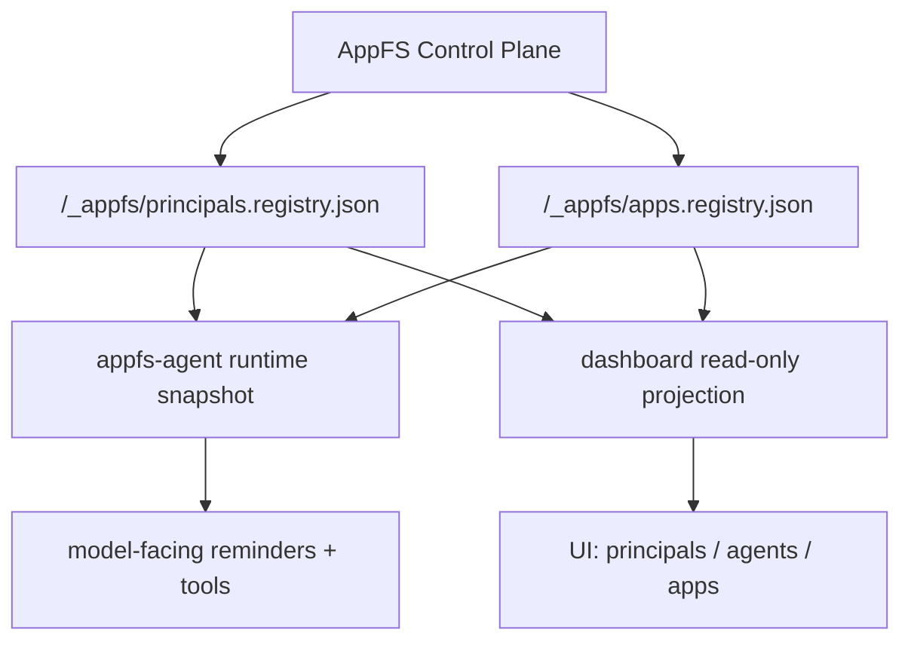

# Principal Registry Refresh and Multi-Agent Awareness Design

## Background

The current multi-agent stack has two different state planes:

- `appfs` owns the authoritative control-plane registries, especially `/_appfs/principals.registry.json` and `/_appfs/apps.registry.json`.
- `dashboard` owns the runtime projection of live agent/session state for the web UI.

Today, `appfs-agent` reads the principal registry at startup and injects a summary into the system prompt. That works for the initial snapshot, but it becomes stale when a new principal is created later in the same project. A long-running agent cannot rely on a frozen system prompt to learn about newly spawned agents.

The failure mode is subtle: principal creation is a durable project-state change, but the current delivery path can look like a one-shot event. That makes one agent see the update while another misses it.

## Goals

- Keep AppFS as the single source of truth for principals.
- Avoid duplicating principal truth inside dashboard Node.
- Make newly created principals visible to all active agents without mutating the system prompt itself.
- Preserve a good UX for the dashboard and for model-facing context.
- Avoid single-consumer registry events.

## Non-Goals

- Do not introduce `/principal use`.
- Do not move principal truth into the dashboard database.
- Do not rely on rewriting the system prompt mid-session.
- Do not make principal creation depend on human manual refreshes.

## Current State

### AppFS side

`appfs-agent` already loads principals from the control plane:

- `load_principal_summaries_from_paths(Some(control_dir.join("principals.registry.json")))`
- `summarize_known_principals(environment)`
- `render_appfs_overview_lines(...)` injects:
  - current principal id
  - known principals in the project

This is the correct authority boundary.

### Dashboard side

The Node backend currently maintains:

- an in-memory `AgentRegistry` of live sessions/processes
- a `ProcessManager` for managed headless agents
- a mounted-apps view read from `/_appfs/apps.registry.json`

This is a runtime projection, not a principal registry source of truth.

## Proposed Architecture

### 1. Authority layer

AppFS remains the canonical source for:

- principal creation/update/delete
- app instance materialization
- app visibility and principal binding

### 2. Runtime projection layer

Both `appfs-agent` and `dashboard` may cache and display principal data, but only as derived views.

### 3. Refresh layer

Principal registry changes are treated as durable state changes with a revision, not as one-shot consumable messages.

## Key Design Decisions

### Decision 1: Principal registry is durable state, not a chat event

When a principal is created, updated, or deleted, the control plane should update `principals.registry.json`. Active agents should learn about the change by checking the registry revision at turn boundaries.

This avoids the problem where one agent consumes the event and another misses it.

### Decision 2: Do not mutate system prompt mid-session

The system prompt can stay stable. New information should be injected as a small reminder or summary block before the next model call.

This keeps the prompt cache model sane and avoids fighting KV cache semantics.

### Decision 3: Add a read-only principal refresh path

The runtime should compare a cached principal registry revision with the current revision. If it changed, inject a concise refresh reminder such as:

- new principal added
- principal removed
- display name changed

### Decision 4: Dashboard reads the same files, but does not own them

The dashboard can expose a `principals` projection route for UI use, but that route must read `/_appfs/principals.registry.json` directly or via a thin server-side cache.

It should not become a second principal registry.

## Runtime Flow

### On agent startup / attach

1. Resolve AppFS environment.
2. Read `principals.registry.json`.
3. Cache:
   - `current_principal_id`
   - `known_principals`
   - `principal_registry_revision`
4. Render the initial system prompt.

### On each model boundary

1. Re-read the principal registry revision.
2. If unchanged, continue normally.
3. If changed:
   - compute a small delta
   - inject a reminder into the next model call
   - update the cached revision

### On principal creation

1. AppFS updates `principals.registry.json`.
2. AppFS may also emit a durable registry-change signal.
3. Each active agent sees the change on its next boundary.
4. Dashboard refreshes its UI projection from the same file.

## Suggested Interfaces

### Registry snapshot

The environment can carry:

- `current_principal_id`
- `known_principals[]`
- `principal_registry_revision`

### Optional model-facing tool

Expose a small read-only tool such as:

- `appfs.list_principals`
- `appfs.status`

This is only for on-demand inspection. It does not replace the turn-boundary refresh.

### Optional dashboard projection route

Add a read-only API route that returns the same principal registry snapshot for the UI.

## Event Semantics

Use two different notions of events:

- **Durable registry changes**: principal/app registry updates. These must be replayable and revisioned.
- **Ephemeral attention events**: messages, wakes, alerts, and reminders. These are per-agent and turn-scoped.

Do not use a single-consumer event queue for registry changes.

## UI Implications

- The dashboard should show live agents from `AgentRegistry` and `ProcessManager`.
- If a principal browser is needed, it should read the AppFS principal registry snapshot.
- The UI should not imply that the dashboard is the owner of principal truth.

## Risks

- If we keep using one-shot events for registry changes, some agents will remain stale.
- If we copy principal truth into dashboard state, we create a second source of truth.
- If we try to rewrite system prompt text in place, we will fight prompt cache semantics.

## Rollout Plan

1. Keep `principals.registry.json` as the only authority.
2. Add a registry revision field or hash to the runtime snapshot.
3. Refresh agent-facing principal context on each model boundary.
4. Add an optional read-only principal status/tool route.
5. Make dashboard consume the same registry snapshot for display only.

## Recommended Outcome

The cleanest model is:

- AppFS owns principals.
- appfs-agent rehydrates principal awareness at turn boundaries.
- dashboard mirrors the same registry for display only.
- new principals become visible without requiring system prompt mutation or a one-shot broadcast event.

