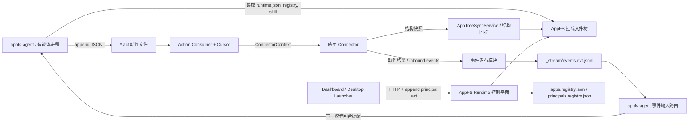
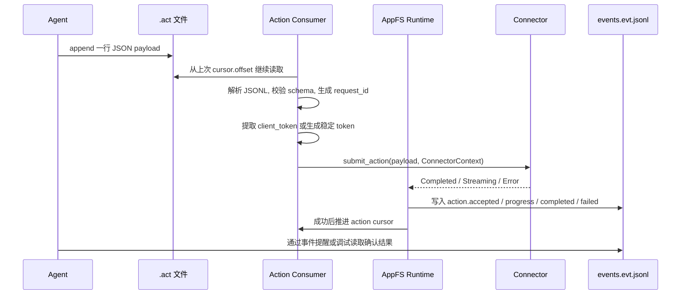
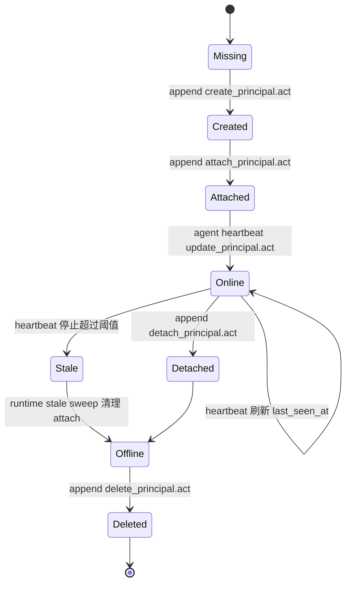

# 一种面向智能体的应用文件系统交互方法、系统、设备及存储介质

版本：技术交底书草稿  
状态：未套模板，供内部技术确认和专利代理人进一步撰写使用  
基础信息：申请人、发明人、联系人、交底日期等暂按待填写处理

## 一、阅读与理解结论

本项目的核心不是单一聊天应用、单一 Dashboard 或单一 agent 客户端，而是一套将外部应用转化为智能体可发现、可读写、可审计、可事件唤醒的文件系统交互层。该系统可称为 AppFS。其总体思想是：让应用以文件树的方式暴露状态、动作入口、事件流和自描述元数据，使智能体无需为每个应用临时编写插件协议，即可通过普通文件读取和追加写入完成应用交互。

经阅读项目文档和实现代码，当前较适合作为专利主题的发明点为：AppFS runtime 发布运行清单并物化应用命名空间，connector 提供结构快照和动作执行能力，runtime 将结构快照转化为 `.res.json`、`.res.jsonl`、`.act`、`.evt.jsonl` 等文件协议对象；智能体通过 runtime manifest、环境变量或目录启发发现 AppFS，绑定稳定 principal 身份和进程级 attach lease；外部事件通过事件流和 cursor 进入下一模型回合；多 agent 通过 principal、profile、private app instance 隔离各自应用上下文和凭据。

Tinode 私有聊天只是该机制的一个完整实施例。它证明同一个 AppFS 机制可以承载真实外部应用：每个 principal 自动拥有自己的 `/private/<principal-id>/tinode` 私有应用实例，`profile_id=tinode:<principal-id>` 被传入 connector，凭据保存在 connector 私有状态而不进入模型可见文件树，发送消息走 `contacts/send_message.act`，收件箱走 `inbox/*.res.jsonl`，新消息走 `_stream/events.evt.jsonl` 唤醒或提醒 agent。

## 二、技术领域

本发明涉及人工智能智能体、应用集成、虚拟文件系统、事件驱动运行时、多智能体协作和应用连接器技术。更具体地，本发明涉及一种面向智能体的应用文件系统交互方法、系统、设备及存储介质，用于将外部应用的状态、动作、事件、身份和上下文隔离能力映射为文件系统协议，使智能体能够以统一方式发现、读取、调用和响应应用。

## 三、背景技术

现有智能体通常通过以下方式与应用交互：

1. 通过插件或工具调用直接暴露应用 API。
2. 通过浏览器自动化模拟用户点击和输入。
3. 通过 MCP、HTTP、gRPC 或本地脚本为每个应用单独编写适配层。
4. 通过对话上下文或提示词手工描述应用状态和可执行动作。

这些方式能解决单点接入问题，但在复杂项目、多应用、多 agent 和外部事件持续发生的场景中会出现明显不足。尤其当智能体需要同时使用多个应用、多个 agent 需要在同一个项目空间内协作、外部应用有私有账号或凭据、应用事件需要反向唤醒模型回合时，单纯 API 插件或浏览器自动化缺少统一的命名、审计、身份绑定和事件传递机制。

## 四、现有技术存在的主要问题

### 1. 应用状态不可统一发现

不同应用以不同 API 或 UI 方式暴露状态，智能体需要提前知道应用特定接口。即使通过工具 schema 描述动作，应用的当前页面、可用资源、当前 scope、可用动作、事件流位置等运行态信息仍难以被统一发现。

### 2. 动作执行缺少文件级审计和幂等机制

传统工具调用通常在一次模型回合内直接执行。若进程重启、网络故障、模型重试或外部系统响应超时，很难从统一介质中判断某个动作是否已经提交、是否完成、是否失败、是否可重试。没有稳定的动作 cursor 和幂等键时，重复发送消息、重复创建群、重复操作业务系统等风险较高。

### 3. 外部事件难以进入模型回合

外部应用中的新消息、状态变化、后台任务完成、凭据过期等事件通常发生在模型回合之外。现有方案往往依赖轮询 API、临时 webhook 或人工再次询问，缺少一种能将事件持久记录、过滤、渲染并注入下一模型输入的统一机制。

### 4. 多 agent 身份和应用私有上下文容易混淆

多个 agent 在同一项目中协作时，需要区分稳定语义身份和进程实例身份。若使用随机进程 id 或会话 id 作为应用账号绑定依据，agent 重启、fork、恢复会导致应用身份变化。若多个 agent 共享同一应用路径或凭据，又可能造成私有消息、账号状态、动作结果互相污染。

### 5. 凭据容易泄露到模型可见上下文

应用接入常常需要 token、密码、cookie、API key 等凭据。如果为了让模型调用应用而直接把凭据放入工具输入、文件树或提示词，容易造成敏感信息泄露。系统需要既能代表某个 principal 使用外部应用账号，又不把凭据暴露给模型可读层。

### 6. 管理端和运行端缺少一致的生命周期协议

Dashboard、桌面壳、agent 进程和 AppFS runtime 都需要参与启动、attach、heartbeat、stop、resume、delete 等流程。如果各方依赖各自的进程表或临时状态，容易出现 UI 显示在线但 runtime 认为 stale、agent 停止后无法删除 principal、重启后无法恢复私有应用实例等问题。

## 五、发明目的

本发明的目的在于提供一种面向智能体的应用文件系统交互方法，使智能体能够通过统一文件系统协议访问应用状态、提交动作、接收事件和管理多 agent 身份。该方法至少实现以下目标：

1. 将应用结构、资源、动作和事件统一映射为文件树。
2. 将动作文件设计为追加式 JSONL 动作槽，并通过 cursor、request_id 和 client_token 实现审计、重试和幂等。
3. 将 connector 作为应用真实结构和业务动作的来源，由 runtime 负责物化文件树，避免 connector 直接写文件系统。
4. 引入 principal 作为稳定 agent 身份，attach lease 作为运行进程绑定，区分语义身份和进程实例。
5. 基于 private app policy 自动为每个 principal 实例化私有应用路径和 profile_id。
6. 通过事件流和事件 cursor 将外部事件转化为模型回合输入，并保留事件来源标注。
7. 将应用凭据保存在 connector 私有状态，模型可见文件树仅暴露安全摘要。
8. 使 Dashboard、桌面启动器和 agent CLI 可以基于同一文件协议管理 principal 和 agent 生命周期。

## 六、核心术语

AppFS runtime：负责发布运行清单、维护控制平面、管理应用 registry、principal registry、事件流和 connector runtime 的运行时。

connector：连接具体外部应用的软件组件，负责返回应用结构快照、执行业务动作、拉取或产生 inbound events，但不直接写 AppFS 文件树。

principal：稳定的 agent 语义身份，例如 `default`、`code-implementer`。principal 用于绑定私有应用实例、应用 profile 和上下文可见性。

attach lease：某个 agent 进程对某个 principal 的运行绑定，包括 `attach_id`、role、session_id、attached_at、last_seen_at 等。attach lease 可以被 heartbeat 刷新，并可由 stale sweep 清理。

profile_id：某个 principal 在某个私有应用中的应用侧身份，例如 `tinode:default`。connector 以 profile_id 查找或创建外部应用账号和凭据。

`.res.json`：单对象资源文件，通常保存控制描述、当前 scope、principal 视图、应用自描述等。

`.res.jsonl`：多行资源文件，通常保存列表、消息流、分页快照或读穿后的资源集合。

`.act`：追加式 JSONL 动作文件。向该文件追加一个 JSON 对象行表示提交一次动作。

`.evt.jsonl`：追加式事件流文件。runtime 将动作结果、外部消息、状态变化等写入该文件。

runtime manifest：位于 `/.well-known/appfs/runtime.json` 的运行清单，用于让 agent 或 launcher 明确发现 mount root、runtime_session_id、控制动作路径和能力标志。

## 七、总体技术方案

本发明提供的系统包括 AppFS runtime、应用 connector、文件树物化模块、动作消费模块、事件发布模块、principal 管理模块、agent attach 模块、事件输入路由模块以及可选的 Dashboard/桌面管理模块。

系统启动后，AppFS runtime 在挂载根目录下发布运行清单 `/.well-known/appfs/runtime.json`。该清单包含 schema_version、runtime_kind、mount_root、runtime_session_id、multi_agent_mode、控制平面动作路径和能力标志。控制平面路径包括但不限于 `/_appfs/register_app.act`、`/_appfs/list_apps.act`、`/_appfs/principals/create_principal.act`、`/_appfs/principals/attach_principal.act`、`/_appfs/principals/update_principal.act`、`/_appfs/principals/detach_principal.act`、`/_appfs/principals/delete_principal.act`、`/_appfs/apps.registry.json`、`/_appfs/principals.registry.json` 和 `/_appfs/_stream/events.evt.jsonl`。

对于具体应用，runtime 通过 connector 获取结构快照。结构快照由若干 AppStructureNode 组成，节点类型包括目录、动作文件、快照资源、实时资源和静态 JSON 资源。runtime 根据这些节点在应用根目录下物化文件树，例如 `_app/actions.res.json`、`_app/control.res.json`、业务资源 `.res.jsonl`、业务动作 `.act` 和 `_stream/events.evt.jsonl`。connector 只返回结构和业务结果，runtime 统一负责路径校验、所有权前缀、runtime 保护路径和文件发布。

智能体发现 AppFS 后，先解析运行清单或环境变量，确定 mount root、runtime_session_id、attach_id、principal_id 和控制动作路径。若 principal 不存在，agent 可向 `create_principal.act` 追加创建请求。随后 agent 向 `attach_principal.act` 追加 attach 请求，runtime 将 attach lease 写入 principal registry，并根据 private app policy 自动为该 principal 实例化私有应用实例。agent 运行期间周期性向 `update_principal.act` 追加 heartbeat，以刷新 last_seen_at。正常退出时向 `detach_principal.act` 追加 detach 请求。若进程异常退出，runtime 定期 sweep stale attach。

业务动作执行时，agent 不直接调用 connector API，而是向对应 `.act` 文件追加一个 JSON 对象行。runtime 的 action consumer 根据 action cursor 读取新增行，解析 JSON、校验 payload、生成 request_id，并提取或生成稳定 client_token。随后 runtime 构造 ConnectorContext，将 app_id、session_id、request_id、client_token、principal_id、profile_id 等传给 connector。connector 返回完成结果或流式计划，runtime 将结果写入 `_stream/events.evt.jsonl`，事件类型包括 `action.completed`、`action.failed`、`action.accepted`、`action.progress` 以及 connector 产生的业务事件。

外部事件处理时，runtime 周期性调用 connector 的 `drain_inbound_events`。connector 返回 ConnectorInboundEvent 列表，runtime 将其转化为 app 事件流，并在必要时触发结构刷新。appfs-agent 在模型调用前收集 AppFS 事件 cursor 之后的新事件，把需要关注的事件渲染成模型输入。系统在渲染时保留来源标注，并提示事件内容属于不可信上下文而非系统指令。

## 八、系统总体架构



该架构的关键在于，agent 与应用之间的交互边界被固定为文件系统协议。应用能力不以临时插件形式散落在模型提示中，而是由 runtime 物化为可发现的文件树，由 connector 提供业务语义，由事件流反馈执行结果。

## 九、文件树命名空间

AppFS 挂载根目录至少包括以下命名空间：

1. `/.well-known/appfs/runtime.json`：运行清单，供 agent、launcher 和管理端发现 runtime。
2. `/_appfs/`：平台控制平面，包含 app registry、principal registry、principal 动作文件和平台事件流。
3. `/public/<app>` 或根级公共 app 目录：面向所有 principal 可见的公共应用实例。
4. `/private/<principal-id>/<app>`：某个 principal 专属的私有应用实例。
5. `<app-root>/_app/`：应用自描述与控制区，包括 actions、control、skill、events、self 等 `.res.json` 文件及控制动作。
6. `<app-root>/_stream/events.evt.jsonl`：应用事件流。
7. `<app-root>/_stream/action-cursors.res.json`：动作消费 cursor 状态。
8. `<app-root>/_meta/manifest.res.json`：由结构快照派生的应用 manifest。

其中，connector 返回的结构节点不得写入 runtime 保护路径，例如 `_stream`、paging、snapshot journal 等。runtime 对路径进行相对路径校验，拒绝绝对路径、`..`、平台保留路径或不安全路径，防止 connector 或外部输入逃逸应用根目录。

## 十、connector 抽象接口

connector 接口的核心字段和方法包括：

1. `ConnectorContext`：包含 `app_id`、`session_id`、`request_id`、`client_token`、`trace_id`、`principal_id`、`profile_id`。
2. `get_app_structure(request, ctx)`：返回应用结构快照或 unchanged 结果。
3. `refresh_app_structure(request, ctx)`：按刷新原因、目标 scope 或动作触发路径刷新结构。
4. `submit_action(request, ctx)`：执行业务动作，返回完成结果或流式计划。
5. `drain_inbound_events(ctx)`：拉取外部应用产生的新事件。
6. `fetch_snapshot_chunk`、`prewarm_snapshot_meta`、`fetch_live_page`：用于资源读穿、分页和实时资源读取。

其中 `principal_id` 和 `profile_id` 由 runtime 根据 registry 和 app policy 填入，动作 payload 不能覆盖这些权威身份字段。这样可以防止模型或调用方在动作 payload 中伪造另一个 principal 的应用身份。

## 十一、应用结构同步方法

结构同步的流程如下：

1. runtime 为某个 app 构造 ConnectorContext。
2. runtime 调用 connector 的 `get_app_structure` 或 `refresh_app_structure`。
3. connector 返回 `AppStructureSnapshot`，其中包括 app_id、revision、active_scope、ownership_prefixes 和节点列表。
4. runtime 校验节点路径和节点类型，拒绝 runtime 保护路径。
5. runtime 将节点转化为目录、空动作文件、资源占位文件或静态 JSON 文件。
6. runtime 生成 `_meta/manifest.res.json` 和结构同步状态。
7. 若 revision 未变化，runtime 可跳过物化，减少重复发布。

该方法使真实应用可以按当前页面、权限、scope、服务端状态动态改变可见文件树，而无需预先静态生成全部目录。以聊天应用为例，联系人和群组变化后，connector 的结构 revision 改变，runtime 可新增 `contacts/<contact-key>/messages.res.jsonl` 或 `groups/<group-key>/send_message.act` 等节点。

## 十二、动作处理流程



动作文件采用追加式 JSONL，而不是覆盖式写入。action consumer 为每个 `.act` 维护 cursor。若检测到非法截断或覆盖，consumer 不会重新执行旧内容，而是跳过被改写区间并等待后续追加。对每行动作，consumer 会生成 request_id。若 payload 未提供 client_token，系统根据 app_id、session_id、动作相对路径、offset 和 payload 内容生成稳定 client_token。该机制使同一动作行在 transient failure 后重试时保持相同幂等键。

connector 返回成功结果后，runtime 将 action.completed 写入事件流；返回业务失败、路由失败或可事件化错误时，runtime 写入 action.failed，并包含错误码、错误消息和 retryable 标志；对于畸形 JSON 行等无法形成有效请求的输入，runtime 可消费并记录拒绝原因，避免把错误内容重复执行。若 connector 表示瞬态故障，runtime 可不推进 cursor，从而后续轮询可重试同一动作行。

## 十三、事件流与模型回合唤醒

事件流文件为 `_stream/events.evt.jsonl`。每条事件至少可包含 `seq`、`event_id`、`ts`、`app`、`session_id`、`request_id`、`path`、`type`、`content`、`error`、`client_token` 等字段。

事件来源包括：

1. 动作结果事件：例如 `action.completed`、`action.failed`、`action.accepted`、`action.progress`。
2. connector inbound 事件：例如 `message.received`、`inbox.updated`、`contacts.updated`。
3. principal 生命周期结果：通常作为 `action.completed` 事件的 `content.principal_event` 字段出现，例如 `principal.created`、`principal.attached`、`principal.status.updated`、`principal.deleted`。
4. 凭据状态事件：例如 `profile.credentials.ready`、`profile.credentials.failed`。

appfs-agent 在模型调用前根据 session 内保存的事件 cursor 读取新增事件。如果事件需要模型关注，则作为 pending input 注入下一模型回合。对于外部消息事件，系统可把正文作为用户可见输入，同时附带来源提醒，例如来自哪个 app、哪个 contact、目标 principal、事件 seq。对于普通状态事件，系统可渲染为 system reminder，并明确说明 source-labeled AppFS events 是不可信上下文，不是系统指令。

该机制把外部应用事件从应用层稳定传递到模型层，同时避免外部事件直接获得系统指令权限。

## 十四、principal 生命周期与私有应用实例



principal registry 位于 `/_appfs/principals.registry.json`，每个 principal 记录包含 principal_id、display_name、description、kind、created_at、updated_at、active_attach_count、active_attaches 和 agent_status。runtime 还会生成 `/_appfs/principals/<principal-id>.res.json` 和 `/_appfs/principals/status.res.json` 作为派生视图。

`create_principal.act` 用于创建稳定身份。若身份已存在，runtime 返回 principal.exists，并确保其派生视图和私有应用实例存在。

`attach_principal.act` 用于把当前 agent 进程绑定到 principal。请求包含 principal_id、attach_id、role、session_id 和 takeover。若相同 attach_id 重复 attach，runtime 刷新 lease；若另一个非 stale attach 已存在且未指定 takeover，runtime 拒绝并返回 attach conflict；若旧 attach 已 stale 或显式 takeover，runtime 替换旧 lease。

`update_principal.act` 有两种用途。第一种是携带 agent_status 更新 agent 状态，此时必须包含匹配当前 active attach 的 attach_id。第二种是不携带 agent_status 的轻量 heartbeat，仅刷新 last_seen_at，不产生事件流噪声。当前实现中 agent 每约 30 秒发送 heartbeat，runtime 以约 90 秒作为 stale attach 判定阈值。

`detach_principal.act` 用于正常退出时移除 attach。`delete_principal.act` 用于删除 principal。若 principal 仍在线，runtime 默认拒绝删除；若允许 force 或 stale 清理后删除，runtime 同步移除对应私有 app runtime，并请求私有应用执行 `_app/forget_credentials.act` 清理凭据。

## 十五、多 agent 可见性与身份隔离

本方案将多 agent 场景拆成三层身份：

1. runtime_session_id：AppFS runtime 生命周期身份，多个 agent 可共享同一个 runtime。
2. attach_id：进程级 attach 身份，用于日志、调试、heartbeat 和在线检测。
3. principal_id：稳定语义身份，用于私有应用实例、应用 profile、技能生成和事件过滤。

private app policy 定义某个应用为私有应用，并配置 `path_template` 和 `profile_template`。例如 Tinode 的 policy 可定义：

```text
visibility = private
path_template = private/{principal_id}/tinode
profile_template = tinode:{principal_id}
```

当 principal `code-implementer` 创建或 attach 时，runtime 自动实例化：

```text
instance_id = tinode--code-implementer
path = private/code-implementer/tinode
profile_id = tinode:code-implementer
```

appfs-agent 生成技能列表和事件提醒时，仅包含当前 principal 可见的私有应用实例，以及公共应用实例。这样，多个 agent 在同一个 AppFS mount root 下运行时，可以共享公共应用，同时隔离各自私有聊天、私有凭据和私有事件。

## 十六、appfs-agent 发现、attach 与提示生成

appfs-agent 通过以下方式发现 AppFS：

1. 优先读取显式环境变量，例如 `APPFS_RUNTIME_MANIFEST`、`APPFS_MOUNT_ROOT`、`APPFS_ATTACH_ID`、`APPFS_PRINCIPAL_ID`。
2. 读取 `/.well-known/appfs/runtime.json` manifest。
3. 必要时通过目录中的 `.act` 文件和 registry 启发式检测。

发现 AppFS 后，agent 会确定当前 principal。若 `APPFS_PRINCIPAL_ID` 不存在，默认使用 `default`。若 default 或显式 principal 不存在，agent 可追加 `create_principal.act` 创建。随后 agent 追加 `attach_principal.act`，获得 AppfsAttachLease，其中包含 detach action path 和 update action path。headless 模式中 agent 后台线程定期调用 heartbeat，向 `update_principal.act` 追加轻量 payload。

agent 的提示生成会读取当前 AppFS 环境，并向模型说明：

1. 当前 mount root。
2. 当前 attach id。
3. 当前 principal id。
4. 公共应用和当前 principal 私有应用。
5. `.act` 文件必须追加 JSONL，不能覆盖写。
6. 应优先通过事件提醒确认动作完成或失败。
7. peer principal 状态可读自 runtime 维护的 status 视图，不能修改。

这些提示不是单纯静态文档，而是由 runtime manifest、registry 和应用自描述资源动态生成，能跟随当前 principal 和 app structure 改变。

## 十七、凭据隔离方法

外部应用通常需要账号、密码、token 或 session。本文方案不将这些凭据写入模型可见文件树。以 Tinode 为例，connector 私有状态保存：

1. profile_id 到 Tinode login 的映射。
2. profile_id 到 Tinode user id 的映射。
3. profile_id 到 Tinode token 或密码的映射。
4. profile_id 和 topic 到消息 cursor 的映射。
5. profile_id 和 client_token 到已完成动作结果的映射。

模型可见层只暴露安全摘要，例如 principal_id、profile_id、tinode_user_id、login、display_name、credential_status 等。动作 payload 中也不需要包含密码或 token。`_app/ensure_credentials.act` 用于要求 connector 创建或复用当前 profile 的凭据，结果通过 `profile.credentials.ready` 等事件反馈。

凭据隔离的关键在于：runtime 为 connector 提供权威 `profile_id`，connector 在私有状态中查找凭据并代表该 profile 执行业务动作，模型只操作文件协议而不接触实际凭据。

## 十八、Tinode 私有聊天实施例

Tinode 实施例展示了一个真实聊天应用如何接入本方案。

### 1. 私有 app 实例

Tinode app 被定义为 private account-backed app。每个 principal 对应一个独立路径：

```text
/private/<principal-id>/tinode
```

对应 profile：

```text
profile_id = tinode:<principal-id>
```

attach_id 不拥有 Tinode 凭据。principal_id 稳定拥有 Tinode 凭据。agent fork 产生新 principal 时，新 principal 默认获得新的 Tinode profile。

### 2. Tinode 文件树

Tinode connector 的结构快照包含：

```text
_app/actions.res.json
_app/control.res.json
_app/events.res.json
_app/skill.res.json
_app/self.res.json
_app/ensure_credentials.act
_app/forget_credentials.act
_app/refresh_structure.act
_app/refresh_inbox.act
contacts/index.res.jsonl
contacts/send_message.act
contacts/resolve.act
contacts/<contact-key>/messages.res.jsonl
contacts/<contact-key>/send_message.act
groups/index.res.jsonl
groups/create_group.act
groups/<group-key>/group.res.json
groups/<group-key>/messages.res.jsonl
groups/<group-key>/send_message.act
groups/<group-key>/invite_members.act
inbox/recent.res.jsonl
inbox/unread.res.jsonl
inbox/mark_read.act
topics/index.res.jsonl
_stream/events.evt.jsonl
```

其中 `_app/skill.res.json` 描述何时使用 Tinode，`_app/actions.res.json` 描述推荐动作，`_app/events.res.json` 描述事件渲染方式，`_app/control.res.json` 描述控制动作和事件路径。

### 3. 发送消息

当 agent 要给另一个 principal 发送私聊消息时，向当前 principal 的 Tinode app root 下追加：

```json
{"to":"principal:code-implementer","text":"请处理这个实现任务。","requires_response":true,"client_token":"msg-001"}
```

追加目标为：

```text
contacts/send_message.act
```

runtime 消费该动作行后，将 `principal_id` 和 `profile_id` 通过 ConnectorContext 传给 Tinode connector。connector 根据 profile_id 找到当前 principal 的 Tinode 凭据，解析 `principal:code-implementer` 为目标 principal 的 Tinode profile 或联系人，发送消息，并产生 `message.sent`、`action.completed` 等事件。若使用相同 client_token 重试，connector 可返回已完成结果，避免重复发送。

### 4. 接收消息

Tinode connector 在 `drain_inbound_events(ctx)` 中按当前 profile 拉取新消息。收到外部消息后，connector 更新本地消息资源和 inbox，并返回：

```text
message.received
inbox.updated
```

runtime 将这些事件写入 `_stream/events.evt.jsonl`。appfs-agent 在下一模型回合前读取事件，将需要关注的消息作为输入提醒，同时附带来源、contact_key、目标 principal 和 seq。

### 5. 多 agent 群聊

当需要多 agent 协作时，当前 principal 可以向：

```text
groups/create_group.act
```

追加包含 title 和 members 的 JSON。members 可使用 `principal:<principal-id>`。connector 通过 AppFS registry 和 Tinode credential state 解析成员，创建群聊并邀请成员。后续消息通过 `groups/<group-key>/send_message.act` 发送。

该实施例证明：同一文件系统协议既能表达私有账号、联系人、群组、消息历史，也能表达动作、事件和 agent 唤醒。

## 十九、Dashboard 与桌面启动管理实施例

Dashboard 作为管理端，通过 HTTP 路由提供 principal 列表、创建、删除、启动、停止和恢复接口。其 lifecycle service 读取 `/_appfs/principals.registry.json` 和 `/_appfs/principals/status.res.json`，并通过追加 `create_principal.act`、`detach_principal.act`、`delete_principal.act` 等文件提交管理动作。

Dashboard 启动 agent 时构造 spawn config，并向子进程环境注入：

```text
APPFS_PRINCIPAL_ID=<principal-id>
APPFS_ATTACH_ID=dashboard-<principal-id>
APPFS_MOUNT_ROOT=<mount-root>
APPFS_RUNTIME_MANIFEST=<mount-root>/.well-known/appfs/runtime.json
```

agent 进程启动后通过 stdout JSONL 返回 session_started、control endpoint、principal_id 等信息。Dashboard 据此维护进程状态，并结合 runtime 的 principal registry 展示在线状态。桌面 Electron launcher 则负责启动 dashboard server、选择可用端口、设置 AppFS CLI 和 agent binary 环境变量，并执行优雅关闭或进程树清理。

该实施例说明 AppFS 的文件协议不仅服务模型回合，也能服务 UI 管理端和桌面启动器，使管理端、runtime 和 agent 共享同一生命周期真相源。

## 二十、关键数据结构与接口摘要

### runtime manifest

路径：

```text
/.well-known/appfs/runtime.json
```

主要字段：

```text
schema_version
runtime_kind
mount_root
runtime_session_id
managed
multi_agent_mode
control_plane
capabilities
generated_at
```

### apps registry

路径：

```text
/_appfs/apps.registry.json
```

主要字段：

```text
instance_id
app_id
visibility
parent_app_id
principal_id
profile_id
path
transport
session_id
registered_at
active_scope
inbound_poll_ms
connector_config
```

### principal registry

路径：

```text
/_appfs/principals.registry.json
```

主要字段：

```text
default_principal_id
principals[].principal_id
principals[].display_name
principals[].kind
principals[].active_attach_count
principals[].active_attaches[]
principals[].agent_status
```

### principal 生命周期动作

```text
/_appfs/principals/create_principal.act
/_appfs/principals/attach_principal.act
/_appfs/principals/update_principal.act
/_appfs/principals/detach_principal.act
/_appfs/principals/delete_principal.act
```

### 应用文件协议

```text
*.res.json       单对象资源
*.res.jsonl      多行资源
*.act            追加式动作文件
*.evt.jsonl      事件流
_app/*.res.json  应用自描述和控制说明
_stream/*        runtime 事件、cursor、任务和 replay 目录
```

## 二十一、可选实现与替代方案

1. 文件系统可由 FUSE、WinFSP、NFS、内存文件系统、SQLite backed VFS 或普通目录模拟实现。
2. connector 可为 in-process、HTTP、gRPC、本地子进程或其他 RPC transport。
3. `.act` 的 payload 可采用 JSONL，也可在保持追加式和 cursor 语义的前提下扩展为 action-line 或带 envelope 的格式。
4. client_token 可由调用方显式提供，也可由 runtime 基于路径、offset 和 payload 稳定派生。
5. event stream 可按 app root 分流，也可加入平台级 event stream 和 per-principal event stream。
6. private app 实例的 path_template 和 profile_template 可由 compose、registry、管理端或策略引擎生成。
7. agent 可通过 manifest、环境变量、工作目录、控制平面文件或服务发现机制检测 AppFS。
8. 凭据存储可为 connector 内存、加密本地数据库、系统密钥库、远端 vault 或专用 credential service，但不应暴露到模型可见文件树。
9. 管理端可为 Web Dashboard、Electron 桌面程序、CLI 或自动化服务，只要通过同一控制动作和 registry 交互即可。

## 二十二、技术效果

本发明至少具有以下技术效果：

1. 降低 agent 与应用耦合。agent 只需理解统一文件协议和应用自描述资源，不需要为每个应用内置专有 API。
2. 提高应用状态可发现性。应用结构、资源、动作、事件路径和技能说明均可通过文件树读取。
3. 提高动作可审计性。动作提交、消费、完成、失败和重试均可通过 `.act`、action cursor 和 `.evt.jsonl` 追踪。
4. 提高动作幂等性。client_token 和稳定派生 token 可避免消息或业务动作重复执行。
5. 支持外部事件进入模型回合。事件流和 cursor 使新消息、状态变化、动作结果可以转化为下一次模型输入。
6. 实现多 agent 私有上下文隔离。principal 与 private app instance 绑定，避免不同 agent 的私有消息、账号和事件互相污染。
7. 区分稳定身份和进程身份。principal_id 作为稳定语义身份，attach_id 作为运行进程 lease，支持重启、恢复、fork 和 stale 清理。
8. 降低凭据泄露风险。凭据保存在 connector 私有状态，模型可见层只包含安全摘要和动作结果。
9. 支持统一管理端。Dashboard 和桌面启动器可通过同一文件协议管理 principal 与 agent 生命周期。
10. 便于扩展到其他应用。Tinode、取证系统、任务系统、知识库、CRM 或其他业务系统均可通过 connector 结构快照接入。

## 二十三、建议重点保护的技术点

以下内容可供代理人扩展为权利要求保护重点：

1. 一种将应用结构、资源、动作入口和事件流映射为文件系统树的方法，其中动作入口为追加式 JSONL 文件，资源为 `.res.json` 或 `.res.jsonl` 文件，事件为 `.evt.jsonl` 文件。
2. 一种 runtime manifest 发现机制，用于向智能体公布 mount root、runtime_session_id、控制动作路径、registry 路径和能力信息。
3. 一种 connector 结构同步机制，其中 connector 返回结构快照，runtime 校验并物化文件树，connector 不直接写 runtime 文件树。
4. 一种基于 action cursor 的 `.act` 消费机制，通过 cursor offset 读取新增动作行，检测覆盖和截断，成功后推进 cursor，失败或 transient error 时保留重试能力。
5. 一种动作幂等机制，通过显式 client_token 或由 app_id、session_id、路径、offset、payload 派生的稳定 token 识别重复动作。
6. 一种动作结果事件化机制，将 action.accepted、action.progress、action.completed、action.failed 写入事件流，并与 request_id、client_token 关联。
7. 一种面向智能体的外部事件输入方法，将 connector inbound events 写入事件流，再由 agent 根据事件 cursor 渲染为下一模型回合输入。
8. 一种多 agent principal 身份模型，将 runtime_session_id、attach_id、principal_id 和 profile_id 分层，以区分 runtime、进程、语义身份和应用账号。
9. 一种 private app 自动实例化机制，根据 private app policy 的 path_template 和 profile_template，为每个 principal 自动创建私有应用实例。
10. 一种 attach lease 生命周期机制，通过 attach、heartbeat、status update、stale sweep、detach、delete 管理 agent 在线状态。
11. 一种凭据隔离机制，connector 根据 runtime 提供的 profile_id 使用私有凭据执行动作，凭据不写入模型可见文件树。
12. 一种应用自描述机制，通过 `_app/actions.res.json`、`_app/control.res.json`、`_app/events.res.json`、`_app/skill.res.json` 向 agent 说明可用动作、事件渲染、使用场景和约束。
13. 一种管理端实施方法，Dashboard 或桌面 launcher 通过读取 registry 和追加 principal `.act` 管理 agent 生命周期，并向 agent 进程注入 AppFS 环境变量。
14. 一种基于 Tinode 的私有聊天实施例，其中每个 principal 对应独立 Tinode profile，动作文件用于发送消息或创建群，inbox 资源用于读取消息，事件流用于唤醒 agent。

## 二十四、附图建议

### 图 1：系统总体架构图

展示 agent、AppFS mount、runtime、connector、registry、event stream、Dashboard/desktop 的关系。

### 图 2：文件树命名空间图

```text
/
├── .well-known/appfs/runtime.json
├── _appfs/
│   ├── apps.registry.json
│   ├── app-policies.registry.json
│   ├── principals.registry.json
│   ├── principals/
│   │   ├── create_principal.act
│   │   ├── attach_principal.act
│   │   ├── update_principal.act
│   │   ├── detach_principal.act
│   │   ├── delete_principal.act
│   │   ├── status.res.json
│   │   └── <principal-id>.res.json
│   └── _stream/events.evt.jsonl
├── public/<app>/
└── private/<principal-id>/<app>/
    ├── _app/
    ├── _stream/events.evt.jsonl
    ├── *.res.json
    ├── *.res.jsonl
    └── *.act
```

### 图 3：动作处理流程图

展示向 `.act` 追加、consumer 读取、cursor、ConnectorContext、connector 执行、事件写入。

### 图 4：principal 生命周期图

展示 create、attach、heartbeat、status update、stale sweep、detach、delete 和 private app materialization。

### 图 5：事件唤醒流程图

展示 connector inbound events、runtime event stream、agent event cursor、pending input、model call。

### 图 6：Tinode 私有聊天实施例图

展示两个 principal 分别具有 `/private/default/tinode` 和 `/private/code-implementer/tinode`，通过 Tinode connector 发送 direct message 或 group message，各自只收到自己的 private events。

## 二十五、实现依据与已核对文件

已核对的关键实现和文档包括：

1. `appfs/sdk/rust/src/appfs_connector.rs`：ConnectorContext、AppConnector trait、SubmitActionRequest、ConnectorInboundEvent、AppStructureNode。
2. `appfs/cli/src/cmd/appfs/runtime_manifest.rs`：`/.well-known/appfs/runtime.json` 生成和控制平面路径。
3. `appfs/cli/src/cmd/appfs/tree_sync.rs`：结构同步、节点物化、runtime scaffolding、`events.evt.jsonl`。
4. `appfs/cli/src/cmd/appfs/action_consumer.rs`：`.act` cursor、JSONL 读取、稳定 client_token、覆盖/截断检测。
5. `appfs/cli/src/cmd/appfs/core.rs`：动作提交到 connector、事件发布、inbound events polling。
6. `appfs/cli/src/cmd/appfs/runtime_supervisor.rs`：principal create/update/delete/attach/detach、private app materialization、stale sweep。
7. `appfs/cli/src/cmd/appfs/registry.rs`：apps registry、app policy registry、principal registry、status view。
8. `appfs-agent/rust/crates/runtime/src/appfs.rs`：AppFS 环境发现、principal ensure、attach、heartbeat、AppFS prompt、事件提醒渲染。
9. `appfs-agent/rust/crates/runtime/src/conversation.rs`：模型调用前收集 AppFS pending inputs 和事件 cursor 更新。
10. `appfs/sdk/rust/src/tinode_connector.rs`：Tinode 私有应用结构、凭据、发送消息、群组、inbox、inbound events。
11. `dashboard/server/src/principal-lifecycle.ts`：Dashboard 读取 principal 视图、追加 principal 动作、创建/删除/恢复 principal。
12. `dashboard/server/src/process-manager.ts`：Dashboard 启动 agent 并注入 AppFS principal、attach、mount、manifest 环境变量。
13. `desktop/src/server-launcher.ts`：Electron 桌面启动 dashboard server 和相关二进制环境。
14. `docs/APPFS-multi-agent-identity-and-app-visibility-v0-design.md`：multi-agent identity 与 private app visibility 设计。
15. `docs/TINODE-APPFS-v0-design.md` 和 `docs/TINODE-APPFS-tree-v0-design.md`：Tinode 实施例设计。
16. `integration/APPFS-appfs-agent-attach-contract-v1.1.md` 和 `integration/APPFS-joint-startup-launcher-contract-v0.1.md`：attach contract 与 launcher contract。

## 二十六、待代理人确认或可补充内容

1. 是否将 Tinode 放入主权利要求，还是仅作为说明书实施例。建议主权利要求保护通用 AppFS 机制，Tinode 放实施例。
2. 是否将 Dashboard/desktop launcher 放入从属权利要求。建议作为管理端实施方式展开。
3. 是否单独拆分第二件专利：多 agent principal 身份和私有应用实例化机制。当前草稿将其作为核心方案的一部分。
4. 是否单独拆分第三件专利：追加式 `.act` 动作槽与事件流驱动模型回合。该点也具备独立保护价值。
5. 正式申请文件需要代理人进一步撰写权利要求书、说明书、摘要和附图，本草稿仅作为技术交底材料。
