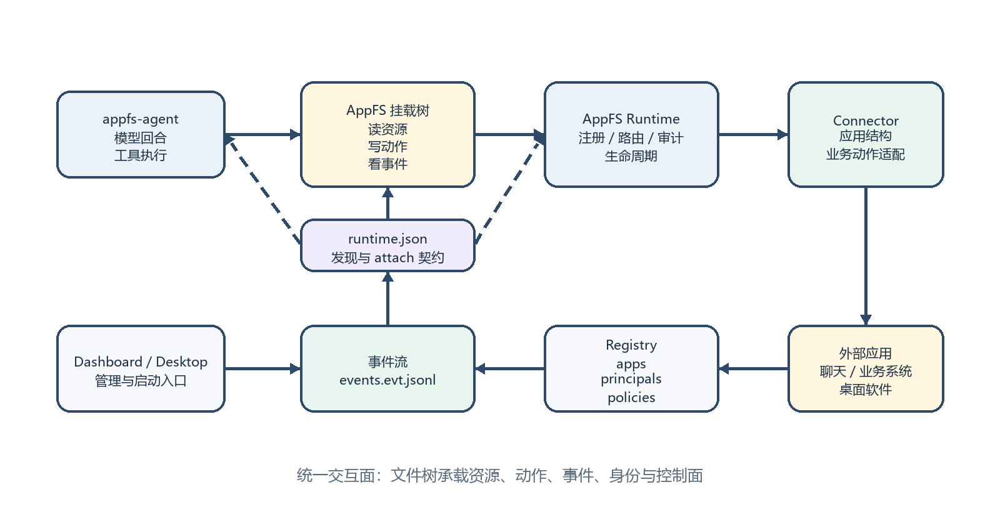
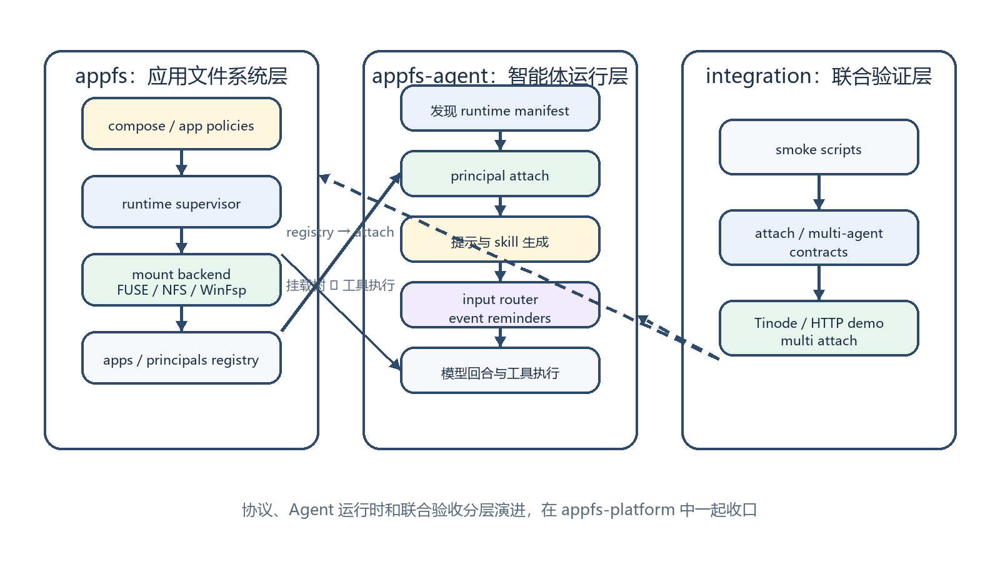
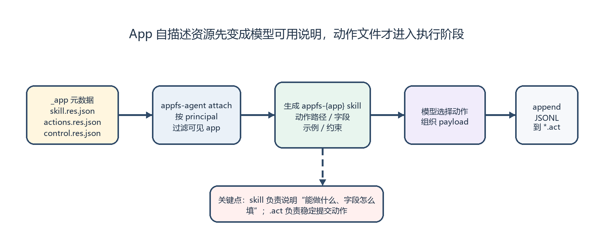
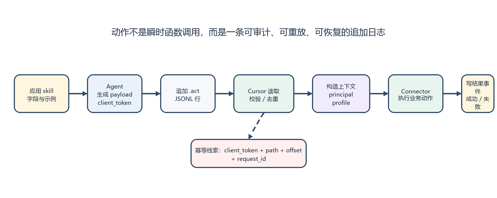
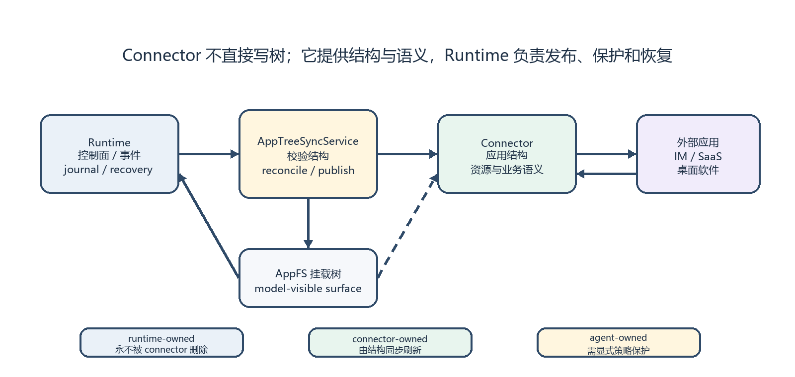
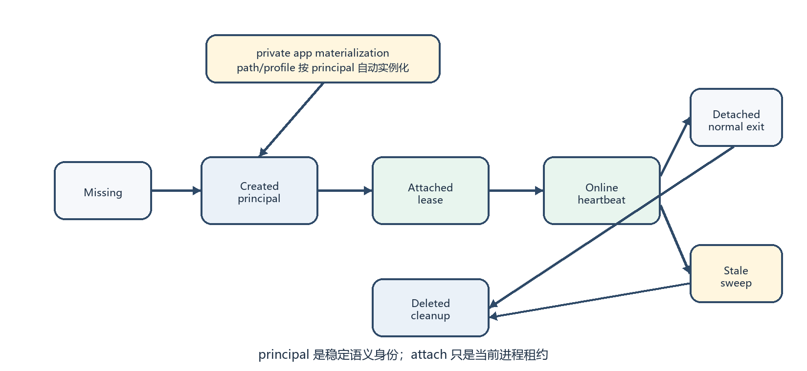
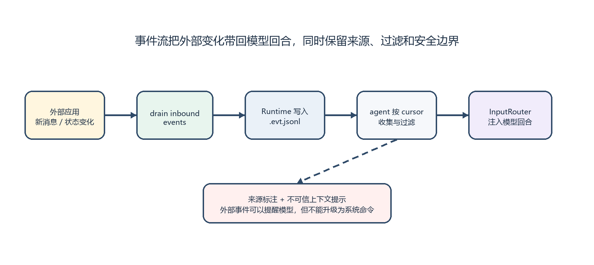
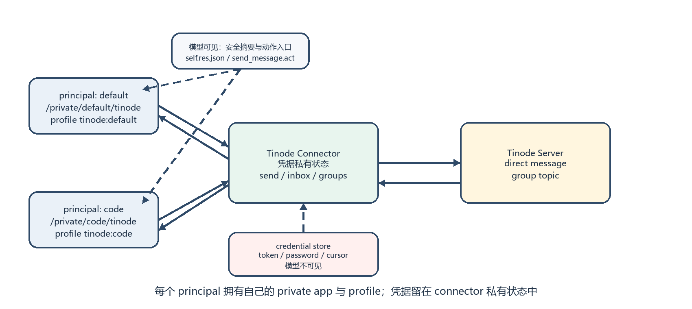

# AppFS Platform：以文件系统为中心的多 Agent 协作基础设施

> 研发期刊｜2026-07-03
>
> 面向希望快速理解 appfs-platform 的读者：这篇文章用研发期刊的方式，解释我们为什么把应用接口做成文件系统，以及它如何支撑多 Agent 协作。

## 给智能体一块稳定的操作地面

过去一段时间，我反复思考一个问题：如果 AI Agent 不再只是单次问答工具，而是能长期运行、能和其他 Agent 协作、能使用真实应用的软件成员，它到底需要什么样的基础设施？

直觉上，答案很容易滑向“多接几个 API”“多写几个插件”。但真实研发很快会把问题推回来：每个应用有自己的鉴权方式、状态模型、动作接口、事件通知和调试方式；每个 Agent 又有自己的会话、身份、上下文和权限边界。把这些东西都塞进 prompt 或工具 schema，系统会越来越像一张临时拼起来的表格，能跑，但不容易长期维护。

AppFS 的选择更接近一条系统软件路线：把应用暴露成一棵文件树。Agent 读文件就是读状态，向 `.act` 文件追加一行 JSONL 就是发起动作，订阅 `.evt.jsonl` 就能接收外部事件。文件系统在这里不是比喻，而是统一交互面。



图 1：AppFS 把 Agent、运行时和外部应用之间的关系收敛到一棵可读写的应用文件树。

## 为什么不是又一个插件系统

插件和工具调用适合表达“现在调用一个函数”。但 Agent 真正接入应用时，面对的往往不是单次函数，而是一组持续变化的事实：

| 真实问题 | 普通工具化后的常见痛点 | AppFS 的处理方式 |
| --- | --- | --- |
| 应用状态如何被发现 | 每个工具都要单独解释 schema | 路径就是语义，目录就是能力边界 |
| 动作字段如何被理解 | 靠人工 prompt 或代码注释补充 | app 生成 skill/action 元数据，appfs-agent 注入模型回合 |
| 动作如何审计与重放 | 调用日志分散在不同进程里 | `.act` 是追加日志，事件流可追踪结果 |
| 外部消息如何进入模型 | 轮询、Webhook、prompt 注入容易混乱 | `.evt.jsonl` 统一承载事件，appfs-agent 渲染为回合输入 |
| 多 Agent 如何区分身份 | 进程、账号、会话经常混为一谈 | `principal_id`、`attach_id`、`profile_id` 分层 |
| 凭据如何不泄露给模型 | token 容易出现在上下文或工具参数里 | Connector 私有保存凭据，模型只看安全摘要 |

所以方案核心强调：AppFS 不是把一个应用包装成一个函数，而是把应用结构、资源、动作、事件、身份和安全边界统一到文件系统协议里。

## 三层栈：协议、Agent、集成验证

appfs-platform 是一个 monorepo，但里面的边界相当清晰：

| 目录 | 职责 |
| --- | --- |
| `appfs/` | 文件系统协议、runtime、mount 后端、Connector、SDK、合同测试 |
| `appfs-agent/` | Agent 运行时、提示组装、事件路由、工具执行、principal 命令 |
| `integration/` | 跨项目脚本、端到端场景、attach 契约和联合验收 |

换句话说，`appfs/` 负责把应用变成文件系统，`appfs-agent/` 负责让模型可靠地使用这棵树，`integration/` 负责证明两者合在一起能工作。



图 2：appfs-platform 的研发边界。协议、Agent 运行时和集成验证分开演进，但在一个仓库里一起收口。

## 一棵会说话的应用树

一个 AppFS 挂载根大致长这样：

```text
/
  .well-known/
    appfs/
      runtime.json
  _appfs/
    apps.registry.json
    app-policies.registry.json
    principals.registry.json
    principals/
      create_principal.act
      attach_principal.act
      update_principal.act
      detach_principal.act
      delete_principal.act
    _stream/
      events.evt.jsonl
  public/
    <app-id>/
      _app/
        skill.res.json
        actions.res.json
        control.res.json
      _stream/
      *.res.json
      *.act
  private/
    <principal-id>/
      <app-id>/
        _app/
          skill.res.json
          actions.res.json
          control.res.json
        _stream/
        *.res.jsonl
        *.act
```

图 3：AppFS 命名空间。`_appfs` 是运行时控制面，`public` 是共享应用实例，`private` 是按 principal 隔离的私有应用实例。

这里有几个关键后缀：

| 后缀 | 含义 |
| --- | --- |
| `.res.json` | 当前资源快照，适合读取配置、元数据、账户摘要 |
| `.res.jsonl` | 流式资源，适合消息列表、事件列表、分页结果 |
| `.act` | 动作入口，Agent 通过追加 JSONL 发起请求 |
| `.evt.jsonl` | 事件流，runtime 或 connector 把动作结果与外部消息写到这里 |

这种命名让 Agent 不必“记住某个 SDK 怎么用”。它只要理解文件树，理解哪些文件可读、哪些文件可追加，就能用统一方式操作不同应用。

## Agent 如何知道 `.act` 该写什么

这里有一个容易被忽略、但对可用性非常关键的机制：AppFS 并不是只把一堆 `.act` 文件扔给模型，让模型凭空猜字段。每个 app 在自己的 `_app/` 目录下都会生成一组面向 Agent 的自描述资源，appfs-agent 再把这些资源整理成模型可用的 app skill。

典型的 `_app/` 元数据包括：

| 文件 | 作用 |
| --- | --- |
| `_app/skill.res.json` | 描述这个 app 能做什么、何时应该使用、对模型暴露的 skill 名称 |
| `_app/actions.res.json` | 列出可用动作、`.act` 路径、payload 字段、示例和结果事件 |
| `_app/control.res.json` | 描述凭据、刷新、恢复、收件箱等控制类动作 |
| `_app/*.schema.json` | 可选的输入/输出 schema，用于更严格地约束动作参数 |

appfs-agent attach 到 AppFS runtime 后，会根据当前 `principal_id` 过滤可见 app：共享 app 来自 `/public`，私有 app 只取 `/private/<principal-id>` 下的实例。随后它读取这些 app 的 `_app/skill.res.json` 和 `_app/actions.res.json`，生成类似 `appfs-tinode` 的 skill，注入到模型回合中。



图 4：app skill 是 `.act` 的说明书。模型先通过 skill 知道有哪些动作、字段怎么填，再把请求追加到对应动作文件。

所以，`.act` 不是发现机制，而是执行机制。发现和说明由 app 自描述资源与 appfs-agent 生成的 skill 完成；追加日志只是把已经明确的动作请求稳定地交给 runtime。

## 动作执行：skill 给字段，`.act` 负责落地

有了 app skill，动作文件就不再是“让 AI 猜 JSON”。Skill 告诉模型该用哪个 `.act`、payload 有哪些字段、哪些字段必填、成功或失败会出现什么事件；`.act` 则负责把这个动作以 append-only JSONL 的方式提交给 AppFS runtime。

AppFS 最重要的细节之一，是动作文件采用追加日志。Agent 不覆盖文件，也不把动作当成瞬时 RPC，而是向动作槽追加一行稳定请求。

例如，一个聊天应用可以暴露：

```text
/private/default/tinode/contacts/send_message.act
```

Agent 发送消息时，只需要追加：

```json
{"version":2,"client_token":"msg-20260703-001","payload":{"to":"张三","text":"会议纪要已经生成，请确认。"}}
```

Runtime 消费动作后，会把结果写入事件流：

```json
{"type":"action.accepted","client_token":"msg-20260703-001","action_path":"contacts/send_message.act"}
{"type":"action.completed","client_token":"msg-20260703-001","summary":"message sent"}
```

如果 connector 或外部系统失败，也会以 `action.failed` 暴露。这样一来，动作发起、处理中、成功、失败都在文件系统里留下可观察的轨迹。



图 5：动作处理流程。`.act` 是输入日志，`.evt.jsonl` 是结果与外部变化的统一出口。

这里的 `client_token` 很关键。它让重复写入、网络抖动、进程重启后的恢复都有可判断的幂等依据。即使 Agent 重试同一动作，runtime 与 connector 也能根据 token、路径、offset、request_id 等信息识别重复请求。

## Connector：外部应用的翻译层

Connector 是 AppFS 接入真实应用的边界。它不直接写 AppFS 文件树，而是向 runtime 返回结构、资源和动作结果。Runtime 再负责把这些内容 materialize 到挂载树里。

这个分工看似绕了一步，但它解决了一个很实际的问题：外部应用的页面、模块、权限和服务端状态会变化，文件树也要能变化。如果让 connector 随便写树，ownership、恢复和审计都会变复杂。AppFS 把边界固定下来：

| 责任 | Runtime | Connector |
| --- | --- | --- |
| 应用结构发布 | 校验并 reconcile 到文件树 | 返回 app structure snapshot |
| 路径 ownership | 保护 runtime-owned 路径 | 标明 connector-owned 节点 |
| 动作执行 | 消费 `.act`、生成 request_id、写事件 | 执行业务动作并返回结果 |
| 资源读取 | 管理 snapshot/live/paging 状态 | 拉取外部系统数据 |
| 恢复 | journal、cursor、recovery | 根据 revision 和上下文重建视图 |

因此，Connector 更像一个“应用语义适配器”，而不是一个随手写文件的后台脚本。



图 6：Connector 只提供结构和业务语义，runtime 负责把它变成稳定、可恢复、可审计的文件系统表面。

## Principal：让多 Agent 不再共享同一张脸

多 Agent 协作里最容易混乱的是“身份”。一个进程、一次运行、一个会话、一个应用账号、一个 Agent 角色，听起来都像身份，但它们不应该混成一个字段。

AppFS 把它拆成四层：

| 名称 | 含义 | 是否稳定 | 典型用途 |
| --- | --- | --- | --- |
| `runtime_session_id` | 一个 AppFS runtime 生命周期 | 单次 runtime 稳定 | 多个 Agent 识别同一个挂载运行时 |
| `attach_id` | 一个 appfs-agent 进程绑定 | 进程级临时 | 日志、调试、attach lease、heartbeat |
| `principal_id` | Agent 的语义身份 | 跨运行稳定 | 私有 app、权限、可见性、协作身份 |
| `profile_id` | 某个 app 内的账号身份 | 按 app 稳定 | Connector 绑定凭据和后端账户 |

这套模型的价值，在 Tinode 这样的私有聊天应用里特别明显。`default`、`incident-reporter`、`code-reviewer` 可以是同一个项目里的三个 principal。它们共享一个 AppFS runtime，但各自拥有自己的 `/private/<principal-id>/tinode`，也各自绑定自己的 `tinode:<principal-id>` profile。



图 7：principal 生命周期。稳定身份由 registry 管理，进程级 attach 只代表当前运行绑定。

这样做有一个重要后果：fork 一个 Agent，不一定等于复制同一个应用账号。新的 principal 可以拥有自己的私有上下文和凭据；如果确实要共享账号，也应该显式共享 `principal_id` 或 `profile_id`，而不是默认把所有 Agent 都塞进同一个后端身份。

## 事件如何进入模型回合

文件系统不只是给 Agent 主动读取，也能把外部世界的变化带回模型回合。

appfs-agent attach 到 runtime 时，会优先读取 `/.well-known/appfs/runtime.json`，再结合环境变量和目录启发式判断当前 AppFS 环境。之后它会读取当前 principal 可见的 app 列表、skill 元数据和事件流，把这些信息渲染成模型可理解的上下文。

事件进入模型时，不直接把无限长的原始 JSON 塞进 prompt，而是经过 input router 转换：



图 8：AppFS 事件进入模型回合的路径。事件会被过滤、聚合、摘要，并标记为外部来源。

这让 Agent 可以被聊天消息、动作完成、凭据就绪、应用状态变化等事件唤醒或提醒。更重要的是，事件不再是散落在各处的回调，而是同一条事件流上的可追踪事实。

## Tinode：第一个私有聊天闭环

Tinode 是 appfs-platform 里非常关键的纵向切片。它不是为了做一个完整 IM 客户端，而是验证 AppFS 能不能把“真实外部应用 + 多 Agent 身份 + 私有凭据 + 事件唤醒”串成闭环。

Tinode 的 AppFS 根路径是：

```text
/private/<principal-id>/tinode
```

一个 v0 树大致如下：

```text
/private/default/tinode/
  _app/
    actions.res.json
    control.res.json
    skill.res.json
    self.res.json
    ensure_credentials.act
    refresh_inbox.act
  _stream/
    events.evt.jsonl
  contacts/
    index.res.jsonl
    send_message.act
    resolve.act
    <contact-key>/
      messages.res.jsonl
      send_message.act
  groups/
    index.res.jsonl
    create_group.act
    <group-key>/
      group.res.json
      messages.res.jsonl
      send_message.act
      invite_members.act
  inbox/
    recent.res.jsonl
    unread.res.jsonl
    mark_read.act
```

图 9：Tinode 私有 app 树。联系人、群聊、收件箱和控制动作都以文件形式暴露给当前 principal。

这里最值得注意的是凭据边界。模型可以看到 `_app/self.res.json` 里的安全摘要，比如 `principal_id`、`profile_id`、登录状态、显示名；但看不到 token、密码、API key 或 cookie。真正的 Tinode session、账号、cursor 和 token 都在 connector 私有状态里。



图 10：Tinode 凭据隔离。模型操作能力和状态摘要，connector 持有真正的后端凭据。

这个切片证明了一件事：AppFS 不只是能把 demo fixture 挂出来，也能承载一个真实应用的账号、消息、群聊和外部事件。

## Dashboard 与桌面启动：把 runtime 变成可管理系统

当 AppFS 只服务一个实验时，命令行足够。但当它要支持多 Agent、多个 private app、长期运行和可视化管理时，Dashboard 或桌面 launcher 就变成自然入口。

管理端并不需要绕开协议。它也可以通过 AppFS 控制面完成操作：

| 管理动作 | 对应机制 |
| --- | --- |
| 创建 Agent 身份 | append `/_appfs/principals/create_principal.act` |
| 启动 Agent 进程 | 注入 runtime manifest、mount root、principal、attach 环境 |
| 查看在线状态 | 读取 `principals.registry.json` 与 attach lease |
| 管理应用实例 | 读取 app policies 和 apps registry |
| 观察运行事件 | tail `_stream/events.evt.jsonl` |

这使得 CLI、Dashboard、桌面 launcher 不必各自发明一套管理 API。它们都可以成为同一棵文件树的不同操作者。

## 研发价值：把复杂性放在可检查的位置

AppFS 最吸引人的地方，不是“把 API 变成文件”这个表面动作，而是它把复杂性放到了可检查、可测试、可恢复的位置。

| 能力 | 研发收益 |
| --- | --- |
| 文件树命名空间 | Agent、开发者、测试脚本使用同一种观察方式 |
| app 自描述与 skill 生成 | 模型不靠猜字段，动作路径、payload、示例和约束都来自 app 元数据 |
| append-only action | 动作有日志、有幂等、有恢复线索 |
| event stream | 外部变化能进入模型回合，也能被回放与审计 |
| connector ownership | 应用结构变化可 reconcile，不污染 runtime 控制面 |
| principal / profile 分层 | 多 Agent 可以共享 runtime，但不必共享账号和私有上下文 |
| credential isolation | 模型拥有能力，不直接拥有密钥 |
| compose-first startup | runtime、connector、app policy 能一起声明和监管 |

这也是 appfs-platform 作为集成仓库的意义：很多问题只有把 AppFS runtime、appfs-agent、真实 connector 和端到端脚本放在一起，才会暴露出真正的边界。

## 展望

当前 AppFS 已经形成了可运行的骨架，但它仍处在快速研发期。几个方向会决定它能不能从“可用原型”走向“可依赖基础设施”：

1. **更多真实 Connector**：Tinode 证明了聊天闭环，下一步需要更多业务系统、桌面软件或 SaaS 应用来验证抽象是否足够稳。
2. **更强的权限边界**：v0 的 principal 可见性更偏协作式约束，后续需要更强的系统级隔离和策略表达。
3. **更好的事件唤醒**：事件过滤、聚合、优先级、跨 turn 摘要还可以继续精炼，让 Agent 不被噪声打断，也不错过关键变化。
4. **更成熟的 Dashboard**：principal、app policy、运行状态、connector health、事件流都适合被做成可视化管理面。
5. **更完整的一致性测试**：文件协议的优势在于可测，后续应继续扩展跨平台 mount、action cursor、recovery、credential boundary 的合同测试。

## 结语：文件系统作为 Agent 协作的公共语言

如果说传统应用集成是在问“这个系统有没有 API”，AppFS 问的是另一个问题：这个系统能不能被 Agent 像观察工作区一样观察，像写日志一样发起动作，像看事件流一样感知外部变化？

appfs-platform 的答案是，把应用、动作、事件、身份和凭据边界收束到文件系统里。它不要求所有应用都长得一样，但要求它们在 Agent 面前呈现出一致的交互秩序。

这就是 AppFS 想成为的基础设施：不是替代应用，也不是替代 Agent，而是在两者之间提供一块稳定、可观察、可恢复、适合多 Agent 协作的操作地面。
